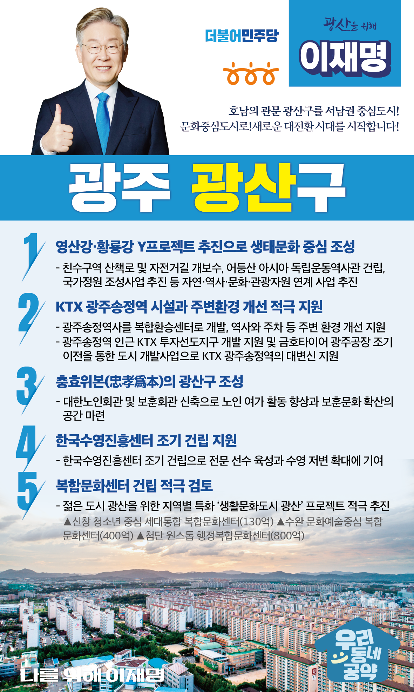

## 광주 지역 공약

# 광산구

### 호남의 관문 광산구를 서남권 중심도시로!
> 2022-01-27

존경하는 광산구민 여러분, 

 

우리 광산구는 예로부터 서남권의 지리적 요충지이자, 나라가 위기에 처할 때마다 분연히 일어섰던 의병정신이 깃든 곳입니다.  

 

광산은, 대한민국의 동서남북을 연결하는 호남의 관문이면서 초기 철기시대 유적지인 신창동 선사유적지를 비롯해 월봉서원, 무양서원, 풍영정 등 수많은 문화유산을 간직한 광주의 보고입니다.

   

대한민국의 대전환을 주도할 ‘서남권 중심도시’로 ‘산업과 생태·환경과 문화 도시의 관문’을 만들기 위한 「광주광역시 광산구 5대 공약」을 약속드립니다.

 

첫째, 영산강, 황룡강 Y프로젝트로 광산구가 생태문화의 중심이 되도록 돕겠습니다. 

광산구는 영산강과 황룡강이 Y자로 만나 호남을 관통하는 핵심거점 지역입니다. 

자연·역사·문화·관광자원을 연계하는 사업을 추진하여 광주 서남권 발전을 견인하겠습니다. 

 

둘째, KTX 광주송정역 시설과 주변환경 개선을 적극 지원하겠습니다. 

KTX 광주송정역이 개통되었으나 역사 공간 부족으로 이용자의 불편함이 가중되고 있습니다. 

광주송정역사를 복합환승센터로 개발하고, 역사 및 주차, 주변 환경개선을 지원하겠습니다. 

또한, 광주송정역 인근 ktx투자선도지구가 적시 개발되도록 지원하고 금호타이어 광주공장의 조기 이전을 통한 도시개발사업을 통해 ktx 광주송정역의 대변신을 지원하겠습니다. 

 

셋째, 충과 효과 근본이 되는 충효위본(忠孝爲本)의 광산구가 돕겠습니다. 

대한노인회 광산지회는 많은 어르신들이 찾고 계시는 본부격 지회입니다.  

그러나 승강기도 없는 낡고 협소한 시설로 인해 어르신들이 많은 불편을 겪고 계십니다. 

보훈회관도 시설 노후와 공간이 협소하여 신축요구가 많습니다.  

노인회관 및 보훈회관 신축을 지원하여 충과 효를 다하는 광산구가 되도록 돕겠습니다.  

 

넷째, 한국수영진흥센터를 조기에 건립하여 광주를 수영 메카도시로 만들겠습니다.

2019년 광주 세계수영선수권대회는 194개국이 참가하여 역대 최대규모로 치렀고, 해외에서도 가장 성공적인 국제대회라는 호평을 받았습니다. 

이제 남은 것은 광주와 광산구를 대한민국 수영의 메카로 키우는 것입니다. 

한국수영진흥센터가 조기에 건립되도록 지원해 수영 저변을 확대시키겠습니다.  

 

다섯째, 광산구가 생활문화도시로 거듭나기 위해 복합문화센터 건립을 적극 검토하겠습니다.  

 

광산구는 평균연령 38.3세의 젊은 도시입니다. 문화 인프라 구축에 대한 요구가 높습니다. 

▲신창 청소년 세대통합 복합문화센터 ▲수완 문화예술 복합문화센터 ▲첨단 원스톱 복합문화센터 건립 등 지역별로 특화된 ‘생활문화도시 광산’ 프로젝트를 적극적으로 돕겠습니다. 

 

광산구민 여러분! 제가 가장 잘하는 게 실력! 실적! 실천! 입니다. 

광산구민 앞으로! 공약실천 제대로! 

이재명이 주권자 시민을 위해 제대로 바꾸겠습니다. 