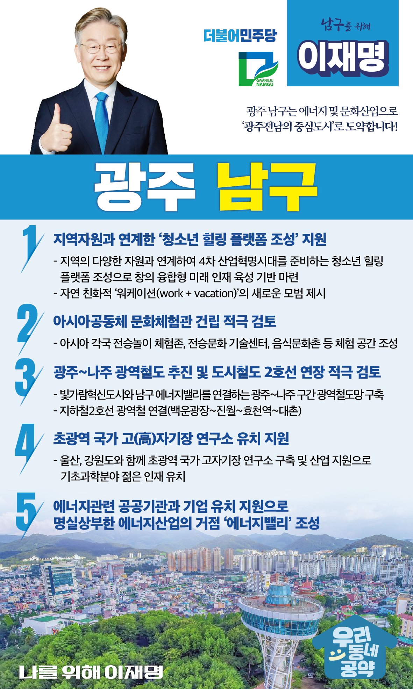

## 광주 지역 공약

# 남구

### 광주 남구는 에너지 및 문화산업으로 광주 전남의 중심도시로!
> 2022-01-27

광주 남구 구민 여러분, 

 

우리 남구는 예로부터 역사와 문화의 터전이자 왜군과 맞섰던 고경명 장군의 기백과 수피아 여고생들의 3.1만세운동이 깃들어 있는 의향의 고장입니다. 

 

남구는 광주의 남부 관문으로서 역할을 담당해 오고 있고 고려시대 석탑인 광주 ‘서 오층석탑’을 비롯해 이장우 가옥, 최승효 가옥, 20세기초 서양의 선교사들이 활동한 양림동 등 수많은 역사문화유산을 간직한 광주의 보고입니다. 

 

이제 남구는 빛가람혁신도시, 한전공대와 함께 신재생에너지 및 문화·생태환경을 기반으로‘광주전남 상생도시’로서 새롭게 시작할 것입니다.

새로운 남구를 위해 이재명과 민주당이 광주 남구 5대 공약을 말씀드립니다. 

 

첫째 지역자원과 연계한 ‘청소년 힐링 플렛폼 조성’을 지원하겠습니다.

남구 지역의 다양한 자원과 연계하여 4차 산업혁명시대를 준비하는 청소년 힐링 플렛폼 조성이 필요합니다.

청소년은 학업과 힐링, 성인은 일과 휴가를 접목한 자연 친화적 ‘워케이션(work + vacation)’의 새로운 모범이 되도록 돕겠습니다. 

놀면서 배우는 창의 융합형 미래 인재 육성의 기반이 되도록 하겠습니다. 

 

둘째, 아시아문화중심도시에 어울리는 ‘아시아공동체 문화체험관’ 건립을 적극 검토하겠습니다.

남구의 자랑인 광주칠석고싸움놀이 등 우리 전통문화와 아시아 놀이 문화의 우수성을 세계에 알릴 필요가 있습니다.   

아시안들과 함께 즐길 수 있는 문화체험 공간인 ‘아시아공동체 문화체험관’ 건립이 추진되도록 돕겠습니다.

 

셋째, 광주~나주 광역철도를 차질없이 추진하고 도시철도 2호선 연장도 적극 검토하겠습니다.

빛가람혁신도시와 남구 에너지밸리의 상생발전을 위해 광주~나주간 광역철도망 구축을 차질없이 추진해 나가겠습니다.

아울러 상생발전의 노력이 더 큰 효과를 거두도록 도시철도 2호선(효천선) 연장을 통한 광역철도망 연계도 적극 검토하겠습니다.

 

넷째, 우리나라 첨단과학기술의 토대가 될 ‘고(高)자기장 연구소’ 유치를 지원하겠습니다.

고자기장 연구시설은 기초과학부터 자기부상열차, 첨단의료영상장비, 그리고 미래 에너지 시스템 등의 혁신을 이끌 국가적 전략기술입니다.

광주시가 울산, 강원도와 함께 추진하는 초광역 국가 고자기장 연구소 유치를 지원하여 기초과학분야의 젊은 인재들이 남구로 모이도록 돕겠습니다. 

 

다섯째, 남구가 에너지산업 거점으로 발전하도록 공공기관과 기업 유치를 지원하겠습니다. 

남구 도시첨단산단에 한국전기연구원, 한국기초과학지원연구원이 입주해 있고, 인근에는 한국에너지공대 등 에너지 관련 연구기관이 있습니다. 

남구에 에너지 관련 기업과 공공기관을 유치해서 남구가 명실상부한 ‘에너지밸리’가 되도록 지원하겠습니다. 

 

 

남구의 대전환과 기분 좋은 변화, 

저 이재명이 함께 하겠습니다.

 

남구민을 위해, 

저 이재명이 앞으로 제대로 하겠습니다. 