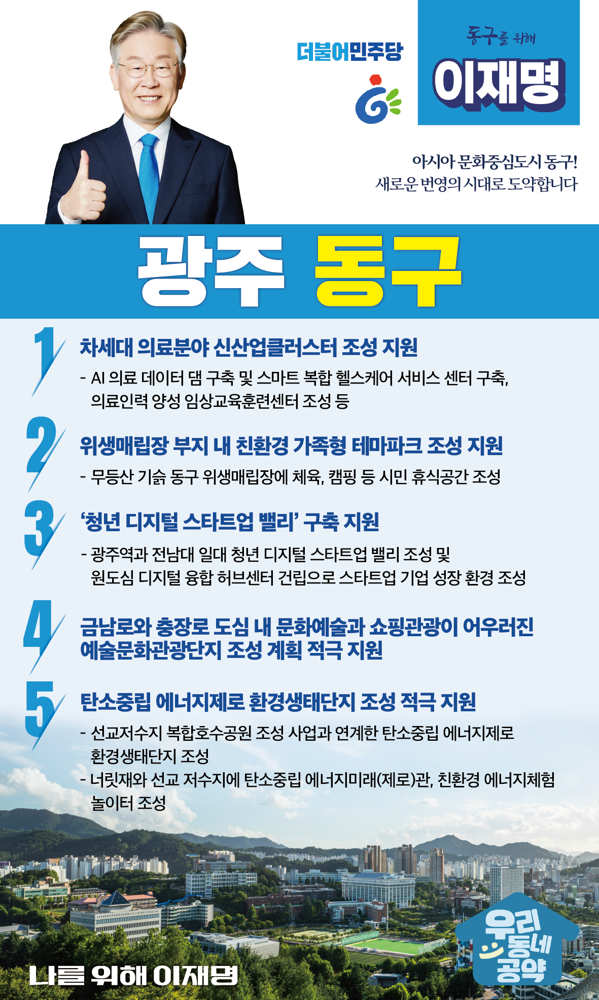

## 광주 지역 공약

# 동구

### 아시아 문화중심도시 동구! 
> 2022-01-27

존경하는 광주시 동구 주민 여러분

 

찬란한 역사 속에 힘차게 뻗어가는 빛고을 일번지의 중심 동구는 아시아 문화중심도시로서 누구나 함께 하고 싶은 문화 예술도시를 구현하고, 활발한 도시개발사업을 통해 화려했던 옛 모습으로 부활하고 있습니다.

 

호남의 진산 무등산과 원도심의 허파 푸른길 등 천혜의 자연을 간직한 동구를 사람과 자연이 공존하는 친환경 녹색도시로 새롭게 발전시키고 문화와 생태가 어울러지는 동구로 만들기 위하여 이재명의 5대 공약을 말씀드립니다.

 

첫째, 인공지능과 스마트기술을 기반한 <차세대 의료분야 신산업클러스터>을 조성되도록 지원하겠습니다. 

원도심에는 새롭게 건축될 전남대병원과 상급 종합병원시설이 모여있습니다. 

이를 기반으로 인공지능 의료 데이터 댐을 구축하고 스마트 복합 헬스케어 플랫폼을 연계한 차세대 의료분야 신산업클러스터가 조성되도록 돕겠습니다.  

 

둘째, 위생매립장 부지에 친환경 가족형 테마파크가 조성되도록 지원하겠습니다.

매립이 종료된 무등산 기슭의 동구 위생매립장에 체육, 캠핑 등 가족이 함께 이용할 수 있는 시민 휴식공간이 조성되도록 지원하겠습니다.  

위생매립장 부지가 친환경 가족형 테마파크로 거듭날 수 있도록 하겠습니다.

 

셋째, 원도심 경제를 살릴 ‘청년 디지털 스타트업 밸리’를 구축하겠습니다. 

광주역과 전남대 일대에 청년 디지털 스타트업 밸리가 조성될 수 있도록 적극 돕겠습니다.  

인공지능, 빅데이터, 메타버스 등 첨단디지털기술과 문화콘텐츠를 결합한 청년 디지털 스타트업이 광주의 미래를 만들어 갈 것입니다. 

원도심에 디지털 융합 허브센터를 건립해 엔젤 투자자와 투자 전문기관이 협업하고 꾸준히 지원하여 스타트업 기업이 성장할 수 있는 환경을 조성하겠습니다. 

 

 

넷째, 금남로와 충장로를 문화예술과 쇼핑관광이 어우러진 복합문화거점이 되도록 적극 지원하겠습니다.

동구는 5.18 민주화운동의 현장인 금남로와 충장로,  국립아시아문화전당 등이 있는 역사문화관광의 중심지입니다. 

광주시가 추진하는 도심 예술문화관광단지 조성 계획을 지원해 금남로와 충장로가 역사문화예술과 쇼핑관광이 어우러진 복합문화거점으로 발전할 수 있도록 돕겠습니다. 

 

다섯째, ‘탄소중립 에너지제로 환경생태단지’조성을 적극 지원하겠습니다.

탄소중립은 피할 수 없는 과제입니다. 

광주시가 추진중인 선교저수지 복합호수공원 조성 사업과 연계하여 탄소중립 에너지제로 환경생태단지가 조성되도록 지원하겠습니다. 

너릿재와 선교 저수지에 탄소중립 에너지미래(제로)관, 친환경 에너지체험 놀이터가 조성되도록 적극 지원하겠습니다. 

에너지제로 휴식공간을 시작으로 탄소중립 녹색전환의 시대를 견인하도록 하겠습니다. 

 

 

동구의 대전환! 

이재명이 제대로 하겠습니다.

 

아시아문화중심도시를 위해 

이재명이 앞으로 제대로 하겠습니다. 