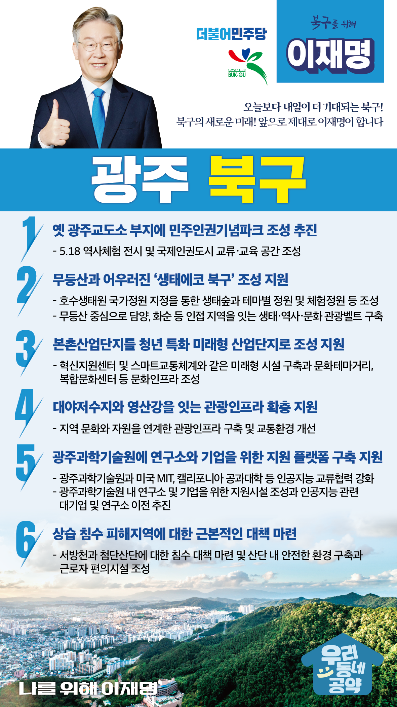

## 광주 지역 공약

# 북구

### 오늘보다 내일이 더 기대되는 북구!
> 2022-01-27

광주의 45만 북구민 여러분,

광주 북구는 비엔날레 전시관과 광주문화예술회관이 있는 예향의 도시이자 5.18 광주민주화운동의 발원지인 전남대학교와 국립 518 민주묘역이 있는 민주․인권의 도시입니다. 

광주정신의 중심이며 광주를 상징하는 지역입니다.

 

광주의 중심이라는 명성을 회복하도록 북구 발전을 위한 6대 공약을 약속드립니다. 

 

첫째, 민주인권기념파크를 구 옛 광주교도소 부지에 조성하겠습니다. 

 

민주인권기념파크 조성 사업이을 차질 없이 추진하겠습니다.

민주인권기념파크를 품은 북구가 민주․인권․정의․자유의 중심지이자 세계인권 교류의 본고장이 되도록 지원을 아끼지 않겠습니다. 

 

둘째, 무등산과 어우러진 ‘생태에코 북구’ 조성을 지원하겠습니다. 

무등산과 호수생태원 일원은 광주의 상징이자 핵심 관광인프라입니다.

무등산 역사, 지리, 문화적 배경을 바탕으로 체류형․정주형 공간으로 거듭나게 해야합니다. 

단절된 군왕봉과 삼각산의 생태축을 연결하고, 훼손된 생태계를 복원하여 도시 전체를 에 걸쳐 숲 생태계가 조성되도록 지원하겠습니다. 

 

셋째, 본촌산업단지를 청년 특화 미래형 산업단지로 탈바꿈하도록 지원하겠습니다. 

본촌산단은 준공된지 38년이 지난 노후산단입니다.

기반시설과 근로자 편의시설 등이 부족해 하여 새로운 경쟁력이 필요합니다.

본촌산단에 혁신지원센터, 스마트교통체계와 같은 미래형 시설 구축을 지원하고, 문화테마거리, 복합문화센터 등의 문화인프라 조성을 도와 청년친화형 산단으로 재탄생하도록 지원하겠습니다. 

 

넷째, 대야저수지와 영산강을 잇는 관광인프라 확충을 지원하겠습니다.

패밀리랜드는 대전 이남 지역 최대 규모인 놀이공원입니다. 

그러나 주변 문화관광 시설이 부족해 관광자원들을 제대로 활용하지 못하고 있습니다.

관광인프라 구축과 교통환경 개선을으로 ‘문화 북구’의 통합적발전 전략을 마련을 돕겠습니다.  

 

다섯째, 광주과학기술원의 연구소와 기업 지원 플랫폼을 구축을 지원하겠습니다.

광주를 4차산업과 인공지능(AI)의 본고장(주역)으로 만들어야 합니다.

광주과학기술원과 미국 MIT, 캘리포니아 공과대학 등 간 인공지능AI 교류협력 강화를 지원하고 인공지능AI관련 대기업과 연구소 이전을 도와 광주과학기술원을 명실상부한 인공지능AI 선도대학으로 도약하도록 지원하겠습니다.

 

여섯째, 북구의 상습적인 침수 피해지역에 대한 근본적인 대책을 마련하겠습니다. 

기상이변에 따른 돌발성 집중호우가 늘어나고 있습니다.

침수가 잦은 서방천과 첨단산단에 대한 근본적인 침수대책이 필요합니다. 

안전한 산업단지 환경 및 근로자 편의시설 조성을 지원해 북구를 재난안심도시, 기업하기 좋은 도시로 만들어가겠습니다.

 

 

존경하는 광주 북구 구민 여러분!

 

이재명은 지킬 수 있는 것만 약속했고 약속했던 것은 지켜왔습니다.

살기 좋은 광주 북구 미래를 위한 약속,

실력과 성과로 입증된 이재명이 반드시 실천하겠습니다.

 

북구 앞으로! 발전 제대로! 

광주 북구 구민을 위해, 이재명!

						