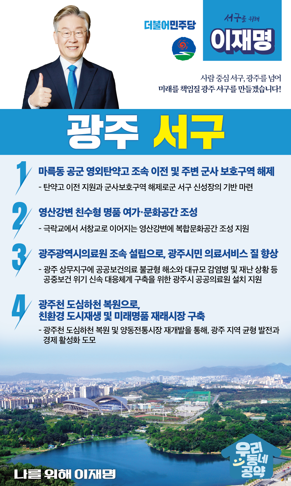

## 광주 지역 공약

# 서구

### 사람 중심 서구, 광주를 넘어 미래를 책임질 광주 서구!
> 2022-01-27

광주 서구민 여러분, 더불어민주당 대통령 후보 이재명입니다.

 

광주 서구는 명실상부한 광주의 중심입니다. 

518 광주 정신의 중심지이며, 행정‧금융‧상업 등 광주의 도시 핵심기능이 집중된 중심지역입니다. 

 

광주공항과 마륵동 탄약고 이전, 아껴놓은 땅 서창의 너른 들녘의 친환경 개발, 에너지밸리와 혁신도시로 이어지는 신영산강 시대를 준비해야 합니다.

신영산강 시대의 중심에 광주 서구가 있습니다.

우리 서구가 어떻게 바뀌냐에 따라 광주의 미래와 먹거리가 달라질 것입니다.

이재명이 광주의 미래를 책임진다는 마음으로 광주광역시 서구 4대 공약을 말씀드립니다. 

 

첫째, 마륵동 탄약고가 원만하게 이전되도록 지원하고, 주변 군사보호구역 해제도 적극 검토하겠습니다.

탄약고가 조속히 이전되도록 지원하고, 군사보호구역 해제를 검토하여 해당 부지가 서구 신성장 기반으로 만들겠습니다. 

 

둘째, 영산강변이 친수형 명품 여가, 문화공간으로 조성되도록 적극 지원하겠습니다.

극락교에서 서창교로 이어지는 영산강변을 고품격의 문화예술이 어우러진 복합문화공간으로 조성을 지원하겠습니다. 

시민들이 영산강변의 청정환경을 편안하게 즐기실 수 있도록 하겠습니다. 

 

셋째, ‘광주광역시 공공의료원’을 설립을 지원하여 공공보건의료 불균형을 해소하겠습니다.  

광역자치단체 중 광주, 울산, 대전만 지방의료원이 없습니다.

공공보건의료 불균형을 해소하고, 신종 감염병 대유행과 재난·응급상황에 대비할 수 있도록 광주시 공공의료원이 상무지구에 들어설 수 있도록 지원하겠습니다. 

 

넷째, 광주천 도심하천을 복원하고 양동전통시장 재개발을 지원하겠습니다.  

광주 양동시장은 100년 역사를 자랑하는 호남권 최대 전통시장입니다.

그러나 시설이 노후화되고 상권이 위축되면서 활력을 잃어가고 있습니다.

광주천 도심하천을 복원하고 양동시장을 재개발해 향후 100년 후에도 사람의 발길이 끊이지 않는 명품 지역이 되도록 돕겠습니다. 

 

제가 여러분께 약속드린 공약을 실천하여 새로운 광주! 새로운 서구!

 

미래 세대가 꿈꿀 수 있고 머물수 있는 공간으로 만들어 가겠습니다.

여러분과 함께 광주 서구의 미래를 이끌어갈 이재명을 기대해주십시오.

 

새로운 서구를 위해 이재명! 