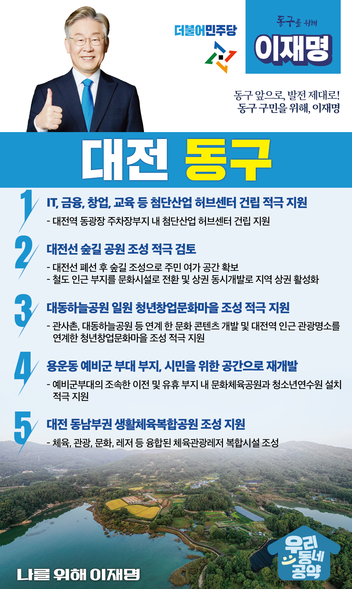

## 대전 지역 공약

# 동구

### 동구 앞으로, 발전 제대로! 동구 구민을 위해, 이재명은 합니다!
> 2022-02-10

존경하는 대전동구 구민 여러분, 

 

대전은 대한민국의 가운데 자리하고 있어 지리적으로 매우 중요한 곳입니다. 

그중에서도 대전역을 품고 있는 동구는 전국 어디든 2시간이면 갈 수 있는 우리나라의 중심입니다. 

 

또한 대동하늘공원, 식장산과 같은 녹지가 도심과 어우러진 동구는 기상산업과 지식재산권 산업 등 미래 산업의 중심이 될 ‘혁신’이라는 말이 가장 잘 어울리는 곳입니다.

 

저 이재명이 동구 구민 여러분과 함께 동구와 대전의 도약을 이루겠습니다. 

새로운 미래를 위한 대전 동구 5대 공약을 말씀드리겠습니다.

 

첫째, 벤처기업을 위한 지식산업복합 센터 건립을 적극 지원하겠습니다. 

대전~오송 간 광역 BRT 환승센터에 혁신 벤처들이 모일 수 있는 지식산업복합 센터가 건립되도록 지원하겠습니다. 

벤처 기업과 IT 관련 직업교육을 통해 대전을 전국적 지식산업의 허브로 키워나가겠습니다. 

 

둘째, 대전선 숲길 공원 조성 추진을 적극 검토하겠습니다.  

오랫동안 대전을 가로지르는 철길을 이제는 시민들의 공간으로 조성할 필요가 있습니다.  

도심의 맥을 끊어온 대전선 주변을 공원으로 조성하는 방안을 검토하겠습니다.

 

셋째, 대동하늘공원 일원에 청년창업문화마을 조성을 적극 지원하겠습니다. 

관사촌, 대동하늘공원 등 동구에는 잠재력이 큰 문화 컨텐츠가 있습니다.

대전역 근처 관광명소들을 하나로 묶어 새로운 컨텐츠를 만들어내는 청년창업문화마을 조성사업을 적극 돕겠습니다. 

 

넷째, 용운동 예비군 부대 부지를 시민들에게 돌려드리겠습니다.

용운동 예비군부대를 조속히 이전하고 이 부지를 시민을 위한 공간으로 개발되도록 돕겠습니다. 

대전시가 계획하는 문화체육공원, 지역 인재 양성을 위한 청소년 연수원 설치 등을 적극 지원하겠습니다.  

 

다섯째, 대전 동남부권에 생활체육복합공원 조성사업을 지원하겠습니다.  

동구 동남부권은 체육·문화 인프라가 부족합니다.  

관광, 문화, 레저가 융합된 복합문화공원 조성이 필요합니다.  

동구 주민의 삶의 질을 확실하게 끌어올리겠습니다. 

 

 

존경하는 동구 구민 여러분!

 

이재명은 지킬 수 있는 것만 약속했고 약속했던 것은 지켜왔습니다.

살기 좋은 대전 동구 미래를 위한 약속 실력과 성과로 입증된 이재명이 반드시 실천하겠습니다.

 

동구 앞으로, 발전 제대로!

동구 구민을 위해, 이재명은 합니다!