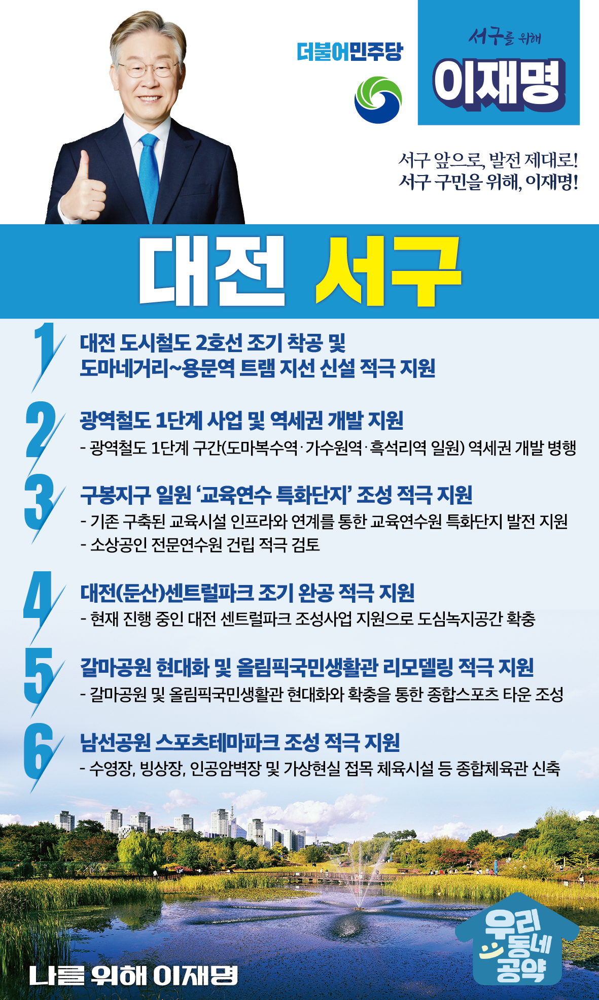

## 대전 지역 공약

# 서구

### 서구 앞으로, 발전 제대로! 서구 구민을 위해, 이재명은 합니다! 
> 2022-02-10

존경하는 대전 서구 구민 여러분, 

 

서구는 대전시 전체 인구의 1/3이 거주하며, 정부대전청사, 시청, 교육청, 법원 등 주요 관공서와 금융·유통·비즈니스·문화 등 각종 도시기능이 모인 ‘대전의 핵심축’입니다.

 

또한, 중부권 최대 도심 공원인 한밭수목원과 자연 생태하천인 갑천·유등천을 품고 있으며, 구봉산, 장태산이 대전의 허파 역할을 하는 도심과 자연이 조화로운 가장 살고 싶은 곳입니다.

 

그러나 지속 가능하고 더 살기 좋은 서구를 위해서는 한 걸음 도약이 필요합니다.

저 이재명이 구민 여러분과 함께 서구에 새로운 활력을 불어넣겠습니다.

이를 위한 서구 6대 공약을 말씀드리겠습니다.

 

첫째, 대전 도시철도 2호선 조기 착공과 도마네거리~용문역 트램 지선 신설도 적극 지원하겠습니다.

도마복수–정림–가수원–관저-도안 노선이 확정되었습니다. 

전 구간이 동시에 완공될 수 있도록 적극 지원하겠습니다.

또한 대전 원도심은 재개발사업으로 많은 인구 유입이 예상됩니다.  

특별한 대책이 필요합니다. 

도시철도 2호선 도마네거리-변동네거리-용문역 지선 신설도 적극 지원하겠습니다.

둘째, 광역철도 1단계 사업과 역세권개발을 지원하겠습니다

도시철도 3호선 기능을 하는 광역철도 1단계 구간인 도마복수역‧가수원역‧흑석리역 일원은 

현재 도시재생사업이 계획중입니다. 

역세권 개발로 이 지역이 완전히 탈바꿈하도록 적극 지원하겠습니다. 

셋째, 구봉지구가 ‘교육연수원 특화단지’로 발전되도록 적극 지원하겠습니다.

구봉지구는 천연 자연환경과 한국발전인재개발원 등 교육연수원이 들어서고 있습니다. 

기존 인프라와 연계한 ‘교육연수원 특화단지’로 발전되도록 지원하겠습니다. 

또한 소상공인 전문연수원 건립을 적극 검토하겠습니다. 

 

넷째, 대전(둔산)센트럴파크 조기 완공을 적극 지원하겠습니다. 

대전 서구는 도심녹지공간이 부족합니다. 

현재 진행 중인 ‘대전 센트럴파크’조성사업을 적극 지원해 주민 여러분의 쾌적하고 건강한 삶을 지키겠습니다.

 

다섯째, 대전시가 계획중인 갈마공원 현대화와 올림픽국민생활관 리모델링을 적극 지원하겠습니다.

갈마공원과 올림픽국민생활관을 종합스포츠타운으로 탈바꿈할 수 있도록 지원하겠습니다. 

대전 서부권에 생활체육시설 확충으로 서구 주민들이 여가를 즐길 수 있도록 돕겠습니다.   

 

여섯째, 대전시의 남선공원 스포츠테마파크 조성을 적극 지원하겠습니다.

 남선공원은 시설이 노후화돼 이용하는 시민들께서 불편을 겪고 계십니다.

수영장, 빙상장, 가상현실을 접목한 실내스포츠가 남녀노소 모두 다양한 체육활동이 가능한 시설로 탈바꿈해야 합니다. 남선공원 스포츠테마파크 조성을 적극 지원하겠습니다.

 

 

 

존경하는 서구 구민 여러분!

 

이재명은 지킬 수 있는 것만 약속했고 약속했던 것은 지켜왔습니다.

살기 좋은 대전 서구 미래를 위한 약속 실력과 성과로 입증된 이재명이 반드시 실천하겠습니다.

 

서구 앞으로, 발전 제대로!

서구 구민을 위해, 이재명은 합니다! 