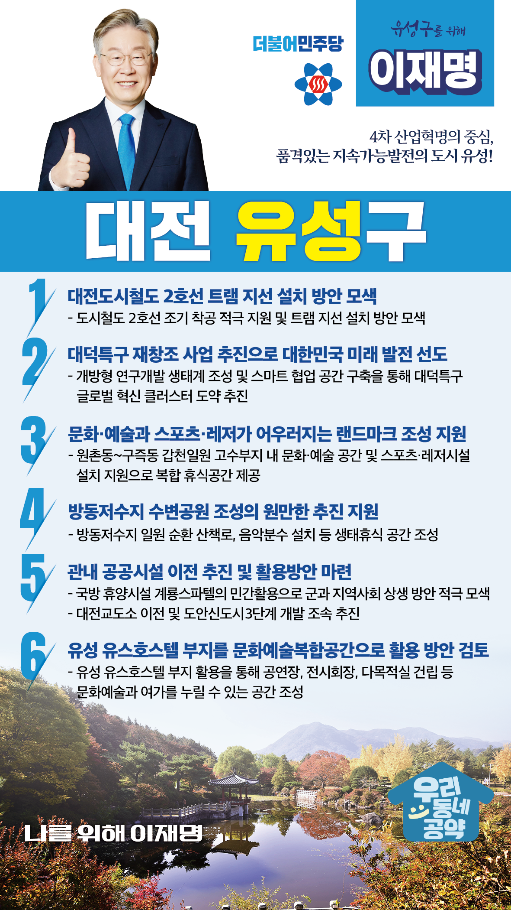

## 대전 지역 공약

# 유성구

### 4차 산업혁명의 중심, 품격있는 지속가능발전의 도시, 유성!
> 2022-02-10

존경하는 유성구민 여러분,

 

대전 유성구는 대덕연구단지를 품고 있으며, 4차산업혁명의 중추적 역할을 하는 과학수도 대전의 핵심입니다.

유성구는 대전 발전의 신성장 동력으로 무한한 잠재력을 지닌 도시이며, 대전 관광의 상징인 유성온천을 품고 있는 도시입니다.

 

한 단계 더 도약하는 유성, 이재명과 민주당이 만들어내겠습니다.

유성구의 지속가능한 발전을 위해 6대 지역공약을 말씀드립니다.

 

 

첫째, 대전도시철도 2호선 트램 지선 설치 방안 마련을 준비하겠습니다. 

신성동, 전민동, 관평동, 구즉동은 대중교통인프라가 부족하여 도심권 이동이 불편합니다. 

도시철도 2호선 조기 착공을 적극 지원하고 트램 지선 설치 방안을 모색하겠습니다.   

교통사각지대를 해소하고, 지역주민의 삶을 향상시키겠습니다. 

 

둘째, 『대덕특구 재창조 사업 추진』으로 대한민국 미래 발전을 선도하겠습니다.

지난 50여년간 대덕특구는 대한민국의 발전을 이끌어 온 과학기술의 중심지입니다.  

이제는 4차 산업혁명·디지털 전환을 선도해 가기 위해서 대덕특구의 한단계 도약이 필요합니다. 

개방형 연구개발 생태계를 조성하고 스마트 협업 공간을 갖춰 세계적 혁신 클러스터로의 도약을 추진하겠습니다. 

 

셋째, 갑천이 문화·예술과 스포츠·레저가 어우러지는 랜드마크가 될 수 있도록 지원하겠습니다.

유성구 원촌동~구즉동 갑천 둔치 일원에 문화·예술 공간과 스포츠·레저시설이 설치되도록 지원하겠습니다. 

유성구의 계획인 갑천 재창조 프로젝트가 완성되면 마을 주민들이 꽃길을 걸으며, 지역예술인들의 작품을 감상할 수 있는 문화공간이 형성됩니다. 

 

넷째, 방동저수지 수변공원 조성이 원만히 추진되도록 지원하겠습니다.

방동저수지 일원에 습지생태원, 수변생태공원 등 친수공간이 필요합니다.  

성북동 산림욕장, 나눔숲체원 등의 주변 자원과 연계하여 지역 경제를 활성화시킬 수 있도록 적극 지원하겠습니다.  

 

 

다섯째, 도시 내 국방 휴양시설의 민간활용방안을 적극 모색하겠습니다. 

유성온천은 대전의 명소지만, 옛 명성을 잃어가고 있습니다.  

국방 휴양시설인 계룡스파텔의 민간활용을 통해, 군과 지역사회가 상생할 수 있는 방안을 적극 모색하겠습니다.  

유성온천이 관광지로서의 옛 명성을 찾을 수 있도록 지원하겠습니다.

 

여섯째, 유성 유스호스텔 부지를 문화예술복합공간으로 활용하는 방안을 검토하겠습니다.

유성 유스호스텔 부지를 활용해 지역주민이 문화예술과 여가를 누릴 수 있는 공간으로 만드는 방안을 적극 검토하겠습니다. 

문화예술인들에는 기회의 장을, 주민들에게는 문화예술 향유의 장을 만들겠습니다.

 

 

존경하는 유성구민 여러분!

 

이재명은 지킬 수 있는 것만 약속했고 약속했던 것은 지켜왔습니다.

살기 좋은 유성구 미래를 위한 약속 실력과 성과로 입증된 이재명이 반드시 실천하겠습니다.

 

유성 앞으로, 발전 제대로!

유성 구민을 위해, 이재명은 합니다!  