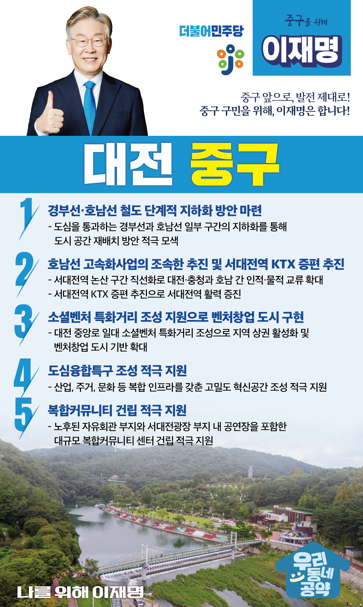

## 대전 지역 공약

# 중구

### 중구 앞으로, 발전 제대로! 중구 구민을 위해, 이재명은 합니다!
> 2022-02-14

존경하는 대전 중구 구민 여러분, 

 

대전 중구는 100여 년 근대도시의 시간을 고스란히 담은 매우 특색 있는 도시입니다. 

 

스쳐 지나가는 도시가 아니라 멈춰서 누리고 즐길 수 있는 곳, 문화와 예술이 서로 북돋는 사람 냄새 가득한 이곳이 바로 중구입니다.

 

대전 중구는 새로운 변화를 맞이하고 있습니다. 근대문화유산의 관광자원화를 통해 도시재생에 박차를 가하는 한편, 도심에 기업과 인재가 모일 수 있도록 고밀도 혁신공간 조성에도 앞장서고 있습니다. 

 

중구 부흥의 대장정에 저 이재명도 함께하겠습니다. 저 이재명이 여러분과 함께 중구에 새 숨을 불어넣겠습니다.

 

이를 위한 대전 중구 5대 공약을 말씀드리겠습니다.

 

 

첫째, 경부선·호남선 철도의 단계적 지하화 방안을 마련하겠습니다. 

대전 도심 한가운데를 통과하는 경부선과 호남선 철도로 인해 생활권 단절과 소음, 진동으로 대전시민들이 오랫동안 불편을 겪어 왔습니다. 도심을 통과하는 경부선과 호남선의 일부 구간을 지하화하여 도시 공간을 재배치하는 방안을 적극 모색하겠습니다. 

 

둘째, 호남선 고속화사업을 조속히 추진하고 서대전역 KTX 증편을 추진하겠습니다.

서대전역에서 논산 구간은 철로 굴곡이 심해 철로 운행의 안전성과 효율성이 떨어집니다. 이 구간을 직선화해 대전·충청과 호남 간 인적·물적 교류를 확대하겠습니다. 또한, 서대전역 KTX 증편을 추진해 서대전역에 활기를 불러일으키겠습니다. 

 

셋째, 소셜벤처 특화거리 조성을 지원해 벤처창업 도시를 구현하겠습니다. 

대전 중앙로 일대의 소셜벤처 특화거리 조성을 적극 지원하겠습니다. 지역 상권을 활성화하고, 벤처창업 도시의 기반을 넓히겠습니다.  소셜벤처 육성으로 대전의 미래 먹거리를 마련하고 혁신성장을 가속하겠습니다. 

 

넷째, 대전 중구가 도심융합특구로 성공적으로 조성되도록 적극 지원하겠습니다. 

현재 진행중인 도심융합특구 조성사업이 차질 없이 추진되도록 지원하겠습니다. 판교와 같이 우수한 기업과 인재가 모이고 산업, 주거, 문화 등 복합 인프라를 갖춘 고밀도 혁신공간이 되도록 힘을 보태겠습니다.

 

다섯째, 대전 중구의 복합커뮤니티 건립을 적극 지원하겠습니다.

구도심인 중촌동과 목동지역은 문화시설이 전무한 상황입니다. 노후된 자유회관 부지와 서대전광장 부지에 공연장을 포함한 대규모 복합커뮤니티 센터 건립되도록 적극 지원하겠습니다. 

 

 

존경하는 중구 구민 여러분!

 

이재명은 지킬 수 있는 것만 약속했고 약속했던 것은 지켜왔습니다.

살기 좋은 대전 중구 미래를 위한 약속실력과 성과로 입증된 이재명이 반드시 실천하겠습니다.

 

중구 앞으로, 발전 제대로!

중구 구민을 위해, 이재명은 합니다! 

						