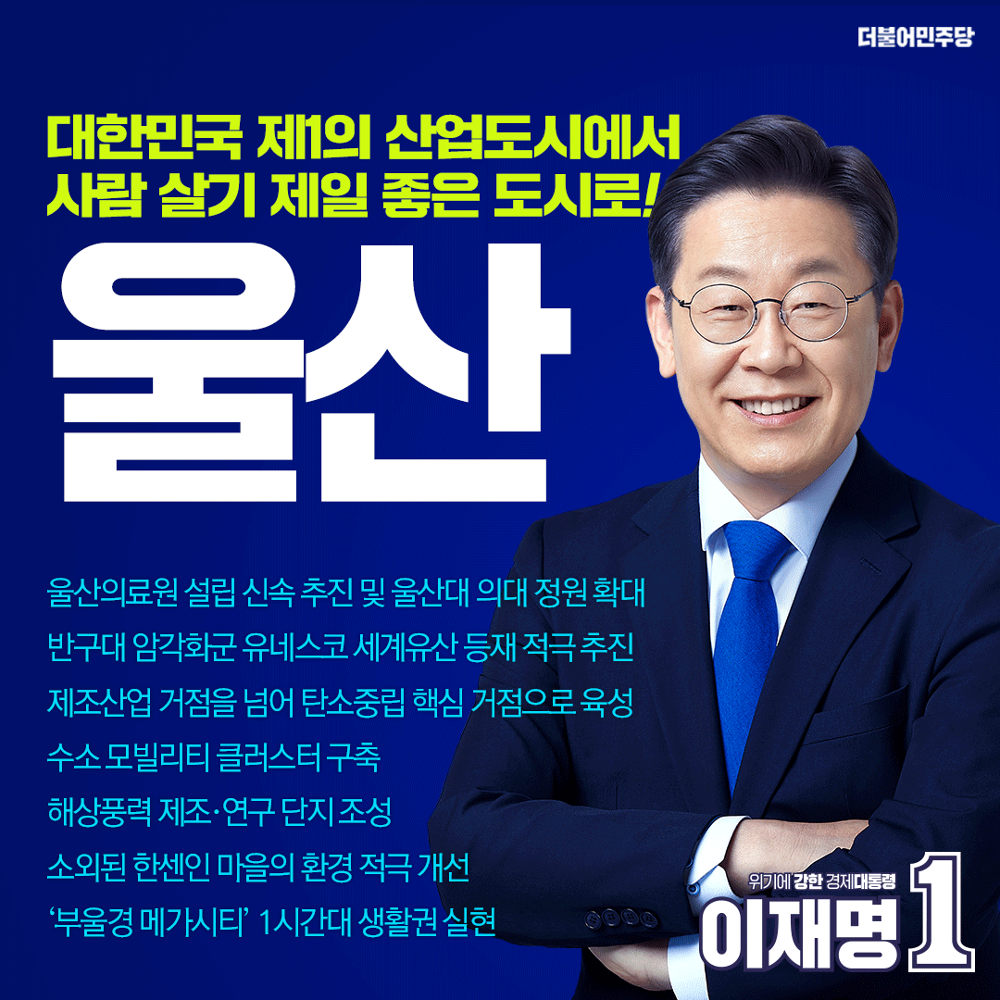

## 지역 공약

# 울산광역시
- [남구](./005_007_001/005_007_001.md)
- [동구](./005_007_002/005_007_002.md)
- [북구](./005_007_003/005_007_003.md)
- [울주](./005_007_004/005_007_004.md)
- [중구](./005_007_005/005_007_005.md)

---

### 의료체계 구축, 그린에너지산업 선도! 사람이 행복한 도시 울산, 이재명은 합니다!
> 2022-02-14

❍ 이 후보는 2월 5일 “의료체계 구축, 그린에너지산업 선도! 사람이 행복한 도시 울산”을 만들겠다는 비전을 제시하며 이를 실현하기 위한 6대 핵심공약을 이행할 것을 울산시민과 국민 앞에 약속헸다.

 

❍ 이날 이재명 후보가 “울산의 변화와 도약을 다시 한번 준비하겠다”는 굳은 각오를 다지며 발표한 울산 6대 핵심공약의 주요 내용은 다음과 같다.

 

❍ 첫째, 울산시민의 건강과 안전을 지킬 의료체계를 구축하겠다는 공약이다.

이 후보는 울산의료원 설립을 조속히 추진하고 울산대 의대 운용을 정상화하겠다고 강조하였다. 특히, 울산대학교 의대는 학생들이 울산에서 의사로 성장할 수 있도록 하고, 의대 정원도 확대하여 지역의료 불균형을 해소하겠다고 밝혔다.

 

❍ 둘째, 반구대 암각화가 있는 울산을 세계문화유산 도시로 발전시켜 나가겠다는 공약이다.

이 후보는 국가 차원에서 반구대 암각화군의 유네스코 세계유산 등재를 적극적으로 추진해 울산을 부울경 관광산업의 허브로 도약하도록 할 것이라고 강조하였다. 이를 위해 ▲암각화 세계유산센터 유치를 추진하고, ▲대곡천 에코지오밸리공원과 둘레길 조성을 추진하겠다고 약속했다.

 

❍ 셋째, 울산의 미래를 준비하기 위해 산업을 과감히 혁신하겠다는 공약이다. 

이 후보는 대한민국 산업수도 울산이 새로운 미래를 열어갈 수 있도록 탄소중립기술 실증화를 지원하여 탄소중립 핵심 거점으로 육성하겠다고 밝혔다. 또한 ▲공정설계기술원 설립과 ▲재활로봇 R&D 연구센터 설립을 지원하고, 울산 제조업의 숙련기술이 계승될 수 있도록 ▲숙련기술진흥원 건립을 추진하겠다고 약속했다. 

 

❍ 넷째, 기후위기에 대응하는 그린에너지 산업을 선도하는 울산을 만들겠다는 공약이다.

이 후보는 이 공약을 이해하기 위해 ▲수소 모빌리티 부품기술 지원센터 설립을 포함한 수소 모빌리티 클러스터 구축을 적극 추진하고, ▲부유식 해상풍력 제조․연구단지를 조성해, 기후위기시대에 울산이 그린에너지 산업을 선도하도록 만들겠다고 약속했다. 

 

❍ 다섯째, 소외된 한센인 마을의 환경을 적극 개선하겠다는 공약이다. 

이 후보는 산업화과정에서 외면되고 방치되어온 한센인 성혜마을의 열악한 환경은 국가가 나서 해결할 문제라는 점을 강조하며, ▲장현첨단산업단지와 연계한 지구단위 재정비사업을 지원하고, ▲평균연령 80세인 한센인의 안정적인 노후생활을 위한 양로주택 건립을 추진하겠다고 약속했다. 

 

❍ 여섯째, ‘부울경 메가시티’를 통해 국토 균형발전을 이루겠다는 공약이다.

이 후보는 부울경 메가시티 1시간대 생활권 실현을 위해 울산과 부산․경남을 잇는 교통망을 확충하겠다고 강조하며, ▲울산~양산~김해를 연결하는 동남권 순환 광역철도 사업 신속 추진하며, ▲부산~양산~울산 광역철도의 재정사업 추진을 적극 지원하고, ▲울산에 수소트램 건설을 지원하여 수소 대중교통의 선도모델을 만들겠다고 약속했다. 또한, 부울경을 수도권 못지않은 경쟁력을 갖춘 메가시티로 만들기 위해 수소경제의 선도지역으로 육성하겠다고 밝혔다. 

 

이재명 후보는 울산 6대 핵심공약 발표를 마무리하면서, “국가적 전환기에 과감한 결단을 통해 위기를 기회로 만들어온 울산은 다시 한번의 변화와 도약을 준비해야 한다”며 “산업도시 울산에서 사람이 행복한 도시 울산으로 탈바꿈 시키겠다”고 약속했다.  