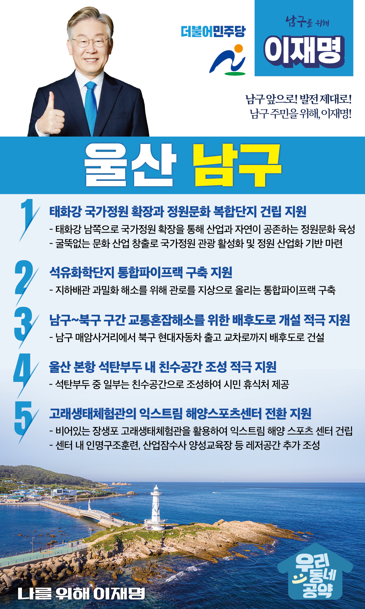

## 울산 지역 공약

# 남구

### 남구 앞으로, 발전 제대로!
> 2022-02-05

존경하는 울산 남구 주민 여러분!

울산 남구는 G20의 경제대국으로 성장하는데 중추적 역할을 담당한 곳입니다. 

1962년 공업센터기공식 뉴스에서는 “이곳 맑은 하늘에 검은 연기가 뒤 덮히는 날 태화강변의 기적이 이룩될 것입니다.”라고 하였습니다.

남구는 그 기적을 이루어 내었습니다.

하지만 앞으로는 맑은 하늘과 푸른 자연이 우리와 후손을 번영시켜 줄 것이며 그것이 새로운 시대정신이 되었다는 말씀을 드립니다.

탄소중립과 그린에너지가 남구의 미래가 될 수 있도록 이재명의 울산 남구 발전 5대 약속을 말씀드리겠습니다.

첫째. 태화강 국가정원 확장과 정원문화 복합단지 건립을 지원하겠습니다.

생명이 숨쉬는 기적의 강 태화강 남쪽으로 국가정원을 확장하여 산업과 자연이 공존하는 정원문화도시 울산 남구를 만들어 가겠습니다.

대한민국 제2의 국가정원에서 굴뚝없는 문화 산업을 창출하여 시민들의 윤택한 삶과 새로운 희망을 주는 도약의 기틀을 마련하겠습니다.

둘째. 석유화학단지 통합파이프랙 구축을 지원하겠습니다.

국내 최초로 지정된 국가산단인 울산 석유화학단지는 지하에 매설된 각종 배관이 노후화되어 안전사고 위험이 높고, 시민들의 불안감도 커지고 있습니다. 

추가 매설 공간 부족으로 기업의 활로 개척에 걸림돌이 되고 있습니다.

관로를 지상으로 올리는 통합파이프랙 구축 사업을 지원하여, 기업의 활력과 남구 시민 안전을 높이겠습니다.

셋째. 남구에서 북구구간 교통혼잡해소를 위한 배후도로 개설을 적극 지원하겠습니다.

 

남구 석유화학단지와 북구 자동차산업공단 구간은 교통혼잡이 극심합니다.이를 해소하기 위해 남구 매암사거리에서 북구 현대자동차 출고 교차로까지 배후도로 건설을 적극 지원하겠습니다.

넷째. 울산 본항 석탄부두에 시민 친수공간이 조성되도록 적극 지원하겠습니다. 

울산 본항의 석탄부두로 인해 남구 주민의 피해가 컸습니다.

석탄부두가 울산신항으로 이전한 만큼 부두 중 일부는 친수공간을 조성하여 시민들 품으로 돌려드리겠습니다. 

해안 친수공간이 주민의 휴식처이자 새로운 관광 명소가 될 것입니다.

다섯째. 고래생태체험관의 익스트림 해양스포츠센터 전환을 지원하겠습니다.

이제 고래를 가두고 쇼를 보는 시대는 지났습니다.

돌고래는 바다로 모두 돌려보내고, 장생포 고래생태체험관은 익스트림해양스포츠센터로 전환하도록 적극 지원하겠습니다. 

이 센터가 인명구조훈련, 산업잠수사 양성교육장, 해양스포츠를 즐기는 레저공간이 될 수 있도록 하겠습니다.

존경하는 남구 주민 여러분!

 

이재명은 지킬 수 있는 것만 약속했고 약속했던 것은 지켜왔습니다.

살기 좋은 울산 남구 미래를 위한 약속,

실력과 성과로 입증된 이재명이 반드시 실천하겠습니다.

 

남구 앞으로! 발전 제대로! 

남구 주민을 위해, 이재명!  

						