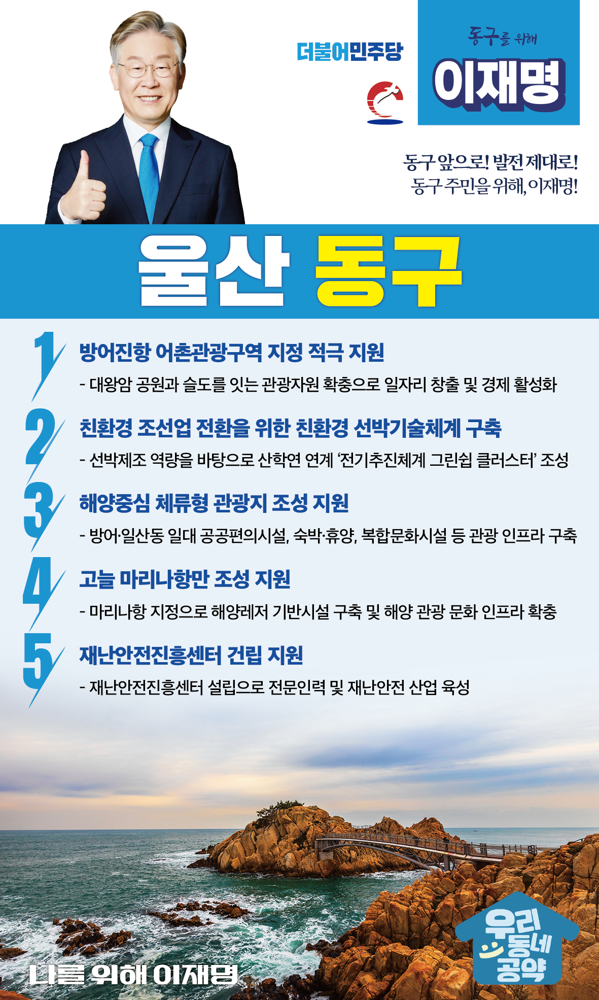

## 울산 지역 공약

# 동구

### 동구 앞으로, 발전 제대로!
> 2022-02-05

존경하는 울산 동구 주민 여러분

 

울산 동구는 1970년대부터 현재까지 대한민국 조선산업의 중심이었으며, 대왕암공원, 슬도, 주전몽돌 해수욕장, 신라의 고찰 동축사 등 천혜의 자연이 어우러진 조선 해양관광도시입니다. 

그러나 최근 현대 중공업 본사 이전과 조선 불황 등 여러 이유로 구민들이 동구를 떠나고 있습니다.

앞으로 동구는 전기추진체계 그린쉽 클러스트 조성을 계기로, 신 조선 산업과 해양생태관광이 도시로 거듭나야 합니다.

 

이를 위한 이재명의 동구 발전 5대 약속을 말씀드리겠습니다.

 

 

첫째. 방어진항의 어촌관광구역 지정을 적극 지원하겠습니다.

 

방어진항은 어업인이 감소하고 어항 기능에 한정되어 관광객 유치에 한계가 있습니다. 

방어진항이 어촌관광구역으로 지정되면,  대왕암공원과 슬도를 잇는 관광자원을 확충할 수 있습니다. 

방어진항에 새로운 일자리를 창출하고 지역경제를 활성화하겠습니다.  

 

둘째. 친환경 조선업 전환을 위해 친환경 선박기술체계를 구축하겠습니다.

 

기후위기 대응을 위해 전기와 수소에 기반한 선박 연료 전환이 필요합니다.  

동구에 발전된 선박제조 역량을 바탕으로 산학연이 연계한  <전기추진체계 그린쉽 클러스터> 조성을 적극 지원하겠습니다.

이 클러스터를 중심으로 조선업의 국제 경쟁력을 높이고, 지역 중,소기업과 상생하여 일자리 창출과 동구경제 활성화를 도모하겠습니다.

 

셋째. 동구를 해양중심 체류형 관광지가 되도록 돕겠습니다. 

 

울산에 오는 관광객 대다수가 볼거리, 먹거리와 숙박시설이 부족하다고 말합니다.  

방어동과 일산동 일대에 숙박·휴양 인프라를 구축하여 해양중심 체류형 관광지 조성이 필요합니다. 

조선업에 의존하던 동구 경제가 관광 분야까지 확대되도록 지원하겠습니다.

 

넷째. 고늘 마리나항만 조성을 지원하겠습니다.

 

동구는 대왕암공원, 일산해수욕장 등 아름다운 대자연을 품고 있습니다. 

또한 조선산업의 메카인 현대중공업이 있습니다. 

이와 같은 인프라를 활용한 고늘 마리나항만 조성이 필요합니다. 

동구에 해양 관광 문화 인프라를 확충하겠습니다.

 

다섯째. 울산시가 추진중인 재난안전진흥센터 건립을 지원하겠습니다.

 

동구는 2019년 염포부두 화재폭발사고를 겪은 바 있습니다. 

주민들은 아직도 재난에 대한 두려움이 큰 상황입니다.

동구에 재난안전진흥센터 설립을 검토하여 전문인력과 재안안전 산업을 육성할 수 있도록 지원하겠습니다.

 

 

존경하는 동구 주민 여러분!

 

이재명은 지킬 수 있는 것만 약속했고 약속했던 것은 지켜왔습니다.

살기 좋은 울산 동구 미래를 위한 약속,

실력과 성과로 입증된 이재명이 반드시 실천하겠습니다.

 

동구 앞으로! 발전 제대로! 

동구 주민을 위해, 이재명! 