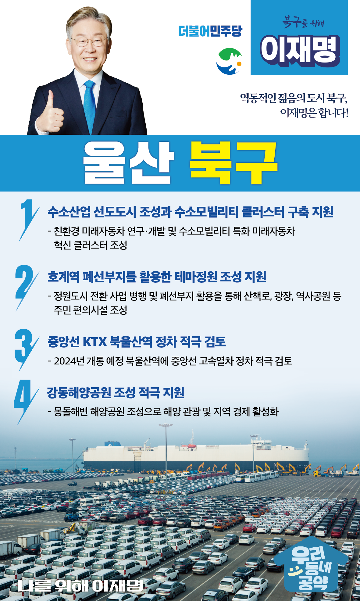

## 울산 지역 공약

# 북구

### 역동적인 젊음의 도시 북구! 
> 2022-02-05

존경하는 울산 북구 주민 여러분, 

 

울산 북구는 대한 광복회 총사령 박상진 의사가 탄생한 호국 도시이자 현대자동차를 중심으로 성장하고 있는 대한민국 최대 자동차 산업도시입니다. 

그림처럼 펼쳐진 강동 동해의 해변이 있는 해양관광도시이기도 합니다.

 

북구는 현대자동차 배후 달천농공단지, 매곡산업단지, 중산산업단지, 모듈화산업단지 등 밀집해 있으며 평균연령 37.6세의 전국에서 가정 젊고 역동적인 노동자 도시이기도 합니다.

 

내일이 더 기대되는 젊은 도시 북구의 미래를 위한 이재명의 4가지 약속을 말씀드리겠습니다.

첫째, 수소산업 선도도시 조성과 수소모빌리티 클러스터 구축을 지원하겠습니다.

 세계는 내연기관에서 전기·수소차로 자동차 산업 대전환이 진행되고 있습니다. 

북구에 친환경 미래자동차 연구와 개발, 수소모빌리티에 특화된 미래자동차 혁신 클러스터를 조성하겠습니다. 

울산 북구의 미래가 대한민국의 미래입니다. 

둘째, 호계역 폐선부지를 활용한 테마정원 조성 지원으로 삶의 질을 높이겠습니다.

 

동해남부선 폐선부지를 녹지축으로 만들어 단절된 도심을 하나로 연결하겠습니다. 

아울러 정원도시로 전환 사업을 병행해 도심 여가와 휴식문화 공간이 조성되도록 적극 지원하겠습니다.

셋째, 중앙선 KTX 북울산역 정차를 적극 검토하겠습니다.

 

울산 북구는 울산 전체 인구가 감소되는 상황에서도 유일하게 인구가 늘고 있는 신도시입니다. 

북울산역에 2024년 개통 예정인 중앙선 고속열차 정차를 적극 검토하겠습니다. 

역세권 개발과 더불어 북구 발전의 새로운 거점이 될 수 있도록 지원하겠습니다.

넷째, 강동해양공원 조성을 적극 지원하겠습니다. 

 

울산 북구에는 천혜의 해양 자연경관을 갖춘 강동 몽돌해변이 있습니다.

이곳을 해양공원으로 조성하여 해양관광과 지역경제 활성화에 원동력이 되도록 적극 지원하겠습니다.

 

  

존경하는 북구 주민 여러분!

 

이재명은 지킬 수 있는 것만 약속했고 약속했던 것은 지켜왔습니다.

살기 좋은 울산 북구 미래를 위한 약속,

실력과 성과로 입증된 이재명이 반드시 실천하겠습니다.

  

북구 앞으로! 발전 제대로! 

북구 주민을 위해, 이재명!