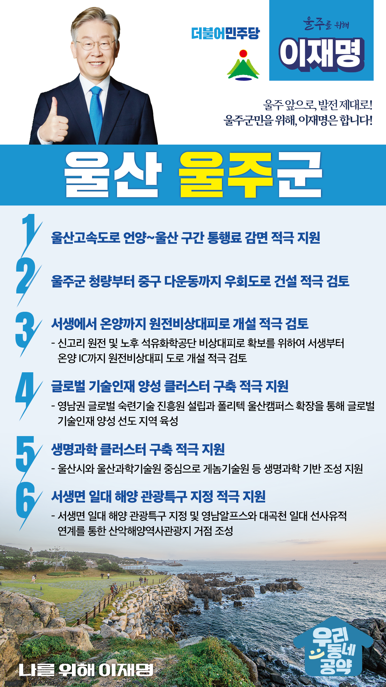

## 울산 지역 공약

# 울주군

### 울주 앞으로, 발전 제대로!
> 2022-02-05

존경하는 울주군민 여러분,

 

울주군은 산업과 자연이 공존하는 서울시의 1.2배에 달하는 광활한 면적을 가진 풍요로운 도시입니다. 

7천 년 반구대 암각화가 말해주듯이 역사가 함께 살아 숨 쉬는 유서 깊은 고장입니다. 

 

울주군은 오늘날 산업수도 울산의 모태라 해도 과언이 아닐 것입니다. 

과거 울산은 농촌 지역이었습니다만 산업화의 길을 걷는 지난 20년 동안 급속한 성장을 거듭해왔습니다. 

울주군의 발전을 위한 이재명의 6대 지역공약을 말씀드리겠습니다.

 

첫째, 울산고속도로 언양･울산 간 통행료 감면을 적극 지원하겠습니다.

울산고속도로 울산~언양 간 통행료 문제는 울산시의 오랜 숙제입니다.

울산고속도로가 경부와 동해고속도로를 연결하는 국가기간교통망의 하나이나 통행료 수입이 이미 시설투자액을 초과했습니다. 

또한, 과도하게 높은 통행료는 울주군민의 경제적 부담입니다. 

다른 고속도로와 형평성을 고려해 통행료 감면을 적극 검토하겠습니다.

 

둘째, 청량에서 다운동까지 우회도로 건설을 적극 검토하겠습니다.

국도 14호선 신복로타리 일대는 상습 교통혼잡으로 사회적 비용이 매우 큽니다.  

울주군 청량부터 중구 다운동까지 우회도로 건설을 적극 검토하여 울산시민 전체의 교통 편익을 높이도록 하겠습니다.

 

셋째, 서생에서 온양까지 원전비상대피로 개설을 적극 검토하겠습니다.

신고리 원전과 노후 석유화학공단 비상시 신속한 대피로 확보가 필요합니다.

이를 위해 서생부터 온양 IC까지 원전비상대피 도로 개설을 적극 검토하겠습니다.  

비상시에 주민들께서 신속하게 대피할 수 있도록 하겠습니다.

 

넷째, 글로벌 기술인재 양성 클러스터 구축을 적극 지원하겠습니다.

현대는 평생학습 사회입니다. 

자동차 조선 등 제조업 분야도 현장의 축적된 기술을 전수하고 신기술을 융합한 기술인력 양성이 무엇보다 중요합니다.

이를 위해 영남권 글로벌 숙련기술 진흥원 설립과 폴리텍 울산캠퍼스 확장을 적극 검토하겠습니다. 

울주군이 글로벌 기술인재 양성 지역이 될 수 있도록 적극 지원하겠습니다.

 

다섯째, 울주군이 추진하는 생명과학 클러스터 구축을 적극 지원하겠습니다.

바이오와 생명공학 분야는 자동차 반도체에 이어 차세대 핵심 성장동력입니다.

울산시와 울산과학기술원이 중심이 되어 추진중인 게놈기술원 등 생명과학 기반 조성을 지원하겠습니다.  

 

여섯째, 서생면 일대 해양 관광특구 지정을 적극 지원하겠습니다.

울주 서생면 일대에는 아름다운 해안선이 있습니다.

이곳을 해양 관광특구로 지정하면, 영남알프스, 대곡천 일대 선사유적과 연계해 산악해양역사관광의 핵심축이 될 수 있습니다.  

자연과 역사를 담은 관광산업을 울주의 새로운 미래먹거리로 육성해 나가겠습니다. 

 

 

 

존경하는 울주군민 여러분!

 

이재명은 지킬 수 있는 것만 약속했고 약속했던 것은 지켜왔습니다.

살기 좋은 울주군 미래를 위한 약속,

실력과 성과로 입증된 이재명이 반드시 실천하겠습니다.

 

울주군 앞으로! 발전 제대로! 

울주군민을 위해, 이재명!