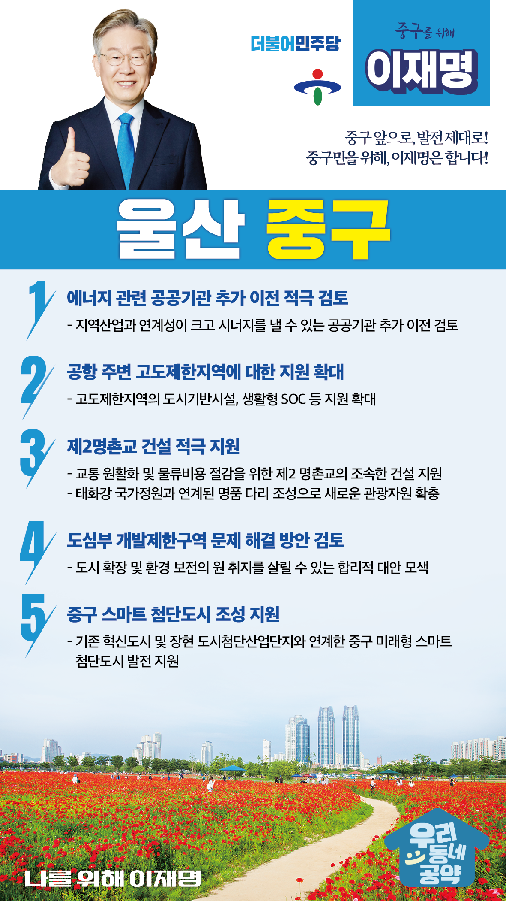

## 울산 지역 공약

# 중구

### 중구 앞으로, 발전 제대로!
> 2022-02-05

존경하는 울산 중구 구민 여러분 

 

 

중구는 1960년대 산업화 이후 울산의 원도심 기능을 수십년간 가져왔습니다.
하지만 광역시 승격 이후 상권이 이동하여 중심지로서의 역할이 점점 감소되어 인구는 줄고 기반시설은 노후화되고 있습니다.

 

중구의 지속발전을 위해서는 새로운 발전전략이 필요합니다.

4차 산업혁명 시대에 맞는 스마트한 도시 기능과 정주 여건 개선이 가장 중요한 과제입니다.

 

이를 위한 이재명의 중구발전 5대 공약을 말씀 드리겠습니다.

 

 

첫째, 에너지 관련 공공기관 추가 이전을 적극 검토하겠습니다. 

울산에는 에너지 관련 공공기관이 이전했습니다. 

울산의 지역산업과 연계성이 크고 시너지를 낼 수 있는 공공기관 추가 이전을 검토해 울산 발전을 지원하겠습니다.

 

둘째, 공항 주변 고도제한지역에 대한 지원을 확대하겠습니다. 

현재 중구는 공항 주변에 일률적인 고도제한으로 과도한 주민 재산권이 침해받고 지역발전이 저해되고 있습니다. 

과도한 희생에 대한 합당한 보상이 필요합니다. 

고도제한지역에 도시기반시설, 생활형 SOC 등 지원을 확대하겠습니다.  

 

셋째, 제2명촌교 건설을 적극 지원하겠습니다. 

울산 산업단지의 남부와 북부를 연결하는 명천교의 교통혼잡이 심각합니다. 

교통 원활화와 물류비용 절감을 위해 제2 명촌교가 조속히 건설되도록 지원하겠습니다. 

제2 명촌교가 태화강 국가정원과 연계한 울산의 명품다리가 될 수 있도록 하겠습니다.

 

넷째. 도심부 개발제한구역 문제 해결 방안을 검토하겠습니다.  

 

울산은 도시 중심부에 그린벨트가 있어 도시 공간구조를 단절하고 균형발전을 저해하고 있습니다. 

울산 도시의 확장과 환경 보전의 원래 취지를 살릴 수 있는 합리적 대안을 모색하겠습니다.  

 

다섯째, 중구가 스마트 첨단도시로 발전하도록 지원하겠습니다. 

울산의 중심인 중구는 산업구조 변화에 발맞춰 원도심의 기능을 회복해야 합니다. 

중구가 혁신도시, 장현 도시첨단산업단지와 연계하여 미래형 스마트 첨단도시로 발전할 수 있도록 지원하겠습니다.

 

 

존경하는 중구 구민 여러분!

 

이재명은 지킬 수 있는 것만 약속했고 약속했던 것은 지켜왔습니다.

살기 좋은 중구 미래를 위한 약속, 실력과 성과로 입증된 이재명이 반드시 실천하겠습니다.

 

중구 앞으로! 발전 제대로! 

중구 구민을 위해, 이재명!  