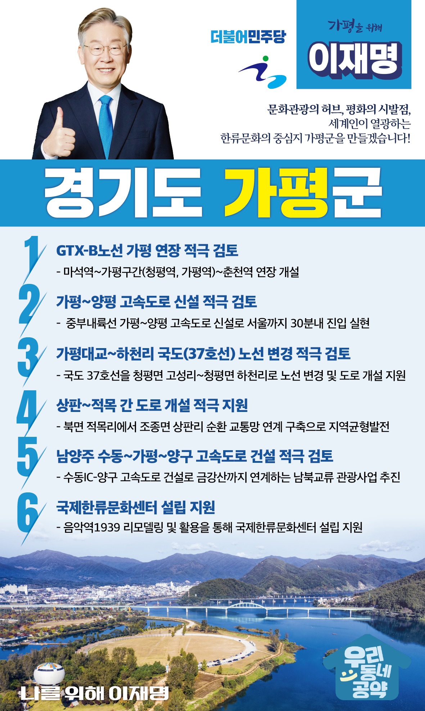

## 경기 지역 공약

# 가평군

### 세계인이 열광하는 한류문화 중심지 가평군!
> 2022-01-25

존경하는 가평군민 여러분

     

가평군은 한반도의 중심이자 천혜의 자연환경과 청정계곡을 보유한수도권 제일의 청정 도시입니다.

또한 연간 1000 만 명이 방문하는 관광의 중심지이고,서울 도심권과 1시간이면 이동이 가능한 교통의 요충지이기도 합니다.

가평군이 지속적으로 성장 발전할 수 있도록이재명과 민주당이 함께 해낼 수 있도록 하겠습니다.

가평군의 중단 없는 발전과 삶의 여유가 있는 품격 있는 도시 완성을 위해가평군민 여러분께 여섯 가지를 약속드리겠습니다.

     

첫째, GTX-B노선의 가평 연장을 적극 검토하겠습니다.

가평군민의 수도권 출퇴근 교통난 해소와 가평의 광역교통망 완성을 위해GTX-B 노선이 가평까지 연장될 수 있도록 적극적으로 검토하겠습니다.

남한강과 북한강을 품은 가평의 교통을 한층 업그레이드 해 내겠습니다.

편리한 교통을 통해 남한강과 북한강을 품은 가평군을문화관광의 허브로 발전시키겠습니다.

     

둘째, 가평-양평 고속도로 신설을 적극 검토하겠습니다.

인구소멸지역으로 선정된 가평군이 소멸위기에서 벗어나기 위해서는교통인프라 구축이 필요합니다.

남이섬과 자라섬, 아침고요수목원 등 가평의 수려한 자연환경을 관광자원으로 활용한관광 허브 도시로 성장하기 위해서는 중부내륙고속도로의 가평 연장이 중요합니다.

가평을 중심으로 한 경기 북부의 경제활성화를 위해 간선교통망 확충을 충실히 검토하겠습니다.

     

셋째, 가평대교~하천리 국도(37호선)의 노선 변경을 적극 검토하겠습니다.

국도 46호선 및 서울-양양간 고속도로의 상습 정체로 인해지역주민과 관광객들이 도로 이용에 큰 불편을 겪고 있습니다.

이를 해소해야 할 국도 37호선 청평구간은 협소하고 굽어 있는 위험 도로입니다.

관광객과 가평군민의 안전한 도로 이용을 위해국도 37호선의 노선변경을 적극 검토하겠습니다.

     

넷째, 상판~적목 간 도로 개설을 적극 지원하겠습니다.

현재 북면과 조종면을 이어주는 도로가 없어지역 주민들이 1시간 30분을 들여 70km를 돌아가고 있습니다.

이를 10분대로 단축하고, 주민과 관광객의 이동시간과 물류비용을 절감하는가평-포천-화천을 잇는 순환교통망 구축이 필요합니다.

이를 위해상판~적목 간 도로 개설을 적극 지원하겠습니다.

     

다섯째, 남양주 수동~가평~양구 고속도로 건설을 적극 검토하겠습니다.

남양주 수동IC에서 양구까지 고속도로가 건설되면수도권과 금강산(내금강 31번국도)을 연결하는 평화의 도로가 조성됩니다.

이를 통해 가평군이 남북교류의 중심지이자, 금강산으로 가는 상징도시가 될 수 있도록수동~양구간 고속도로 건설을 적극 검토하겠습니다.

     

여섯째, 가평군이 추진하는 국제한류문화센터 설립을 지원하겠습니다.

가평군은 자라섬국제재즈페스티벌을 통해세계 속에 한국의 재즈문화를 널리 알린 한류음악의 도시입니다.

가평군이음악역1939를 활용해 추진하고 있는 국제한류문화센터 설립을 지원하여한류문화의 도시 가평, 새로운 한류스타를 배출하는 가평이 되도록 하겠습니다.

가평군은 항상 지역발전에 소외되고 홀대받았습니다.

이재명 후보는 경기도지사로 재직했던 시절 하천정비사업을 통해 청정계곡을 가평군에 돌려드렸습니다.

어느 누구도 하지 못했던 일, 이재명은 했습니다.

     

이재명이 세계인이 찾는 가평

새로운 미래를 창조하는 가평군으로 만들겠습니다.

이제 가평을 위해, 나를 위해 이재명!

						