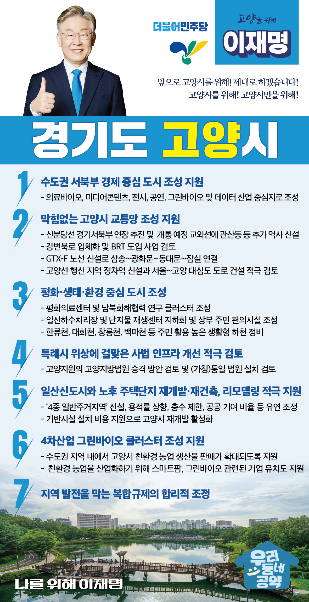

## 경기 지역 공약

# 고양시

### 앞으로 고양시를 위해! 제대로 하겠습니다!
> 2022-01-26

존경하는 고양시민 여러분,

 

고양시는 경기도 북부의 최대 도시이자 

남북평화교류의 중심도시로서 주민들의 거주 만족도가 높은 계획도시입니다. 

하지만 1기 신도시조성 이후 30년간 도시가 급속 성장하면서

교통망은 부족하고 도시 인프라는 낙후되고 있습니다. 

 

고양시가 향후 30년 더 성장할 수 있도록 이재명과 민주당이 지원하겠습니다. 

 

교통이 편리한 4차산업의 중심지, 남북평화 교류의 중심지인 고양의 미래를 위해 

7대 지역공약을 말씀드리겠습니다.

 

첫째, 고양시가 수도권 서북부의 경제 중심지가 되도록 지원하겠습니다.

고양시는 의료바이오, 미디어 콘텐츠 전시․공연, 그린바이오, 데이터 산업의 중심지로 

탈바꿈하고 있습니다. 

고양시 계획이 차질 없이 진행될 수 있도록 정부 차원의 지원을 아끼지 않겠습니다.

고양시는 대한민국의 대표적인 경제도시로 거듭날 것입니다.

 

둘째, 막힘없는 교통망으로 고양시민이 빠르고 편리하게 이동하실 수 있게 지원하겠습니다. 

우선 신분당선의 경기서북부 연장이 원만히 추진되도록 지원하겠습니다. 

더불어 GTX-F 노선을 신설하여 삼송에서 광화문-동대문-잠실까지 

빠르고 편리하고 이용하실 수 있도록 하겠습니다. 

고양시 구도심의 주민들을 위해 향후 개통될 교외선에 관산동 등 추가 역사 신설을 지원하겠습니다. 

고양선 행신지역 정차역 신설과 서울에서 고양까지 대심도 도로 건설을 적극 검토하겠습니다. 

자유로와 강변북로의 만성적인 정체를 해결하기 위해 

강변북로 입체화 및 BRT 도입 사업도 검토하겠습니다.

 

셋째, 고양시의 자연환경을 활용해 평화·생태·환경 도시를 만들겠습니다.

일산테크노밸리에 평화의료연구기반을 조성하고,  

통일정보자료센터와 연계하여 고양시가 평화연구 선도 도시로 만들겠습니다. 

난지 물재생센터와 일산하수처리장이 지하화 될 수 있도록 돕겠습니다.  

호수의 도시인 고양시에 걸맞게 창릉천, 한류천, 대화천, 풍동천이 생태친화적으로 정비되어 

생태, 환경이 살아있는 고양시를 만들겠습니다. 

 

넷째, 특례시 위상에 맞는 사법 인프라 개선을 적극 검토하겠습니다. 

고양시는 인구와 도시규모에 비해 사법행정 인프라가 부족합니다. 

고양지원의 고양지방법원 승격 방안을 검토하겠습니다. 

아울러 통일 이후를 대비하여 가칭 통일법원 설치도 염두에 두겠습니다. 

 

다섯째, 일산신도시와 노후 주택단지의 재개발·재건축, 리모델링을 적극 지원하겠습니다. 

주거환경개선사업의 사업성을 높여 리모델링과 순환 재건축이 빠르게 추진되도록 지원하겠습니다. 

‘4종 일반주거지역’을 신설하고, 용적률 상향, 층수 제한, 공공 기여 비율 등도 유연하게 조정하고 기반시설 설치에 필요한 비용도 지원해 고양시의 재개발 활성화를 돕겠습니다. 

 

여섯째, 고양시에 4차산업 그린바이오 클러스터 조성을 지원하겠습니다.

수도권 지역 내에서 고양시 친환경 농업 생산물 판매가 확대되도록 지원하겠습니다.

또한 친환경 농업을 산업화하기 위해 스마트팜, 그린바이오 관련된 기업 유치도 지원하겠습니다. 

고양시가 친환경 농업 클러스터가 되도록 적극 육성 하겠습니다.

  

일곱째, 지역발전을 막는 복합규제는 합리적으로 조정해 가겠습니다.  

경기북부는 복합규제로 인해 경기 남부에 비해 상대적으로 사회·경제적 발전이 더딥니다. 

경기 남북부 균형발전을 위해 일괄적 수도권 규제에 대한 재검토가 필요합니다.

경기 북부가 일자리 창출과 기업유치, 교통망 구축에 차별받지 않도록 최선을 다하겠습니다.  

 

존경하는 고양시민 여러분

이재명 후보는 경기도지사시절부터 고양시와 고양시민들의 어려움을 이해하고 

문제를 해결하고자 누구보다 노력해왔습니다. 

 

이재명은 하고자 하는 일은 해냈고 할 수 있는 일들은 미루지 않았습니다.

 

109만 고양시민에게 희망과 지속가능한 미래를 선물하겠습니다.  
기업유치, 일자리, 자족도시, 풍부한 교통망까지, 

 

일은 해 본 사람이 잘합니다.

 

앞으로, 제대로 하겠습니다.

고양 109만 시민을 위해, 이재명은 합니다 

						