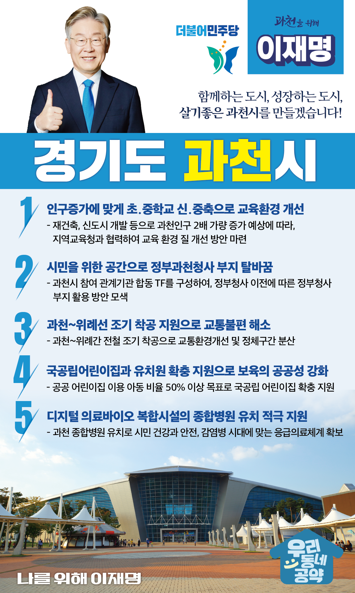

## 경기 지역 공약

# 과천시

### 함께하는 도시, 성장하는 도시, 살기좋은 과천시!
> 2022-01-23

존경하는 과천시민 여러분, 더불어민주당 대선후보 이재명입니다.

 

과천은 서울 강남권과 인접해 있는 행정도시입니다.  

녹지 등 자연환경이 좋고, 풍부한 문화관광 인프라를 갖추고 있어서  누구나 살고 싶어하는 도시입니다. 

 

그러나, 정부청사의 세종시 이전에 따라 지역경제의 활기가 떨어지고 있고 재건축과 신도시 개발 등에 따라 교육과 교통 문제 등 성장통을 겪고 있습니다. 

 

이를 해결하기 위해 과천의 자족 기능을 강화하고, 인프라 확충을 지원하여 과천이 살기 좋은 명품도시로 거듭날 수 있도록 뒷받침하겠습니다. 

 

저 이재명이 지속적으로 성장하는 살기 좋은 과천을 만들기 위해 5가지 약속을 드립니다.

첫째, 과천의 신도시 개발과 재건축 등 인구 증가에 맞춰 초중학교의 교육환경을 개선하겠습니다. 

재건축, 신도시 개발 등으로 과천인구가 2배 가량 증가할 예정입니다.  

그런데 우리 아이들이 다닐 초등학교와 중학교가 부족한 상황입니다. 

지역교육청과 협력하여 교육환경 질이 개선되도록 적극 지원하겠습니다. 

 

둘째, 정부과천청사 일대 부지를 과천의 새 미래를 담아내는 공간으로 만들겠습니다. 

지난 8.4 부동산 대책의 사업지 재조정 이후에 과천청사 일대 부지의 활용방안에 대한 시민들의 기대와 우려를 잘 알고 있습니다.

정부청사 일대 부지를 과천의 미래를 담아낼 수 있는 공간으로 만들겠습니다. 

이를 위해 과천시가 참여하는 관계기관 합동 TF를 구성하여 정부과천청사 일대 부지의 활용방안을 모색하겠습니다. 

 

셋째, 과천~위례선의 조기 착공을 지원하여 과천시민의 교통 불편을 해소하겠습니다. 

과천에서 사당이나 양재로 가는 길은 극심한 만성정체로 유명합니다. 

이를 해결하기 위해 과천~위례간 전철을 조기 착공을 지원하고, 과천 시민의 교통불편을 해소하겠습니다. 

 

넷째, 과천시 내 국공립어린이집과 유치원의 확충을 지원하겠습니다.  

재건축과 주택개발로 신혼부부, 청년층 유입은 증가하고 있지만 보육시설은 많이 부족합니다. 

공공 어린이집 이용 아동 비율 50% 이상을 목표로 국공립 어린이집 확충을 지원하겠습니다.

 

다섯째, 과천시 종합병원 유치를 적극 지원하겠습니다. 

과천은 향후 10년 이내에 인구가 15만명에 달할 것으로 예상되지만 종합병원 수준의 의료시설이 전무합니다. 

과천에 종합병원이 들어올 수 있도록 지원하여 시민의 건강과 안전을 지키고, 코로나와 같은 감염병 시대에 맞는 응급의료체계를 갖추겠습니다.

 

과천시민 여러분, 

이재명은 지킬 수 있는 것들만 약속합니다. 약속은 실천으로 보여드렸습니다.

과천 앞으로, 발전 제대로!

나를 위해, 과천을 위해 이재명입니다. 

						