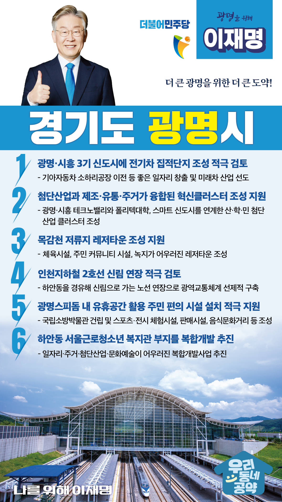

## 경기 지역 공약

# 광명시

### 더 큰 광명을 위한 더 큰 도약!
> 2022-01-23

존경하는 광명시민 여러분,

 

서울의 베드타운이었던 광명시는 지난 10년 동안 눈부신 발전을 이뤄왔습니다. 

구도심 환경개선과 도시재생, 사통팔달 광역교통, KTX광명역세권의 상생을 통해 성장 가능성을 입증하며 대한민국에서 가장 주목받는 도시가 되었습니다.

  

광명·시흥 테크노밸리, 광명동·철산동, 하안2공공주택지구, 구름산지구 재개발로 ‘더 큰 도약’을 준비하고 있습니다.

  

광명의 중단없는 발전과 품격있는 명품도시 완성을 위해 시민 여러분께 여섯 가지를 약속드립니다.

  

첫째, 광명·시흥 3기 신도시에 전기차 집적단지 조성을 적극 검토하겠습니다. 

  

전기차 집적단지 조성으로 좋은 일자리가 창출되고, 광명·시흥이 미래차 산업을 선도하게 될 것입니다.  

  

둘째, 광명․시흥을 첨단산업과 제조․유통․주거가 융합된 혁신클러스터로 키우겠습니다. 

  

광명·시흥 테크노밸리와 폴리텍대학, 스마트 신도시를 연계한 서울 서남부 산‧학‧민 산업 클러스터 조성되도록 지원하겠습니다.

첨단‧혁신 산업 거점과 맞물린 광명‧시흥 신도시는 그린 스마트 도시의 표준이 되도록 돕겠습니다.  

  

셋째, 목감천 저류지가 레저타운으로 조성되도록 지원하겠습니다. 

  

목감천 7만 5천평 저류지에 광명시가 추진하는 체육시설, 주민 커뮤니티 시설, 녹지가 어우러진 레저타운이 조성되어 광명시민들에게 체험형 관광지가 될 수 있도록 돕겠습니다.  

  

넷째, 인천지하철 2호선 신림 연장을 검토하겠습니다.

광명시에는 인구 20만명 규모의 택지개발사업이 진행되고 있어 광역교통체계를 선제적으로 구축해야 합니다. 하안동을 경유해 신림으로 가는 연장노선을 검토하겠습니다. 

  

다섯째, 광명스피돔 경륜장을 문화, 체육, 예술, 청년, 창업을 위한 공간이 되도록 돕겠습니다. 

  

국민의 생명과 재산을 지키는 소방관들의 자긍심이 될 국립소방박물관을 차질 없이 건립하겠습니다.  

또한 광명 스피돔 유휴공간 6,000여평을 활용해 스포츠ㆍ전시 체험시설, 판매시설, 음식문화거리를 조성하는 광명시 계획을 적극 지원하겠습니다. 

  

여섯째, 하안동 서울근로청소년 복지관 부지를 복합개발하겠습니다.

  

지난 6년간 방치되어온 서울근로청소년복지관의 복합개발을 추진하여 광명시민의 품으로 돌려드리겠습니다. 

  

  

존경하는 광명시민 여러분,

 

지난 10년간, 더불어민주당은 변화의 무풍지대였던 광명에 변화의 씨앗을 뿌려 왔습니다. 

그 씨앗이 열매를 맺을 수 있도록, 확고한 미래비전과 실행력을 갖춘 이재명이 ‘더 큰 광명을 위한 더 큰 도약’을 이루겠습니다.

이재명이 열어갈 광명시의 미래를 기대해주십시오.

  

앞으로 제대로 

이재명이 하겠습니다. 