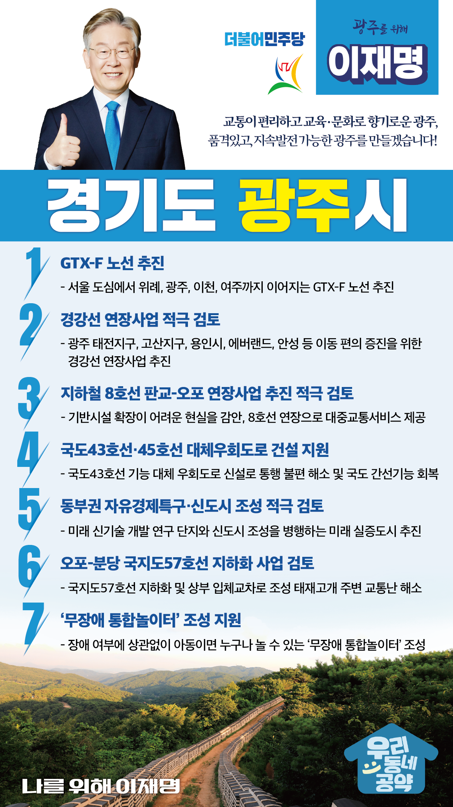

## 경기 지역 공약

# 광주시

### 교통이 편리하고 교육, 문화로 향기로운 광주! 
> 2022-01-24

존경하는 광주시민 여러분, 

 

경기도 동부권의 중심, 천년 역사의 광주는 오랜 세월 수십 년 전의 낡은 규제에 묶여 희생해왔습니다.

이런 악조건 속에서 무관심하고 무책임했던 행정은 아름다운 우리 광주에 난개발이라는 더 깊은 상처를 냈습니다.

 

광주시가 경기도 동부권의 교육과 문화의 도시, 첨단산업과 교통 허브로 발돋움하기 위해서는 경기도의 현실을 누구보다 잘 알고 있는 일꾼이 필요합니다.

광주의 중단없는 발전과 품격있는 도시 완성을 위해 도정운영 성과와 실력으로 입증된 이재명이 광주시민 여러분께 7가지를 약속드립니다.

 

첫째, 수도권 동남부권역 지역불균형을 해소하기 위해 광주에도 ‘GTX-F 노선’을 추진하겠습니다. 

수도권 동남부권역에 위치한 광주시, 여주시, 이천시는 택지개발과 기업환경개선으로 인구가 증가하고 있습니다. 

서울 주요 중심지역으로의 접근성을 위한 교통 인프라 확보가 필요합니다. 

서울 도심에서 위례, 광주, 이천, 여주까지 이어지는 GTX-F 노선을 추진하겠습니다. 

 

둘째, 경강선 연장사업을 적극 검토하겠습니다.  

광주시를 생태 친화적 문화·관광 허브로 발전시키기 위해서는 경강선 연장사업이 꼭 필요합니다. 

광주 태전지구, 고산지구, 용인시, 에버랜드, 안성 등으로 쉽게 이동하실 수 있게 경강선 연장사업이 추진될 수 있도록 노력하겠습니다. 

 

셋째,‘지하철 8호선 판교-오포’연장사업이 추진되도록 노력하겠습니다.  

광주시 오포지역은 도시개발과 교통량 증가로 큰 불편을 겪고 있습니다. 

기반시설 확장이 어려운 지역 현실을 감안하면 철도인프라 확충이 필요합니다. 

오포지역에 철도시대가 열릴 수 있도록 적극 검토하겠습니다. 

 

넷째, 국도43호선·45호선 대체우회도로가 건설되도록 지원하겠습니다.

경기 동부권은 광역교통망이 부족한 곳입니다.

국도43호선·45호선 대체우회도로를 건설하면 통행 불편은 해소되고, 광역도로망을 이용하는 광주시민들의 편의는 높아집니다. 

지역 균형 발전에 기여할 수 있도록 노력하겠습니다.

 

다섯째, 동부권 자유경제특구·신도시 조성을 적극 검토하겠습니다.  

경기 동부지역은 각종 중첩규제에 묶여 균형발전과 지역개발이 제한 받아 왔습니다.

이제는 동부권 발전을 위해 연구자들이 실제 거주하면서, 연구할 수 있는 자유경제특구 또는 신도시 조성 등 인프라 구축을 적극 검토하겠습니다.

 

여섯째, 태재고개 주변의 교통난 해소를 위해 국지도57호선의 지하화를 검토하겠습니다.

태재고개의 만성적 교통정체로 시민들이 오랫동안 많은 불편을 겪어오고 있습니다. 

국지도57호선을 지하화하고 상부는 입체교차로로 조성하면 출퇴근 시간의 극심한 교통정체가 상당히 해소될 수 있습니다. 

이 구간에 대한 지하화 사업을 적극 검토하겠습니다.  

 

일곱째, 광주시에 ‘무장애 통합놀이터’가 조성될 수 있도록 지원하겠습니다. 

광주시는 난개발로 인해 아이들이 마음 놓고 뛰어놀 수 있는 공간이 부족합니다. 

특히 장애아동이 이용할 수 있는 놀이시설이 턱 없이 부족합니다. 

장애 여부와 상관없이 아이들 누구나 마음껏 놀 수 있는 ‘무장애 통합놀이터’가 조성될 수 있도록 적극 지원하겠습니다.

 

“앞으로 제대로 광주의 중단없는 발전을 위해, 이재명”  

						