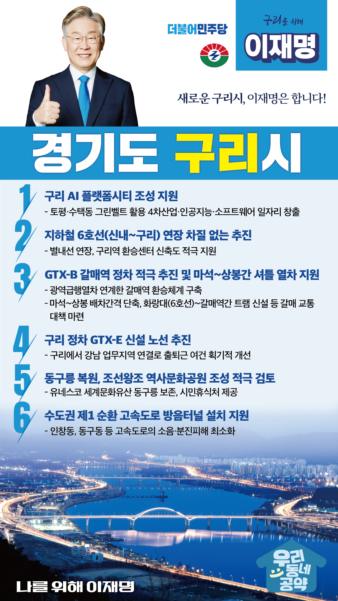

## 경기 지역 공약

# 구리시

### 새로운 구리시, 이재명은 합니다!
> 2022-01-25

존경하는 구리시민 여러분 반갑습니다.

 

구리시는 고구려의 기상이 넘치고, 조선의 숨결이자 세계문화유산 동구릉을 보유한 역사문화 도시입니다.

경기도의 정중앙에 위치하여 서울과 수도권 어디든 빠르게 이동할 수 있는 사통팔달의 교통요지이며 발전가능성이 무궁무진한 기회의 도시입니다.

  

이제 구리시의 대전환을 추진할 때입니다. 

시민행복 특별시인 구리를 산업과 교통의 거점도시로 만들기 위해 저 이재명이 구리시민께 약속드리는 맞춤형 지역공약 여섯 가지를 말씀드리겠습니다.

  

첫째, 구리시의 AI 플랫폼시티 조성을 지원하겠습니다.

  

디지털과 에너지 대전환 시대를 맞아 구리시가 AI 스마트 인프라와 친환경 에너지 도시가 될 수 있도록 적극 지원하겠습니다.

첨단 산업 생태계와 AI, 소프트웨어 전문인력 교육 및 양질의 일자리가 선순환하는 구리 발전의 새로운 원동력을 만들겠습니다.

  

둘째, 지하철 6호선 연장을 차질 없이 추진하겠습니다. 

  

신내에서 구리까지 6호선 연장하여 구리 시민들의 출퇴근 길이 보다 편리해질 수 있도록 지원하겠습니다.

더불어 시민 행복과 교통복지 향상을 위해 별내선 연장사업과 구리역 환승센터 신축도 적극 지원하겠습니다. 

  

셋째, GTX-B 갈매역 정차를 적극 추진하고, 마석-상봉간 셔틀열차, 갈매 트램을 통해 갈매지역 교통문제를 해결하겠습니다. 

  

GTX 노선은 수도권 교통의 중추적 역할을 하게 될 것입니다.

갈매지역의 교통여건 개선을 위해 갈매역에서도 GTX-B 열차를 탈 수 있도록 적극 추진하겠습니다.

  구리 갈매지구 1만여세대, 갈매역세권 6,300여세대, 태릉골프장 6,800세대 등 갈매 일대의 주택 수요에 맞는 교통 대책이 필요합니다. 

마석-상봉간 셔틀열차를 통해 경춘선 배차 간격을 단축하고, 6호선 화랑대역과 갈매역간 트램 신설 등을 통해 갈매동 주민의 교통 불편 해소를 돕겠습니다.

  

넷째, GTX-E 노선을 신설해 구리시 교통혁명을 이뤄내겠습니다. 

  

GTX-E 노선으로 구리에서 강남 업무지역을 연결해 서울 출퇴근시간을 획기적으로 줄이겠습니다. GTX-E 노선이 신설되면 구리시의 교통 환경이 획기적으로 개선될 것입니다. 

  

다섯째, 동구릉을 복원하고 조선왕조 역사문화공원 조성을 적극 검토하겠습니다.

  

2009년 유네스코 세계문화유산으로 등재된 동구릉 전역에 우거진 숲과 개울 등 동구릉 일대를 조선왕조 역사문화공원으로 조성하여 천혜의 자연환경을 보존하고 시민들에게는 보다 쾌적한 휴식처가 되도록 돕겠습니다.

  

여섯째, 수도권 제1 순환 고속도로 방음터널 설치를 지원하겠습니다.

  

수도권 순환 고속도로의 교통량 증가로 소음과 분진이 갈수록 늘고 있습니다.

이로 인해 인창동과 동구동 주민께서 많은 불편을 겪고 있습니다.

순환도로 일부 구간에 방음터널을 설치하여 주민의 생활불편을 해소할 수 있도록 적극 지원하겠습니다. 

  

전국 기초자치단체 중 면적이 가장 좁은 구리시는 가장 효율적인 도시로 대전환해야 합니다. 

이를 위해서는 꼼꼼한 설계와 인프라가 뒷받침되어야 합니다. 

  

지역주민의 민생을 최우선으로 하는 후보, 구리시민의 삶을 지켜낼 후보 구리 시민 행복을 위해 꼭 필요한 이재명이 되도록 하겠습니다.

  

새로운 구리시, 이재명은 합니다! 