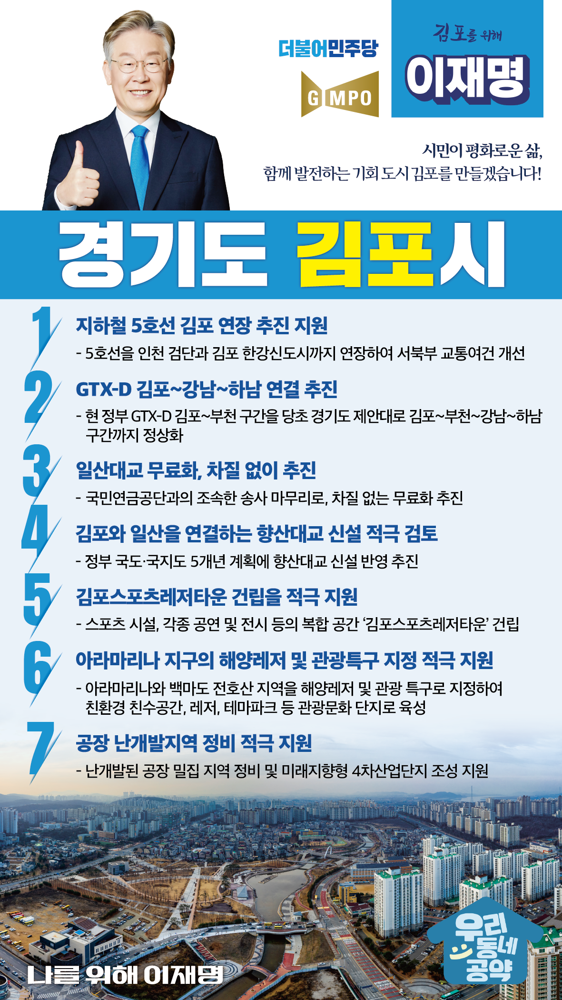

## 경기 지역 공약

# 김포시

### 시민이 평화로운 삶, 함께 발전하는 기회 도시 김포!
> 2022-01-27

존경하는 김포시민 여러분

 

 

인구 50만의 성장도시 김포, 그러나 급속한 성장에도 불구하고 교통과 교육, 복지 문화 등 관련 인프라가 뒤따르지 못하면서 시민들의 불편이 계속되어 왔습니다. 

 

새로운 김포, 발전하는 기회 도시 김포를 위해 교통망 확충과 체육문화 관광시설, 괘적한 주거환경 조성을 비롯한 이재명의 김포발전 미래상을 제시합니다.

 

 

첫째, 지하철 5호선의 김포 연장이 원활하게 추진되도록 지원하겠습니다.

 

서울지하철 5호선을 인천검단과 김포 한강신도시까지 연장하여 김포를 비롯한 서북부지역 주민들의 교통여건을 개선하겠습니다. 

 

둘째, GTX-D가 김포에서 강남을 거쳐 하남까지 연결되도록 추진하겠습니다.

김포가 강남 등 서울 도심까지 30분에 연결되도록 GTX-D는 현 정부의 김포~부천 구간을 당초 경기도의 제안대로 김포~부천~강남~하남 구간까지 정상화하겠습니다. 

 

셋째, 일산대교 무료화, 차질 없이 추진하겠습니다.

 

1.4㎞ 통행에 편도 1,200원의 비싼 요금을 내고 이용해야 하는 일산대교. 김포를 비롯한 경기 서북부지역과 인천시민들의 교통기본권을 제약하고 있습니다. 
국민연금공단의 송사를 조속히 마무리짓고 무료화를 차질 없이 추진하겠습니다.

 

 

넷째, 김포와 일산을 연결하는 향산대교 신설을 적극 검토하겠습니다. 

 

김포시 풍무지역과 시네폴리스, 향산지역은 복합개발사업이 빠르게 진행되고 있습니다.  

이제는 일산 신도시와 물류·인적교류를 확대해 지역발전 잠재력을 높여야 합니다. 

김포와 일산을 연결하는 향산대교가 추진될 수 있도록 노력하겠습니다. 

 

다섯째, 김포시가 추진하는 김포스포츠레저타운 건립을 적극 지원하겠습니다.

 

김포시는 문화 체육 인프라가 턱없이 부족해 수요를 따라가지 못하고 있습니다. 
스포츠 시설 뿐만 아니라 각종 공연과 전시 등 복합공간으로 활용 가능한 시설이 필요합니다. 김포시의 김포스포츠레저타운 건립을 적극 지원하겠습니다.

 

 

여섯째, 아라마리나 지역이 해양레저, 관광특구로 거듭나도록 적극 지원하겠습니다. 

 

항만시설인 아라마리나 지역과 전호산, 백마도를 연계하여 해양레저, 문화 관광 단지로 개발하는 계획이 수립되고 있습니다.
앞으로 친수공간, 복합문화공간, 생태공원과 테마파크를 조성하여 김포시민의 휴식과 문화공간이 되도록 지원하겠습니다.

 

 

일곱째, 공장 난개발지역 정비를 적극 지원하겠습니다.

김포시 북부에 있는 거물대리 지역은 생활권에 인접한 지역에 공장이 혼재하여 주거환경이 열악합니다. 

난개발된 공장 밀집 지역을 정비하고, 미래지향형 4차산업단지가 조성되도록 지원하여 쾌적한 주거환경이 될 수 있도록 하겠습니다. 

 

 

존경하는 김포시민 여러분!

 

시민의 삶이 평화로워지고 함께 성장하는 미래 도시 김포를 위한, 
저 이재명이 드리는 약속! 실천으로 제대로 보여드리겠습니다. 

 

 

김포 시민행복 앞으로, 

교통망 확충 제대로, 

나를 위해 이재명! 

						