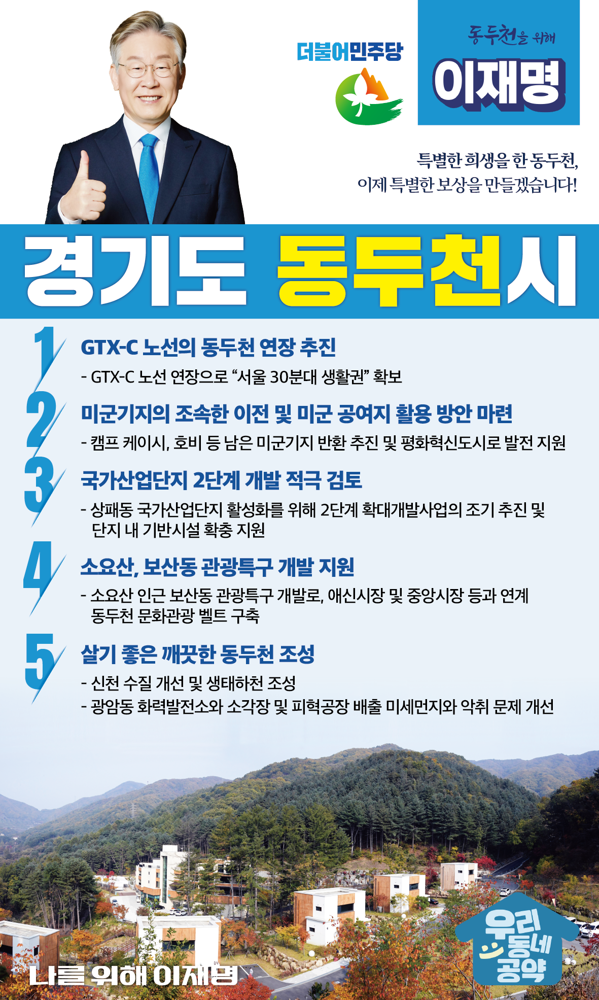

## 경기 지역 공약

# 동두천시

### 특별한 희생을 한 동두천, 이제 특별한 보상을 만들겠습니다!
> 2022-01-25

존경하는 동두천시민 여러분,

토정 이지함이 한반도의 중심지로 명한 동두천은 ‘경기의 소금강’으로 불리며 원효대사와 요석공주의 설화가 깃든 소요산이 있는 곳입니다.

 

동두천은 한국전쟁 이후 미군 주둔과 함께 많은 변화를 겪었습니다.

시민들의 의지와는 상관없이 국가안보를 위해 70년간 전체 면적의 약 30%에 달하는 부지를 미군에 제공해왔습니다.

 

그러나 산업 기반이 전무한 상태에서 미군의 평택기지 이전과 함께 지역경제는 파탄지경에 이르렀습니다.

 

대한민국 안보를 위한 70년의 특별한 희생에 대해 경의를 표하며 동두천시민 여러분께 동두천시의 재탄생을 위해 다섯 가지 약속을 드립니다.

 

 

첫째, GTX-C 노선의 동두천 연장을 추진하겠습니다.

국가발전계획에서 소외되었던 동두천에 GTX-C 노선 연장을 추진하겠습니다. 

동두천시민들의 교통편의와 삶의 질을 향상시키고, 남북경협 시대를 대비한 새로운 도약에 발판을 마련하겠습니다. 

GTX-C 노선 연장으로 동두천을 “서울 30분대 생활권”으로 만들겠습니다. 

 

둘째, 미군기지를 조속히 이전하고 동두천이 평화혁신도시로 거듭나도록 하겠습니다.

캠프 케이시, 호비 등 남은 미군기지 반환을 추진하고 동두천을 평화혁신도시로 발전시키겠습니다. 

미군 공여지 활용방안에 대한 시민들의 의견을 듣고 동두천이 남북경제협력시대를 이끌 수 있도록 정부가 적극 지원하겠습니다. 

 

셋째, 동두천 국가산업단지 2단계 개발을 적극 검토하겠습니다. 

동두천에는 미래먹거리 산업의 육성이 필요합니다.

정체되어 있는 상패동 국가산업단지의 활성화를 위해 2단계 확대개발사업의 조기 추진하고 단지 내 기반시설 확충을 지원하겠습니다.  

 

넷째, 소요산, 보산동 관광특구 개발로 동두천이 경기북부 문화 관광의 중심이 될 수 있도록 지원하겠습니다.

소요산은 동두천의 관광명소로 유명하지만 연계할 수 있는 관광 인프라가 부족한 상황입니다.

소요산 인근에 문화관광시설이 조성과 전통문화가 깃든 보산동 관광특구를 개발로 애신시장, 중앙시장 등과 연계한 동두천 문화관광 벨트가 구축되도록 돕겠습니다. 

동두천을 사람이 모여드는 관광도시로 만들겠습니다.

 

다섯째, 살기 좋은 깨끗한 동두천이 되도록 돕겠습니다. 

하패리 축산농가와 음식쓰레기처리장에서 배출되는 악취로 시민의 불편이 큽니다. 

 악취 시설을 적극 관리하고 근본적 해결책을 마련하겠습니다. 

국가 하천으로 승격된 신천의 수질을 개선하고 생태하천으로 조성하겠습니다.
광암동 화력발전소와 쓰레기 소각장 및 피혁공장에서 배출되는 미세먼지와 악취 문제의 개선책도 마련하여 깨끗하고 살기 좋은 동두천시를 만들겠습니다. 

 

 

특별한 희생을 한 동두천! 

이제 이재명과 민주당이 특별한 보상을 만들겠습니다.

 

새로운 동두천을 위해, 이재명! 

						