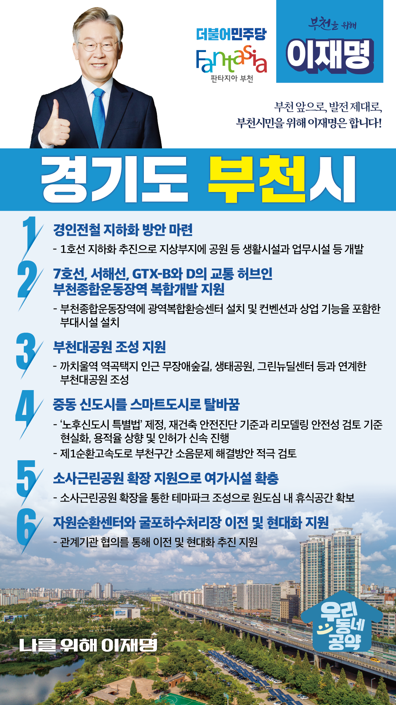

## 경기 지역 공약

# 부천시

### 부천 앞으로, 발전 제대로, 부천 시민을 위해 이재명!
> 2022-01-26

존경하는 부천시민 여러분, 

 

사통팔달 시원한 교통, 원도심과 신도심의 균형감 있는 발전으로 부천의 브랜드 가치를 높이겠습니다.

부천은 서부수도권 중심도시이자 유네스코가 지정한 동아시아 최초의 문학 창의 도시입니다.

 

부천은 새로운 미래를 향해 나아가야 합니다.

창의도시 부천, 문화도시 부천을 넘어 균형발전도시 부천으로 나아가야 합니다. 

부천은 수도권 규제가 있고, 토지 면적이 부족하여 외적 성장에는 한계가 있습니다. 

부천의 체력을 튼튼하게 내실을 다지는 성장 전략이 필요합니다.

 

부천 앞으로, 발전 제대로, 부천시민을 위해 이재명이 부천발전 6대 전략을 말씀드리겠습니다.

 

 

첫째, 83만 부천시민의 숙원이던 경인전철 지하화 방안을 마련하겠습니다. 

 

도심을 양분하는 경인전철은 부천지역 발전의 가장 큰 걸림돌이었습니다. 

1호선 지하화를 추진하여 단절된 도시를 연결하겠습니다. 

지상부지는 공원 등 생활시설과 함께 일부 지역은 업무시설 등으로 개발하여 단절된 도시를 잇고 정주환경을 더 쾌적하게 바꾸겠습니다.

 

둘째, 7호선, 서해선, GTX-B와 D의 교통 허브인 부천종합운동장역 복합개발을 지원하겠습니다. 

 

Y자 노선으로 추진되는 GTX-D로 부천시민들은 인천공항과 서울 도심으로 양쪽으로 이동이 가능해집니다.

부천을 “서울 30분대 생활권”으로 만들겠습니다.

4중 역세권이 될 부천종합운동장역에는 광역복합환승센터를 설치하여 쉽고 편하게 환승할 수 있도록 돕겠습니다.

또한 컨벤션과 상업 기능을 포함한 부대시설을 설치하여 도시경쟁력이 강화되고 양질의 교통서비스가 제공될 수 있도록 지원하겠습니다.  

 

셋째, 부천대공원을 조성하여 부천시민의 쉼터가 되도록 지원하겠습니다.  

 

부천에는 우수한 자연환경을 지닌 생태공원과 도시공원이 필요합니다.

까치울역 역곡택지 인근에 부천대공원을 조성하여 무장애숲길, 생태공원, 그린뉴딜센터 등과 연계한 도심 속 대단위 힐링 휴식공간이 만들어질 수 있도록 하겠습니다.

 

 

넷째, 중동 신도시를 스마트도시로 탈바꿈시키겠습니다. 

 

중동 신도시는 노후화됨에 따라 주차난, 층간소음, 기반시설이 낡아 시민의 불편이 가중되고 있습니다. 

시민 누구나 안전하고 쾌적한 환경에서 살아갈 수 있도록 ‘노후신도시 특별법’을 제정해 중동을 스마트도시로 탈바꿈시키겠습니다. 

재건축 안전진단 기준과 리모델링 안전성 검토기준을 현실에 맞게 완화하겠습니다.  

용적율을 높이고 인허가를 신속히 진행해 시간과 비용을 줄이겠습니다. 

또한 제1순환고속도로 부천구간의 소음문제 해결방안도 적극 검토하겠습니다.

 

다섯째, 소사근린공원 확장을 통해 시민들의 여가시설이 늘어날 수 있도록 돕겠습니다. 

 

부천의 대표적인 원도심인 소사, 역곡, 심곡본동 지역은 공원과 여가시설이 부족합니다.

소사근린공원이 조속히 확장되도록 지원하겠습니다. 이 부지에 부천시가 추진하는 테마파크가 조성되어 원도심 내 휴식공간을 충분히 확보할 수 있도록 지원하겠습니다. 

 

여섯째, 자원순환센터와 굴포하수처리장의 원만한 이전과 현대화를 돕겠습니다.  

 

부천 대장신도시 인근에 있는 자원순환센터와 굴포하수처리장은 이전이 필요합니다. 

관계기관과 협의하여 이전과 현대화가 원만히 추진되도록 지원하겠습니다. 

 

부천시민의 숙원 사업들을 누가 할 수 있습니까?

강력한 추진력과 남다른 행정력을 갖춘 후보! 이재명은 합니다.

검증된 능력으로 공정하고, 투명하며, 부강한 대한민국을 만들겠습니다.

부천의 가치를 높이겠습니다.

 

부천 앞으로, 발전 제대로, 

부천시민을 위해 이재명은 합니다.  

						