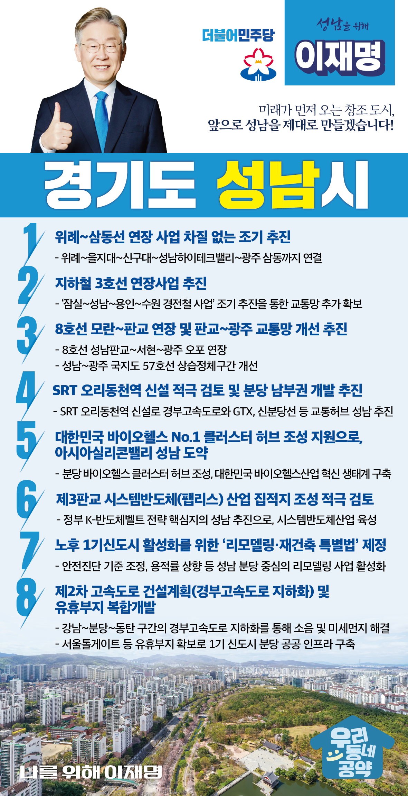

## 경기 지역 공약

# 성남시

### 미래가 먼저 오는 창조 도시, 성남!
> 2022-01-24

존경하고 사랑하는 성남시민 여러분, 

 

성남은 이재명 후보의 출발지이자 중심지입니다. 

성남은 가장 먼저 앞으로, 제대로 나아갈 준비가 된 저력이 있는 도시이기도 합니다. 

 

미래가 가장 먼저 오는 성남을 만들기 위해 사통팔달 교통망사업으로 첨단도시를 완성해야 합니다.

교통 사각지대 없는 성남을 제대로 만들겠습니다.

 

성남시 3대 핵심 전략산업 바이오헬스, 게임, AI에 시스템반도체 산업을 추가해 4대 핵심전략산업 거점도시를 구축해 지속가능한 성남을 만들어야 합니다. 

 

30년이 경과된 분당 1기신도시에 대한 특별한 대책도 필요합니다. 

열악한 노후주거환경을 개선하고, 미래 수요도 반영되어야 합니다.  

 

이재명 후보와 민주당이 미래가 먼저 오는 창조도시 성남을 위해 8가지를 약속드립니다.

 

첫째, 위례~삼동선 연장사업을 차질 없이 추진하겠습니다. 

성남시 위례동·양지동·중원구·상대원동 하이테크밸리의 고질적인 교통 혼잡을 해소하기 위해 위례-삼동선 사업을 차질 없이 추진하겠습니다.

편리한 교통을 통해 원도심의 균형발전과 하이테크밸리의 경쟁력까지 강화하겠습니다. 

 

둘째, 지하철 3호선의 연장사업을 추진하겠습니다.  

성남시 고등택지지구, 금토택지지구, 대장동 택지개발지구 등 새로 조성되는 택지지구는 교통망 추가확보가 시급합니다. 

성남의 첨단산업단지를 연계해 지역경제와 고용도 활성화해야 합니다. 

지하철 3호선을 성남·용인·수원까지 연장하여 첨단도시로 가는 길을 앞당기겠습니다.

 

셋째, 8호선 모란~판교 연장사업과 판교~광주 교통망 개선대책을 조속히 추진하겠습니다.

지하철 8호선을 성남판교·서현·광주오포까지 연장해 교통망을 확충하고 원도심과 신도심 간 대중교통체계를 개선하겠습니다. 

판교 테크노밸리와 연계한 직주근접 지역경제 활성화 및 고용 창출이 가능해질 것입니다.

성남~광주 국지도 57호선 상습정체구간 개선대책을 적극 지원하겠습니다. 

 

넷째, SRT 오리동천역 신설을 적극 검토하고 분당 남부권 개발을 추진하겠습니다.

경기 동남권은 성남시, 용인시, 수원북부 인구 250만이 거주하는 미래형 산업클러스터가 밀집한 지역입니다.

SRT 정차역 신설을 적극 검토해 주민의 교통 편의성을 높이겠습니다.

이를 통해 성남을 경부고속도로와 GTX, 신분당선 등과 연계한 교통허브로 만들어 가겠습니다.

 

다섯째, 대한민국 NO.1 클러스터 바이오 허브 조성을 지원하겠습니다.

분당은 디지털헬스케어 기업 최다 집적지입니다.

그 위상에 걸맞게 바이오헬스 허브를 중심으로 바이오헬스 산업 생태계를 조성하겠습니다.

바이오헬스 클러스터 구축으로 성남이 아시아의 실리콘밸리로 거듭나도록 하겠습니다. 

 

여섯째, 시스템반도체 산업 집적지를 제3판교에 조성하는 것을 적극 검토하겠습니다.

 

미래 반도체 산업 핵심은 시스템반도체입니다.
판교는 ICT 기반의 핀테크와 팹리스 등 시스템반도체산업 육성으로 최첨단 미래도시, 일자리가 넘치는 성남을 만들겠습니다. 

 

일곱째, 노후 1기신도시 활성화를 위한 ‘리모델링·재건축 특별법’을 제정하겠습니다.  

 

성남 분당 1기 신도시는 조성된지 30년이 넘어 노후화 대책 마련이 필요합니다. 

안전진단 기준 조정, 용적률 상향 방안 등을 조속히 마련하겠습니다. 

성남시 분당을 중심으로 리모델링 사업 활성화 및 가속화를 위한 제도개선을 추진하겠습니다. 

 

여덟째, 경부고속도로 경기도 구간 지하화를 추가 검토하고 유휴부지를 복합개발을 지원하겠습니다.

경부고속도로가 지나는 강남-분당-동탄 구간은 주거시설과 업무시설이 인접해 있어 환경개선이 시급합니다. 

도심 구간의 지하화를 통해 소음 및 미세먼지 문제를 해결하고 서울 톨게이트 등 유휴부지를 확보하여 1기 신도시 분당의 부족한 공공인프라를 구축하겠습니다. 

 

존경하는 성남시민 여러분! 

 

성남시는 내년이면 개청 50주년을 맞이하게 됩니다. 

성남의 새로운 50년을 준비하겠습니다. 

미래를 위한 변화와 발전을 행동과 실천으로 보여드리겠습니다.

 

경기도 도약의 중심 성남시!

준비된 미래를 통해 앞으로, 제대로! 

나를 위해 이재명은 합니다. 

						