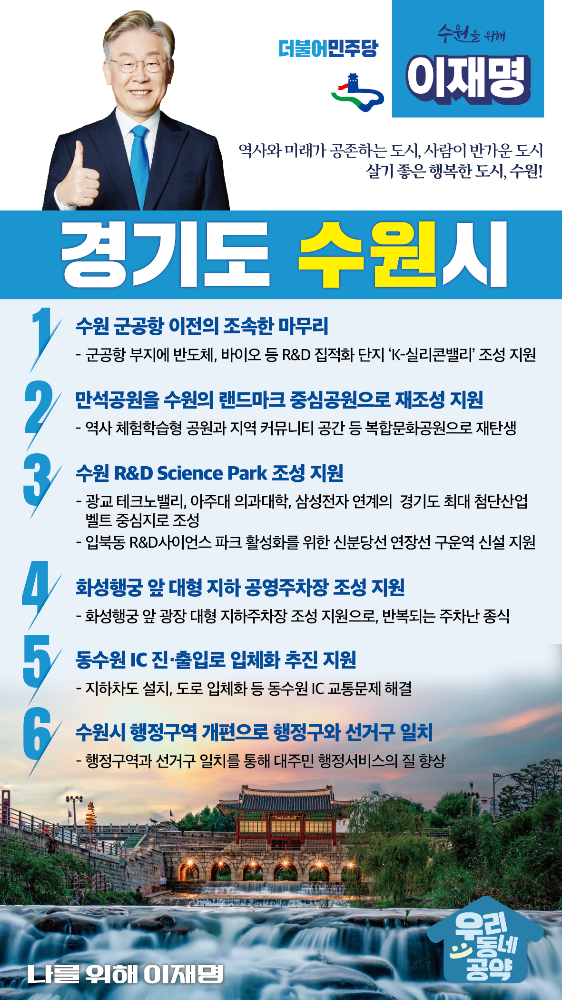

## 경기 지역 공약

# 수원시

### 역사와 미래가 공존하는 도시, 사람이 반가운 도시, 살기 좋은 행복한 도시, 수원!
> 2022-01-23

존경하는 수원시민 여러분,

 

수원은 경기도청이 자리한 경기도의 중심이자 경제, 문화, 사회, 역사, 교통의 중심지입니다. 

또한, 수원시는 특례시로 지정되어 특별한 발전이 기대되는 곳입니다.

 

하지만 동부와 서부의 균형 발전 과제를 안고 있고, 자족도시의 기능을 한층 더 강화할 필요가 있습니다. 

수원시의 상징인 수원화성 주변도 획기적으로 개선해야 합니다. 

 

사람이 반가운 도시, 살기 좋은 행복한 수원시를 만들기 위해 이재명이 수원시민에게 여섯 가지 약속을 드립니다. 

 

첫째, 수원 군공항 이전을 마무리 짓겠습니다.

수원시 중심에 위치한 군 공항으로 인해 수원시민들은 재산권을 제약받고 소음으로 피해를 받았습니다.  

이재명과 민주당이 수원군공항 이전을 원만하게 추진하고 수원시민들에게 부지를 돌려드리겠습니다. 

군공항 부지에 K-실리콘밸리 조성을 지원하여 수원의 새로운 먹거리로 창출하겠습니다. 

 

둘째, 만석공원을 수원의 역사와 문화가 살아 숨 쉬는 곳이 되도록 돕겠습니다. 

만석공원은 많은 수원시민들이 사랑하는 장소입니다.

만석공원이 역사를 담은 체험학습형 공원, 지역 커뮤니티 공간 등 복합적인 공원으로 재탄생할 수 있게 지원하겠습니다.

 

셋째, 수원 R&D 사이언스 파크 조성사업을 지원하여 서수원 발전의 교두보를 마련하겠습니다.

광교 테크노밸리-아주대 의과대학-삼성전자와 연계한 수원 R&D 사이언스파크 조성사업을 지원하여 경기도의 첨단산업 벨트가 되도록 하겠습니다.

이를 위해 신분당선 연장선 구운역 신설을 지원하겠습니다. 

수원시민 여러분께 편리한 교통서비스를 제공하고, 지역발전에 기여할 수 있는 교통대책이 만들어지도록 각별히 챙기겠습니다.

 

넷째, 화성행궁 앞에 대형 지하 공영주차장 조성을 지원하겠습니다. 

화성행궁은 수원의 중심이지만, 주차공간이 절대적으로 부족해 많은 시민들과 관광객들이 불편을 겪었습니다.

화성행궁 앞 광장에 대형 지하주차장 조성을 지원해 반복되는 주차난을 종식시키겠습니다.  

 

다섯째, 동수원IC 진·출입로 입체화 추진을 지원하겠습니다.

동수원IC는 수원을 드나드는 큰 관문중 하나입니다. 

광교신도시 개발로 더 심각해진 동수원IC의 교통문제를 해결하겠습니다.

도시 규모가 확대되며 늘어난 교통 체증으로 답답하셨을 수원시민들의 마음을 풀어드리겠습니다. 

러시아워의 답답함을 시원하게 뻥 뚫어드리겠습니다.

 

여섯째, 수원시 행정구역 개편을 적극 검토하여 양질의 행정서비스를 제공하겠습니다.

수원시는 전국에서 제일 큰 기초자치단체지만 현재 4개 행정구역과 5개 선거구가 일치하지 않아 주민들은 혼란스럽고 행정서비스도 부족했습니다. 

행정구역과 선거구 일치를 적극 검토하여 대주민 행정서비스의 질을 이전보다 높이겠습니다. 

자연지리성, 인구형평성, 행정효율성을 고려해 분구를 추진하여 수원특례시를 완성하겠습니다. 

 

큰 정책과 비전이 대한민국을 풍요롭게 하지만 때로는 작은 정책이 국민들의 삶을 바꾸기도 합니다.

작고 알찬 민생과제를 해결하여 수원시민의 삶의 질을 높이겠습니다. 

 

역사와 미래가 공존하는 도시! 수원!

이재명과 민주당이 만들어가겠습니다. 

						