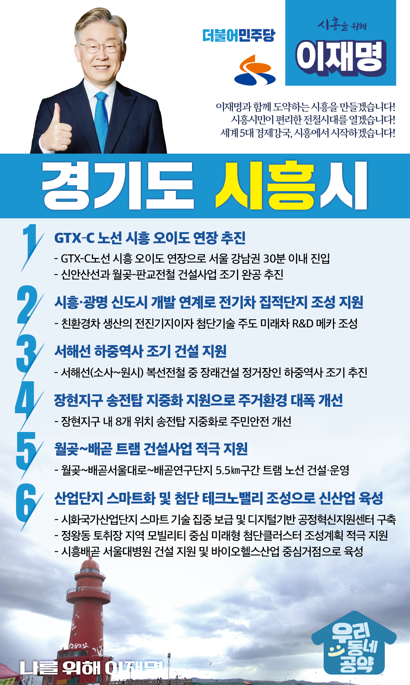

## 경기 지역 공약

# 시흥시

### 세계 5대 경제강국, 시흥에서 시작하겠습니다!
> 2022-01-27

존경하는 시흥시민 여러분, 더불어민주당 대통령 후보 이재명입니다.

 

시흥시는 인구 50만을 넘어, 빠르게 성장하고 있는 도시입니다. 

제3기 신도시로 시흥의 미래는 더욱 밝아질 것입니다.

시흥을 가장 잘 아는 이재명이 시흥시민과 손잡고 수도권 서남부에 새로운 중견도시, 시흥시대를 열겠습니다.

 

4년 전 시흥에 아시아 최대 인공서핑장을 만들자고 했던 계획.

이 거북섬 프로젝트를 현실로 만든 추진력으로 대한민국 최대 시화국가산업단지를 품은 시흥을 한 단계 더 도약할 수 있도록 최선을 다하겠습니다.

 

시흥의 미래를 위한 6대 지역공약을 말씀드리겠습니다.

 

첫째, GTX–C 노선의 시흥 오이도 연장을 추진하겠습니다. 

GTX 노선은 수도권 광역 교통을 재편할 것입니다.

GTX-C노선을 시흥 오이도까지 연장하면 서울 강남권을 30분 이내로 갈 수 있습니다. 

신안산선과 월곶-판교전철 건설사업도 조기에 완공되도록 속도를 내겠습니다. 

시흥시민이 편리한 전철시대 개막으로 시흥의 경쟁력을 업그레이드하겠습니다. 

 

둘째, 시흥·광명 신도시 개발과 연계하여 전기차 집적단지 조성되도록 지원하겠습니다.

전기차는 국가 핵심전략산업 중 하나입니다. 향후 조성될 시흥·광명 신도시와 인근지역의 경제활력을 제고하고, 지역 내 첨단산업 분야의 일자리가 늘어나도록 돕겠습니다. 

시흥이 친환경차 생산의 전진기지이자, 첨단기술을 주도하는 미래차 R&D 메카로 거듭나도록 적극 지원하겠습니다.

 

셋째, 서해선 하중역사가 조기에 건설되도록 지원하겠습니다.

교통계획은 주민의 편의와 균형발전을 최우선으로 고려해야 합니다.

시흥 내 교통 인프라 격차 해소와 균형발전을 위해서는 서해선 하중역 건설이 필요합니다. 

관련기관과 원활히 협의하여 신속히 역사가 착공되도록 지원하겠습니다.

 

넷째, 시흥 장현지구 송전탑 지중화를 지원하여 주거환경을 대폭 개선하겠습니다.

장현지구를 가로지르는 송전탑은 오랫동안 지역발전을 가로막아 왔습니다.

송전탑 지중화사업이 조속히 추진되도록 적극 지원하여 장현지구 도시미관과 정주여건을 대폭 개선하겠습니다. 

 

다섯째, 월곶~배곧 트램 건설사업을 적극 지원하겠습니다. 

트램은 경제성 높은 친환경 교통수단이자, 스마트시티 배곧신도시에 어울리는 차세대 교통시스템입니다.

월곶~배곧 트램이 조기에 추진될 수 있도록 적극 지원하여 배곧신도시의 대중교통 접근성을 획기적으로 개선하겠습니다. 

 

여섯째, 시흥의 산업단지를 스마트화하고 첨단 테크노밸리를 조성하여 신산업을 육성하겠습니다. 

시화국가산업단지에 스마트 기술을 집중 보급하고, 디지털기반 공정혁신지원센터를 구축하겠습니다. 

시흥·광명 신도시에 74만평 규모의 첨단테크노밸리를 조성하여 양질의 일자리가 넘치는 명품 신도시로 만들겠습니다.

시흥시가 정왕동 토취장 지역에 추진하는 모빌리티 중심의 미래형 첨단클러스터 조성계획도 적극 지원하겠습니다. 

올해부터 본격 추진되는 시흥배곧 서울대병원 건설사업을 차질없이 지원하여 수도권 서남부지역 의료복지 개선은 물론, 바이오헬스산업 중심거점으로 육성하겠습니다. 

 

세계 5대 경제강국, 시작은 시흥에서! 

시흥 앞으로, 발전 제대로!

나를 위해, 시흥을 위해, 이재명은 합니다!