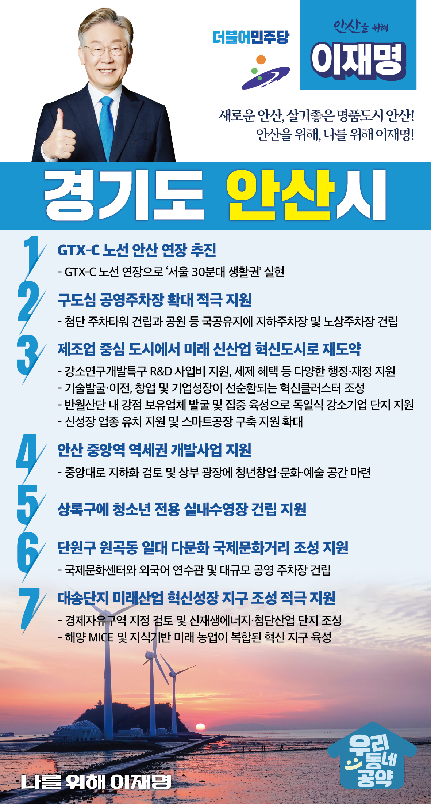

## 경기 지역 공약

# 안산시

### 새로운 안산, 살기좋은 명품도시 안산!
> 2022-01-27

존경하는 안산시민 여러분,

 

안산은 수많은 중소기업 노동자의 피와 땀으로 대한민국 산업화를 이끌어온 경제발전의 주역이었습니다.

또한 안산은 국내 최초의 계획도시로서 좋은 주거환경과 도시기반시설을 갖추고 성장해 왔습니다.

 

그러나 산업환경 변화로 주력 업종은 쇠퇴하고 대다수 업체가 영세화되면서 성장동력이 약화되고 있습니다. 

 

이제 안산에도 변화의 바람이 필요합니다.  

20년을 끌어오던 신안산선이 드디어 착공돼 2024년 개통을 기다리고 있고, 수인선 개통으로 인천, 수원, 용인, 분당 이동이 편리해졌습니다.  

장상지구, 신길지구 신도시 개발로 인구 역시 증가할 것입니다.

 

지금이 바로 안산의 미래를 결정할 골든타임입니다. 

사통팔달의 편리한 교통과 우수한 주거환경을 갖춘 도시, 미래산업을 선도하고, 풍성한 문화가 살아 있는 수도권 서남부 최고의 도시로 만들겠습니다.

 

첫째, GTX–C 노선의 안산 연장을 추진하겠습니다. 

GTX 노선의 안산 연장은 안산 교통을 획기적으로 바꿀 것입니다. 

안산의 재도약을 위해 우수한 인재와 기업 유치를 위해 교통 인프라 확충이 필요합니다.  

GTX-C 노선의 연장으로 안산의 중소전략산업 경쟁력과 안산시민의 교통편의는 더욱 높아질 것입니다. 

안산을 ‘서울 30분대 생활권’으로 만들겠습니다. 

 

둘째, 구도심에 공영주차장이 확대되도록 적극 지원하겠습니다.

공영주차장에 첨단 주차타워를 건립하면 주차공간을 획기적으로 늘어날 것입니다.  

또한 공원 등 국공유지에 지하주차장이나 노상주차장을 건립하여 안산시가 편리하고 안전한 도시가 되도록 지원하겠습니다.  

 

 

셋째, 안산을 제조업 중심의 도시에서 미래 신산업 혁신도시로 재도약 시키겠습니다. 

안산 강소연구개발특구에 R&D 사업비 지원, 세제 혜택 등 다양한 행정·재정지원으로 기술 발굴·이전과 창업 및 기업성장이 선순환되는 혁신클러스터를 조성하겠습니다.

반월산단 내 기술력을 갖추거나 발전 전망이 높은 업체를 발굴·육성하여 독일식 강소기업 단지로 거듭나도록 지원하겠습니다.

또한 안산시가 미래형 자동차 산업과 같은 신성장 업종을 유치하도록 지원하고, 스마트공장 구축 지원을 확대하겠습니다. 

 

넷째, 안산 중앙역 역세권 개발사업을 지원하겠습니다. 

중앙대로 지하화를 검토해 교통정체를 해소하고 상부 광장에는 청년창업·문화·예술 공간을 마련해 신·구도심간 단절 문제가 해결되도록 돕겠습니다. 

 

다섯째, 상록구에 청소년 전용 실내수영장 건립을 지원하겠습니다.  

안산은 학생 수에 비해 수영 시설은 부족합니다. 

안산의 청소년들이 안전하게 수영 교육을 받을 수 있도록 청소년 전용 실내수영장이 원만히 건립되도록 지원하겠습니다. 

 

여섯째, 단원구 원곡동 일대의 ‘다문화 국제문화거리’조성을 지원하겠습니다.

안산시가 추진하는 다문화 국제문화거리에 국제문화센터와 외국어 연수관 등을 건립하고, 대규모의 공영 주차장을 만들어 각국의 전통문화를 체험할 수 있는 관광명소가 되도록 돕겠습니다. 

 

일곱째, 대송단지가 미래산업의 혁신성장 지구로 조성되도록 돕겠습니다. 

현재 조성 중인 대송단지가 경제자유구역 지정을 검토하겠습니다. 

이에 더해 신재생에너지·첨단산업과 해양 MICE, 지식기반 미래농업이 복합된 혁신성장 지구로 발전하도록 적극 지원하겠습니다.   

 

 

이재명이 열어갈 안산의 변화, 제대로 하겠습니다.

 

새로운 안산, 살기좋은 명품도시 안산! 

안산을 위해, 나를 위해 이재명!  

						