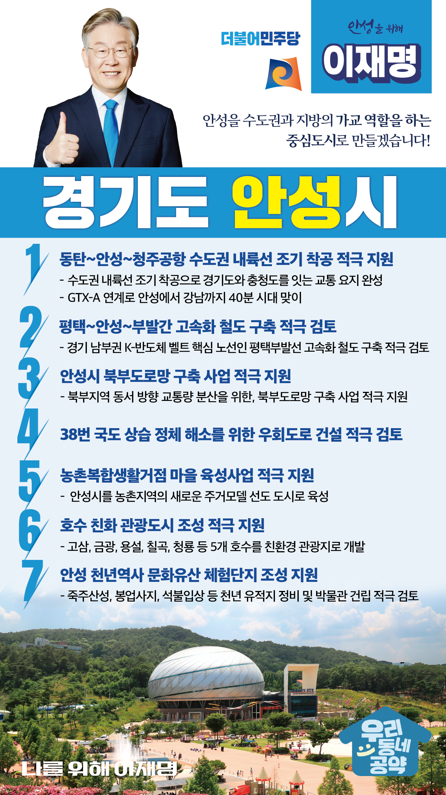

## 경기 지역 공약

# 안성시

### 안성을 수도권과 지방의 가교 역할을 하는 중심도시로! 
> 2022-01-23

존경하는 안성시민 여러분,

안성은 천년의 역사와 문화를 고스란히 간직한 도시이자 산과 호수가 어우러진 자연친화적 도시입니다.

 

또한 지리적 이점으로 인해 조선시대 안성은 대구, 전주와 함께 3대 상업도시 중 하나였고, 전국의 물건들이 모이는 물류 거점의 도시였습니다.

 

그러나 지금은 교통, 산업 인프라가 부족해 다른 지역에 비해 성장에 많은 제약을 받고 있습니다.

 

이제 안성의 옛 명성을 되찾고, 수도권과 지방의 가교 역할을 담당하는 도시로 우뚝 설 수 있게 이재명이 든든한 버팀목이 되겠습니다.

 

안성 발전을 위한 7대 공약을 약속드립니다.

 

첫째, 안성을 경유하는 수도권 내륙선의 조기 착공을 적극 지원하겠습니다.

안성은 철도망이 닿지 않는 지역입니다.

동탄에서 청주공항으로 이어지는 수도권 내륙선이 완성되면 안성은 경기도와 충청도를 잇는 교통의 요지로 다시 태어납니다.

GTX-A가 연계되면 안성에서 강남까지 40분 시대가 열리게 됩니다.

 

둘째, 평택부발선 고속화 철도 구축을 적극 검토하겠습니다.

평택, 안성, 이천 부발을 연결하는 평택부발선은 경기 남부권 K-반도체 벨트를 잇는 핵심 노선입니다.

평택부발선이 차질 없이 추진될 수 있도록 적극 검토하겠습니다.

 

셋째, 안성시 북부도로망 구축을 적극 지원하겠습니다.

안성의 북부지역은 동서 방향의 교통량 분산을 위해 도로망 확충이 필수적입니다.

안성시가 추진하고 있는 북부도로망 구축 사업을 지원해 안성 시민들이 편리하게 이동할 수 있도록 도와드리겠습니다.

 

넷째, 38번 국도 상습 정체 해소를 위해 우회도로 건설을 적극 검토하겠습니다.

안성시를 가로지르는 38번 국도는 출퇴근 시간대 상습적으로 정체되어 시민들에게 많은 불편을 드리고 있습니다.

38번 국도 우회도로가 국가계획에 반영될 수 있도록 적극 검토하겠습니다.

 

다섯째, 농촌복합생활거점 마을 육성사업을 적극 지원하겠습니다.

지방인구 소멸위기에 대응하기 위해 안성시에 농촌복합생활거점 도시를 육성하여, 안성시가 농촌지역에 새로운 주거모델을 선도하는 도시가 될 수 있도록 지원하겠습니다.

 

여섯째, 안성시가 추진하고 있는 ‘호수 친화 관광도시’ 계획을 지원하겠습니다.

안성에 있는 고삼, 금광, 용설, 칠곡, 청룡 호수는 안성을 경기남부의 대표적인 여가관광도시로 만들 수 있는 훌륭한 관광자원입니다.

5개의 호수를 친환경 시대에 걸맞은 관광지로 개발해 호수 친화 관광도시 조성사업을 지원하겠습니다.

 

일곱째, 안성시의 천년 역사 문화유산 체험단지 조성을 지원하겠습니다.

안성시 죽산면에는 죽주산성, 봉업사지, 석불입상 등 천년이 넘는 문화유적이 많습니다.

천년 유적지를 정비하고, 박물관 건립을 적극 검토하겠습니다.

 

안성은 ‘안성맞춤’이란 말이 생겨날 정도로 풍요로운 지역이었습니다.

안성맞춤의 미래, 이제 이재명이 열어가겠습니다.

 

안성 앞으로, 발전 제대로!

안성을 위해, 나를 위해, 이재명!

						