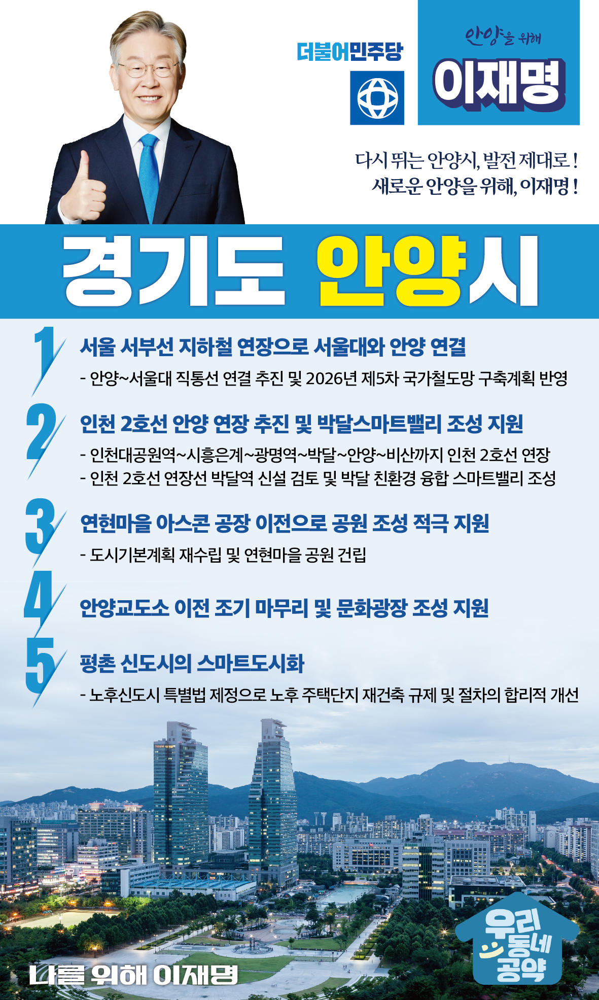

## 경기 지역 공약

# 안양시

### 다시 뛰는 안양시, 발전 제대로! 새로운 안양을 위해!
> 2022-01-27

사랑하고 존경하는 안양시민 여러분,

 

안양은 경기남부 교통의 중심지로서, 

서울과 가깝고 생활환경이 좋은 도시입니다. 

특히, 인덕원역 주변 지역 개발과 GTX-C 노선으로 

시민들의 생활여건은 더욱 좋아질 것입니다. 

 

그러나, 안양은 지역경제 기반 조성을 통해 혁신적 성장과 도약이 절실한 시점입니다. 

안양이 베드타운이 될 것인지, 

혁신과 활력이 넘치는 스마트도시가 될 것인지는  

이제부터가 주요합니다. 

 

민주당과 이재명 후보가 안양시민 여러분과 함께 

안양에 새로운 활력을 불어넣겠습니다. 

안양의 지속가능발전을 위한 안양시 5대 공약을 말씀드리겠습니다.

 

첫째, 서울 서부선 지하철 연장해 서울대와 안양을 연결하겠습니다.

 

서울대학교와 안양의 직선거리는 8킬로미터 정도밖에 되지 않습니다. 

서부선을 서울대 관악산역부터 안양까지 잇겠습니다. 

서울대의 인재들을 활용해 안양을 대한민국 혁신밸리로 만들 수 있습니다. 

안양의 교통망과 지역 경제환경을 혁신적으로 바꿔나가겠습니다.

 

둘째, 인천 2호선 안양 연장을 추진하고 박달스마트밸리 조성을 지원하겠습니다.

인천 2호선 안양 연장 사업은 국가철도망 계획에 추가검토사업으로 반영되어 있습니다.

이 사업이 확정될 수 있도록 지원하고, 박달역 신설도 검토하겠습니다.

또한, 박달동에 조성하고 있는 박달 스마트밸리 사업이 

신속하게 추진될 수 있도록 돕겠습니다.

 

셋째, 연현마을에 있는 아스콘 공장을 이전해 공원이 조성될 수 있도록 적극 지원하겠습니다.  

 

연현마을 공원 건립사업은 지역 최대 현안 중 하나입니다.

기업과 주민들의 소송전도 이어지고 있어 조속한 정리가 필요합니다.

도시기본계획을 재수립하고 연현마을에 공원이 건립될 수 있도록 지원하겠습니다. 

 

넷째, 안양교도소 이전을 조기에 마무리하고 숲이 포함된 문화광장 조성을 지원하겠습니다.

 

안양교도소 이전을 위해 중앙정부와 지자체 등 

여러기관의 다양한 이해관계 조율이 필요합니다. 

안양시민의 오랜 염원을 풀기 위해 적극 나서겠습니다.  

안양교도소 부지가 다시 시민의 품으로 돌아올 수 있도록 돕겠습니다. 

 

다섯째, 평촌 신도시를 스마트도시로 탈바꿈시키겠습니다. 

 

평촌 신도시는 노후화됨에 따라 주차난, 층간소음, 기반시설이 낡아    

시민의 불편이 가중되고 있습니다. 

시민 누구나 안전하고 쾌적한 환경에서 살아갈 수 있도록 

‘노후신도시 특별법’을 제정해 평촌을 스마트도시로 탈바꿈시키겠습니다. 

재건축 안전진단 기준과 리모델링 안전성 검토기준을

현실에 맞게 완화하겠습니다.  

용적율을 높이고 인허가를 신속히 진행해 시간과 비용을 줄이겠습니다. 

 

 

존경하는 안양시민 여러분!

 

안양시는 경기 남부의 거점도시가 될 수 있는 저력을 가지고 있습니다.

그 저력을 이제는 현실로 만들 때입니다.

오직 실력과 성과로 평가를 받아 이재명 후보가

안양의 발전을 제대로 지원하겠습니다. 

 

다시 뛰는 안양시, 발전 제대로 !

새로운 안양을 위해, 이재명 ! 

						