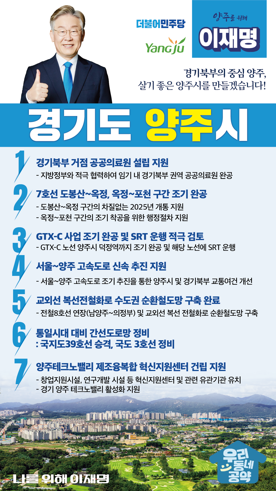

## 경기 지역 공약

# 양주시

### 경기북부의 중심 양주, 살기 좋은 양주시!
> 2022-01-26

존경하는 양주시민 여러분, 더불어민주당 대통령 후보 이재명입니다.

 

과거에는 사대문 북동쪽은 전부가 양주 땅이었고, 양주는 경기북부의 중심이었습니다.

 

그러나 전쟁과 분단의 상처를 겪으며,  양주는 군사규제, 수도권규제, 그린밸트 등 각종 중첩규제를 받았습니다.

지난 70여년 간 국가안보를 위해 특별한 희생을 감내해 왔습니다.

 

양주시는 다시 경기북부의 중심으로 성장하고 있습니다.

옥정과 회천 신도시가 개발되며 꾸준히 인구가 유입되고 있습니다. 

전철 7호선, GTX-C, 수도권 제2순환도로 등 부족한 교통인프라가 확충되고, 경기양주테크노밸리, 은남산업단지 등 산업 인프라도 구축되고 있습니다.

 

이제 ‘경기북부의 중심 양주’의 시대를 확실히 열기 위한 양주시 7대 공약을 말씀드리겠습니다.

 

첫째, 양주시에 경기북부 거점 공공의료원 설립을 지원하겠습니다. 

 

정부가 이며 수차례 경기북부 권역 공공의료원 설립을 발표했지만, 아직까지 진척을 보지 못하고 있습니다. 

임기 내에 공공의료원이 완공되도록 지방정부와 적극 협력하고, 양주시민과 경기북부 주민의 의료 환경을 개선하겠습니다.

 

둘째, 전철 7호선 도봉산~옥정, 옥정~포천 구간을 조기에 완공하겠습니다. 

 

공사가 진행 중인 도봉산~옥정 구간은 예정대로 개통될 수 있도록 지원하고, 행정절차가 진행 중인 옥정~포천 구간은 조기 착공과 개통을 위해 힘을 쏟겠습니다. 

 

셋째, GTX-C 노선을 조기에 완공하고, SRT 운행을 적극 검토하겠습니다.

 

GTX-C 노선은 양주시의 교통환경을 획기적으로 개선할 것입니다. 

GTX-C 노선이 사업 지연 없이 개통되도록 지원하고, 이 노선을 따라서 SRT 운행을 적극 검토하겠습니다. 

 

넷째, 서울~양주 고속도로가 신속히 추진되도록 지원하겠습니다.

 

서울~양주 고속도로는 양주시 서부권 교통환경을 획기적으로 개선할 것입니다.

서울~양주 고속도로가 순조롭게 행정절차를 마무리하고, 조기에 개통할 수 있도록 지원을 아끼지 않겠습니다. 

 

다섯째, 교외선 복선전철화를 통해 ‘수도권 순환철도망’을 완결하겠습니다.

 

저는 경기도지사 시절부터 경기도 순환철도망 구축을 위해 교외선 복선전철화를 약속한 바 있습니다. 

비록 수요는 조금 부족하더라도 경기 남북부의 균형발전과 통일 시대를 대비해 정책적으로 교외선 복선화를 추진하겠습니다.

 

여섯째, 국지도 39호선을 국도로 승격시키고, 국도 3호선을 정비하겠습니다.

 

국지도 39호선은 송추부터 가납까지 사업이 진행중이고, 최근 상수부터 한산까지 구간도 사업 대상으로 선정되었습니다.

국지도 39호선을 국도로 승격하여 남북평화시대의 주축 도로로 만들겠습니다.

또한 국도 3호선을 신속하게 정비하여 경기북부 발전의 중심축으로 만들겠습니다.

 

일곱째, 양주테크노밸리 제조융복합 혁신지원센터 건립을 지원하겠습니다.

 

섬유산업이 집중된 경기북부 산업은 첨단화와 노후화의 기로에 있습니다.

경기북부 특화산업인 생활 소비재업종의 고도화를 위해 제조 융복합 지원에 필요한 인프라를 구축하고 경기양주 테크노밸리 활성화를 지원하겠습니다.

 

양주시는 더 이상 차별의 도시가 아닙니다.

경기북부로 성장하는 양주, 살기 좋은 양주를 만들어 가겠습니다. 

 

이재명이 열어갈 양주시의 미래를 기대해주시고 지지해주십시오. 

양주시 앞으로, 발전 제대로! 이재명은 합니다!  

						