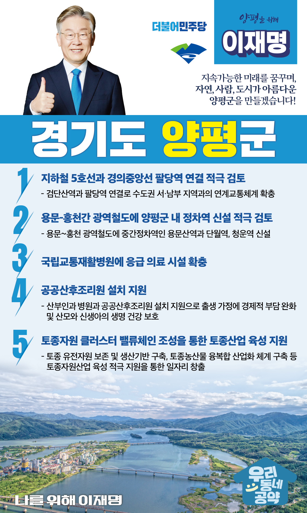

## 경기 지역 공약

# 양평군

### 자연, 사람, 도시가 아름다운 양평!
> 2022-01-24

존경하는 양평군민 여러분!

 

 

양평은 민족의 지도자 몽양 여운형 선생의 고향이자, 역사의 고비마다 숭고한 의병활동과 독립운동으로 국민주권과 정의를 지켜온 혁명의 고장입니다.

 

사시사철 찬란한 자연환경이 펼쳐지는 아름다운 고장 양평!

하지만 다양한 규제에 묶여 양평의 잠재력은 정체됐습니다.

양평을 잘 아는 정치인이 양평의 미래를 열어야 합니다. 

 

양평을 위해 양평군민께 5가지를 약속드립니다.

 

첫째, 지하철 5호선과 경의중앙선 팔당역 연결을 적극 검토하겠습니다. 

양평은 서울 등 수도권으로 통하는 교통의 요충지지만 광역교통체계가 열악합니다. 

5호선 하남검단산역과 경의중앙선 팔당역을 연결하는 방안을 검토하겠습니다.

양평에서 서울 접근성이 향상되도록 만들고 교통편의를 위해 노력하겠습니다. 

 

둘째, 용문-홍천간 광역철도에 양평군 내 정차역 신설을 적극 검토하겠습니다.  

경의중앙선 용문역과 홍천을 잇는 용문~홍천 광역철도가 국가계획에 포함되었습니다.

그간 철도 인프라가 부족해 불편을 겪었던 양평군의 교통이 달라집니다. 

이제 남은 것은 양평군민이 편리하게 이용하실 수 있게 중간정차역을 만드는 것입니다.

용문산역과 단월역, 청운역 신설을 적극 검토하겠습니다. 

 

셋째, 국립교통재활병원에 응급 의료 시설을 확충하겠습니다.

양평 인구는 11만명이나 되지만 응급 의료 시설은 턱없이 부족합니다. 

양평에 있는 국립교통병원에 응급의료시설 확충을 지원해 양평군민들이 더 나은 의료 복지를 누릴 수 있도록 하겠습니다. 

 

넷째, 양평에 공공산후조리원 설치를 지원하겠습니다.

양평군에는 분만이 가능한 산부인과 병원과 공공산후조리원이 없습니다. 

양평에 산부인과 병원과 공공산후조리원 설치를 지원해 산모와 신생아의 안전과 건강을 지키겠습니다.  

 

다섯쩨, 양평군이 추진하고 있는 토종자원산업 육성을 적극 지원하겠습니다.  

기후위기시대에 토종자원은 새롭게 가치를 인정받고 있습니다. 

우리 농업의 종자주권과 경제성을 확보할 수 있는 유일한 대안이기도 합니다.

양평군 내 토종자원 클러스터 밸류체인 조성을 지원하여 일자리를 창출하겠습니다.

토종농산물을 통해 GMO로부터 안전한 먹거리를 제공할 수 있도록 돕겠습니다.  

 

 

자연과 사람을 지켜내고 미래를 위해 변화하는 새로운 도시 양평!

양평의 새로운 미래를 위해 확실히 지원하겠습니다. 

 

양평 앞으로, 발전 제대로!

새로운 양평을 위해, 이재명은 합니다!

						