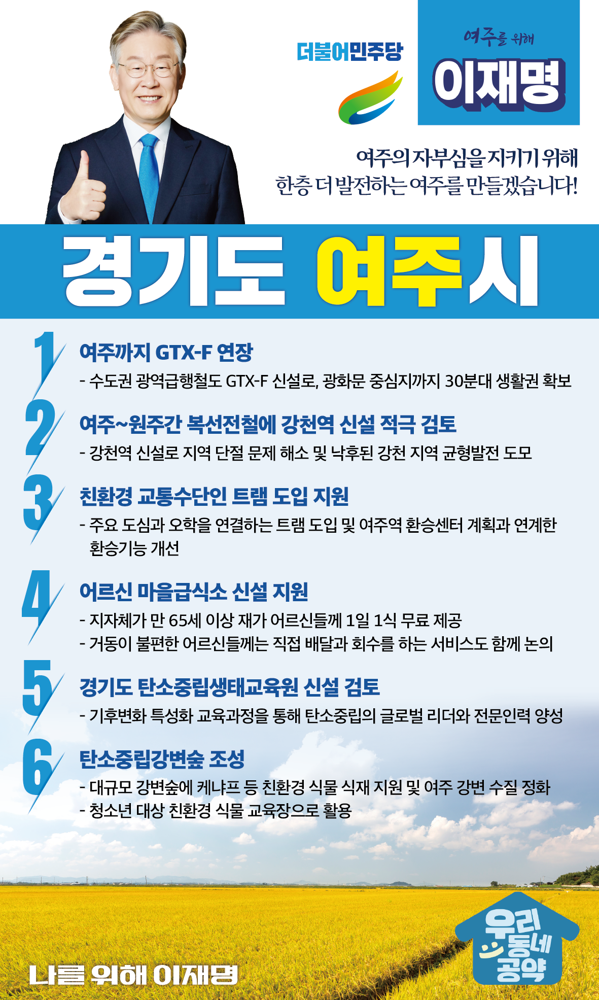

## 경기 지역 공약

# 여주시

### 여주의 자부심을 지키기 위해 한층 더 발전하는 여주!
> 2022-01-24

존경하는 여주시민 여러분,

 

여주는 세종대왕과 효종대왕, 우암 송시열 선생등을 모신 긍지높은 인문학의 도시입니다. 

또한 남한강과 신륵사, 황학산, 주어사지와 고달사지 등 다양한 관광자원을 갖춘 도시입니다.

 

그러나 여주는 각종 규제로 인해 발전이 제약받고 있습니다. 

 

여주가 이제 규제를 극복하고 교통이 편리한 수도권 동남부의 중심도시이자 생태․역사․문화의 메카가 될 수 있도록 지원하겠습니다. 

 

여주의 발전을 위한 이재명의 여섯 가지 약속을 말씀드리겠습니다.  

 

첫째, GTX-F를 여주까지 연장하겠습니다. (GTX 새로추가)

여주시민의 교통편의를 대폭 높이기 위해  수도권 광역급행철도인 GTX-F를 신설하겠습니다. 

여주에서 서울 광화문 등 중심지까지 30분대 생활권을 만들겠습니다. 

여주의 성장을 위해 GTX-F를 반드시 추진하겠습니다. 

 

둘째, 여주-원주간 복선전철에 강천역을 신설을 적극 검토하겠습니다. 

신설되는 여주-원주간 복선전철은 역간 거리가 22km나 되지만 정차역이 없습니다.

여주시민들의 전철 접근성을 높여야 합니다. 

여주-원주간 복선전철에 강천역 신설을 적극 검토하겠습니다. 

강천역 신설로 지역 단절 문제를 해소하고, 각종 규제로 낙후된 강천지역의 균형발전을 이루겠습니다. 

 

셋째, 친환경 교통수단인 트램 도입을 지원하겠습니다.

여주는 GTX-F 등 교통수단이 도입되면, 서울 주요 도심까지 30분대 생활권이 됩니다. 

앞으로 인구와 관광객 증가를 대비하고 여주 시내의 교통 불편을 해소하기 위해 여주시가 추진하고 있는 친환경 교통수단인 트램 도입을 지원하겠습니다. 

 

넷째, 어르신 마을급식소 신설을 지원하겠습니다. 

지자체가 만 65세 이상 재가 어르신들께 1일 1식을 무료로 제공할 수 있도록 마을급식소 신설을 적극 지원하겠습니다. 

거동이 불편한 어르신들께는 직접 배달과 회수를 하는 서비스도 함께 논의하겠습니다.

어르신들의 건강관리 시스템을 도입하고, 책임감 있는 서비스를 제공하도록 노력하겠습니다.

 

다섯째, 경기도탄소중립생태교육원 신설을 검토하겠습니다.

기후위기 극복을 위한 탄소중립은 모든 인류가 가야할 길입니다. 

천혜의 자연환경을 가지고 있는 여주에 탄소중립생태교육원을 신설을 검토하고 여주가 탄소중립의 글로벌 리더가 될 수 있도록 지원하겠습니다.

 

여섯째, 여주 ‘탄소중립강변숲’ 조성을 돕겠습니다.

여주는 서울 여의도 면적보다 넓은 대규모 강변숲을 보유하고 있습니다. 

이 강변숲에 ‘탄소중립강변숲’을 조성하고 케냐프 등 친환경 식물을 식재하도록 지원하겠습니다.  

여주 강변의 수질을 친환경적으로 정화하고  탄소중립강변숲을 청소년 대상 친환경 식물 교육장으로 활용할 수 있도록 돕겠습니다. 

 

존경하는 여주시민 여러분! 

 

아름다운 산과 강을 보유한 눈부신 도시 여주, 

그러나 수많은 개발규제에 묶여 낙후되어왔던 여주를 

이제는 지속가능발전의 상징도시로 만들어야 합니다.  

이재명과 민주당이 온 힘을 모으겠습니다. 

 

새로운 여주시를 위해

앞으로 제대로 이재명은 합니다!

						