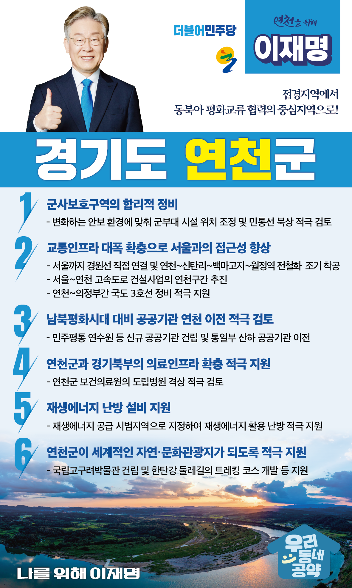

## 경기 지역 공약

# 연천군

### 접경지역에서 동북아 평화교류 협력의 중심지역으로!
> 2022-01-27

존경하는 연천군민 여러분,

연천은 유네스코 지정 세계지 질 공원으로 선정된 한탄강이 있고, 30만년전 구석기 유물인 아슐리안 주먹도끼, 고구려 성인 당포성과 호루고루 성, 고려의 임금과 충신을 모신 숭의전 등 각종 고대 문화유적이 보전되어 있는 지역입니다.

 

 DMZ와 접하고 있어서 전 지역이 군사시설보호구역으로 지정되어 지난 70년간 재산권 행사에 많은 불이익을 받았습니다.

 또 수도권에 소재한다는 이유로 수도권 규제까지 이중의 고통을 겪고있습니다.

 

 대한민국의 국가안보를 위해 희생한 연천군은 이제 특별한 혜택과 보상을 받아야할 때입니다. 

 이재명과 민주당이 새로 태어나는 연천군을 위해 여섯 가지 공약을 약속드립니다.

 

 

첫째, 지역발전과 주민편의 증진을 위해 군사보호구역을 합리적으로 정비하겠습니다.

군사기지법에 따른 제한보호구역 범위와 기준이 제대로 지켜지는지 점검하여 주민의 정당한 이익을 보호하겠습니다. 

변화하는 안보 환경에 발맞춰 군부대시설의 위치를 조정하고, 민통선을 북상시키는 것도 적극 검토하겠습니다. 

주민들의 불편을 해소하고 연천의 발전을 이재명이 책임지겠습니다. 

 

둘째, 서울과 접근성을 높이고 교통인프라를 대폭 확충하겠습니다.

경원선 전철운행이 연천까지 직결시키는 방안을 적극 검토하여 연천 주민과 관광객의 교통편의를 돕겠습니다.  

연천-신탄리-백마고지-월정역까지 전철화 사업이 조기에 추진될 수 있도록 최선을 다하겠습니다. 

서울-연천 고속도로 건설사업의 연천구간 추진도 적극 지원하겠습니다. 

연천-의정부간 국도 3호선 정비도 적극 지원하여 남북평화 경제시대를 준비하겠습니다.

 

셋째, 남북평화시대를 대비해 공공기관의 연천 이전을 적극 검토하겠습니다. 

산업 인프라가 발달되지 않아 기업유치가 연천은 기업유치가 쉽지 않습니다. 

연천 지역경제의 활력을 불어넣기 위해 공공기관 유치를 적극 지원하겠습니다.  

 

넷째, 연천군과 경기북부의 의료인프라 확충을 적극 지원하겠습니다.  

종합 병원이 전무한 연천군에서 응급환자가 발생하면 의정부, 파주, 일산 등 인근지역 병원으로 이동해야 합니다.  

연천군과 경기북부의 의료 인프라를 확충해 연천군민들의 건강과 안전을 위협하는 의료 사각지대를 해소하겠습니다. 

연천군 보건의료원의 도립병원 격상도 적극 검토하겠습니다. 

 

다섯째, 재생에너지 난방 설비를 지원해 따뜻한 연천군을 만들겠습니다.  

연천군은 대한민국에서 가장 추운 지역이지만 도시가스 공급에 제약이 많습니다.

이제 세계적 흐름에 맞춰 재생에너지로 난방을 할 수 있는 시스템을 만들어야 합니다.

북유럽처럼 재생에너지를 활용한 난방을 적극 지원하겠습니다.  

 

여섯째, 연천군이 세계적인 자연·문화관광지가 되도록 적극 돕겠습니다.

연천군은 지질시대와 선사시대의 문화자원뿐만 아니라 사람의 손길이 닿지 않은 천혜의 자연보고인 DMZ 생태환경을 품고 있습니다.  

세계지질공원과 역사문화관광자원을 가진 연천군이 앞으로 세계적인 관광도시가 되도록 지원을 아끼지 않겠습니다. 

 

 

연천군의 미래, 일 할 수 있고 검증된 이재명이 열어갈 수 있습니다.

이재명이 열어갈 연천군의 미래를 기대해주십시오.

연천을 위해, 나를 위해, 이재명!  

						