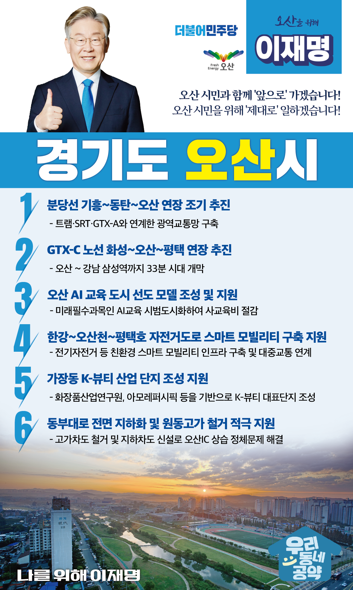

## 경기 지역 공약

# 오산시

### 오산 시민과 함께 앞으로 가겠습니다!
> 2022-01-23

오산시민 여러분, 오산시는 작지만 강한 도시입니다. 

 

오산시는 마을교육공동체, 시민개방 학교복합시설, 맞춤형 돌봄서비스, 오산천 생태하천 복원 등 전국을 대표하는 오산형 성공모델을 창출하였습니다. 

 

전국에서 벤치마킹하는 교육도시, 가까운 곳에서 문화체육을 즐기는 문화도시, 아이 키우기 좋은 보육도시, 생태하천 오산천이 흐르는 생태도시로 성장하고 있습니다. 

 

오산시민 여러분, 이제는 오산시의 가치를 더 높이는 새로운 발전 전략이 필요합니다. 

오산을 제대로 성장시키기 위한 6대 지역공약을 말씀드리겠습니다.

 

첫째, 기흥~동탄~오산 분당선 연장을 조기에 추진하겠습니다. 

 

분당선 연장은 경기 남부 주민들의 숙원사업입니다.  

트램·SRT·GTX-A 노선과 연계한 광역 교통망 구축이 오산의 핵심 발전전략입니다. 

분당선 연장을 통해 오산의 발전을 앞당기겠습니다. 

 

둘째, GTX-C 노선의 화성~오산~평택 연장을 추진하겠습니다.  

경기도 도지사 시절 화성, 오산, 평택시와 함께 공동으로 추진했던 사업입니다. 

경기 남부 주민의 삶의 질을 높이고 경기도 균형발전을 위해 반드시 필요합니다.

GTX-C를 오산, 평택까지 연장하고 세 방향 Y자 노선을 추진하겠습니다. 

오산시민을 위한 교통망, 이재명이 적극 추진하겠습니다. 

 

셋째, 오산시가 AI 교육도시가 되도록 지원하겠습니다.  

 

오산은 전국에서 벤치마킹하는 교육도시입니다. 

교육도시 오산시를 AI 교육을 선도하는 AI 교육도시로 육성하겠습니다. 

사교육 없이도 체계적인 AI 교육이 가능한 전국 모델로 만들겠습니다. 

 

넷째, 한강~오산천~평택호 생태하천 자전거도로에 그린스마트모빌리티 인프라 구축을 지원하겠습니다. 

저 이재명이 약속했던 한강~오산천~평택호 자전거도로, 그린웨이 100km 구간이 완공을 눈앞에 두고 있습니다. 

그 연장선상으로 자전거도로에 전기 자전거를 비롯한 친환경 스마트 모빌리티 인프라가 구축되도록 돕겠습니다.  

 

다섯째, 오산시 가장동에 K-뷰티 산업단지 조성을 지원하겠습니다.

오산은 세계 최고 화장품 기업과 전문연구기관이 있어 K-뷰티 산업을 이끌어갈 수 있는 핵심지역입니다. 

가장동 K-뷰티 산업단지를 한류 콘텐츠 K-뷰티 대표단지가 되도록 적극 지원하겠습니다.

오산시를 K-뷰티산업의 중심지로 만들어 지역경제 성장동력으로 만들겠습니다. 

 

여섯째, 동부대로를 지하화하고 원동고가 철거를 적극 지원하겠습니다. 

민주당의 노력으로 오산 시민의 숙원사업인 동부대로 지하화와 원동고가 철거가 조금씩 성과가 나타나고 있습니다. 

새 정부에서 적극 지원하여 오산시 상습정체 구간 문제를 해결하겠습니다. 

 

 

오산 시민 여러분께 약속드립니다. 

이재명은 모든 국민이 골고루 잘 사는 국가균형발전을 위해 오산시의 가치를 높여 강소도시로 만들겠습니다.
오산시와 발전전략을 함께 세우고 오산시 발전을 위해 반드시 실천하겠습니다.

오산 시민과 함께 '앞으로' 가겠습니다. 
오산 시민을 위해 '제대로' 일하겠습니다. 

 

이재명은 합니다! 고맙습니다.

						