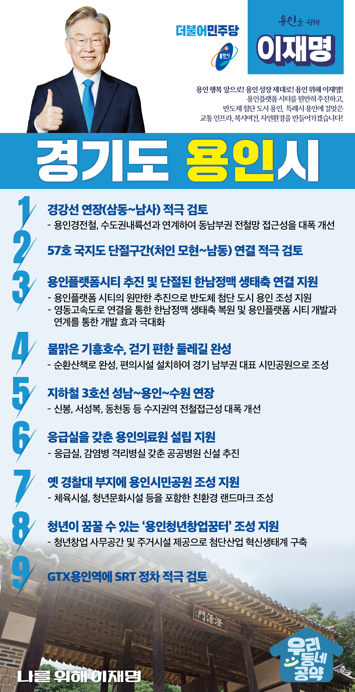

## 경기 지역 공약

# 용인시

### 반도체 첨단 도시 용인, 특례시 용인에 걸맞은 교통 인프라, 복지여건, 자연환경을 만들겠습니다!
> 2022-01-24

존경하는 용인특례시민 여러분,

 

용인은 예로부터 아름답고 풍요로운 고장으로 

역사적으로도 살기 좋은 지역으로 손꼽혀온 수도권 남부의 중심도시입니다.

 

또한 용인은 우리 국토 교통망의 남북 축과 동서 축의 중심에 위치하며, 

반도체를 비롯한 첨단산업과 물류의 요충지로서 대한민국의 발전을 이끌고 있습니다.

이를 통해 용인 특례시 시대를 열었습니다.

 

하지만 아직 용인이 가야 할 길이 남아 있습니다. 

인구 규모에 걸맞지 않게 공공인프라는 부족하고, 교통인프라도 확충이 필요합니다. 

 

용인이 안고 있는 과제들을 해결하기 위해서는, 

강력하게 실천하는 전문가가 필요합니다.

 

이재명과 민주당이 하겠습니다. 용인을 위한 이재명의 9대 공약을 들어주십시오.

 

첫째, 경강선 연장을 적극 검토해 철도교통을 획기적으로 개선하겠습니다. 

용인 처인구의 만성적인 교통문제를 해소하고, 균형발전을 이루기 위해 경강선 연장이 필요합니다. 

용인에는 대규모 공동주택과 산업단지가 계속 늘어나고 있어 선제적으로 교통대책을 수립해야 합니다.

경강선 연장을 적극 검토하여 용인 동부권 철도시대를 열겠습니다. 

 

둘째, 57호 국지도 단절구간 연결을 적극 검토하겠습니다.  

57호 국지도는 처인 모현과 남동구간이 수십년째 단절되어있습니다. 

2022년 개통 예정인 서울~세종 고속도로 북용인IC가 연결되면 교통량은 더 급증하게 될 것입니다. 

국지도 57호선의 단절구간 연결을 위해 노력하겠습니다. 

 

셋째, 단절된 한남정맥의 생태축 연결이 되도록 지원하겠습니다.

한남정맥은 백두대간으로부터 이어지는 한반도 13개정맥 중 하나로, 

경기 남부의 허파 역할을 하고 있습니다. 

그러나 영동고속도로 개통으로 일부 구간이 단절되어 많은 주민들은 불편을 호소하고 있습니다.

한남정맥을 복원해 자연환경 뿐 아니라 단절된 지역간 소통도 회복하겠습니다.

 

넷째, ‘물맑은 기흥호수, 걷기편한 둘레길’을 완성하겠습니다. 

기흥호수는 몇 해 전 까지만 해도 수질오염이 심각했지만 

중앙정부, 경기도, 용인시가 함께 노력해 많은 개선을 이루어 왔습니다. 

‘물맑은 기훙호수, 걷기 편한 둘레길’을 완성해 

기흥호수를 용인시민과 경기남부 도민께 더욱 사랑받는 편안한 휴식처로 만들어내겠습니다.

 

다섯째, 지하철 3호선을 성남·용인·수원까지 연장하겠습니다. 

용인은 경부고속도로와 영동고속도로가 교차하는 교통 요충지입니다. 

그러나 정작 용인시민은 심각한 교통 정체의 문제를 오롯이 감당해 왔습니다. 

용인 뿐 아니라 경기 남부 주변 도시도 인구유입에 따른 교통 문제를 겪고 있습니다. 

지하철 3호선의 연장이 해법입니다.

더 빠른 용인을 위해 지하철 3호선을 연장하겠습니다.

 

여섯째, 용인의료원 설립을 지원하겠습니다. 

국민의 생명과 건강보다 우선하는 것은 없습니다. 

인구 100만이 넘는 용인에 아직 공공병원이 없고, 

37만 인구의 수지구에는 응급실을 갖춘 병원마저 없습니다. 

국민의 생명과 건강을 위해서는 위기상황에 

바로 대응할 수 있는 응급실이 반드시 가까운 곳에 있어야 합니다. 

응급실, 격리병실을 갖춘 공공병원 신설을 적극 검토하겠습니다. 

 

일곱째, 옛 경찰대 종전부동산 부지에 용인시민공원 조성을 지원하겠습니다. 

옛 경찰대 법무연수원 부지내에 수영장 등 체육시설, 청년문화시설이 있는 문화공원, 

원형을 그대로 살린 산책로와 친환경 데크가 있는 산림공원 조성을 지원하겠습니다. 

시민의 공간을 시민에게 돌려드리겠습니다. 

 

여덟째, 청년이 꿈꿀 수 있는 공간, ‘용인청년창업꿈터’ 조성을 지원하겠습니다. 

용인 동백 쥬네브 상가에 숙박형 창업보육공간 조성을 지원해 

청년창업을 위한 사무공간을 제공하겠습니다. 

이를 통해 100개 창업기업의 보육을 추진해 청년이 꿈꾸는 용인을 만들겠습니다. 

 

아홉째, GTX용인역에 SRT 정차역 설치를 적극 검토하겠습니다. 

SRT 정차를 통해 용인시플랫폼시티 부지 내 복합환승센터는 지하철, GTX, SRT, 광역/시내버스 등

모든 교통수단을 한곳에서 편리하게 이용할 수 있는 국내 최대 교통 요지로 건설될 것입니다. 

 

 

존경하는 용인시민 여러분!

 

대한민국의 경쟁력은 반도체와 첨단산업에 있고,

대한민국 반도체와 첨단산업의 중심에는 용인이 있습니다.

 

용인의 성장이 시민의 행복으로 이어지도록 이재명이 함께하겠습니다.

 

여러분과 함께, 성장하는 용인 시대를 열겠습니다.

이재명이 열어갈 용인의 미래를 기대해주십시오.

 

새로운 용인, 이재명은 합니다!

						