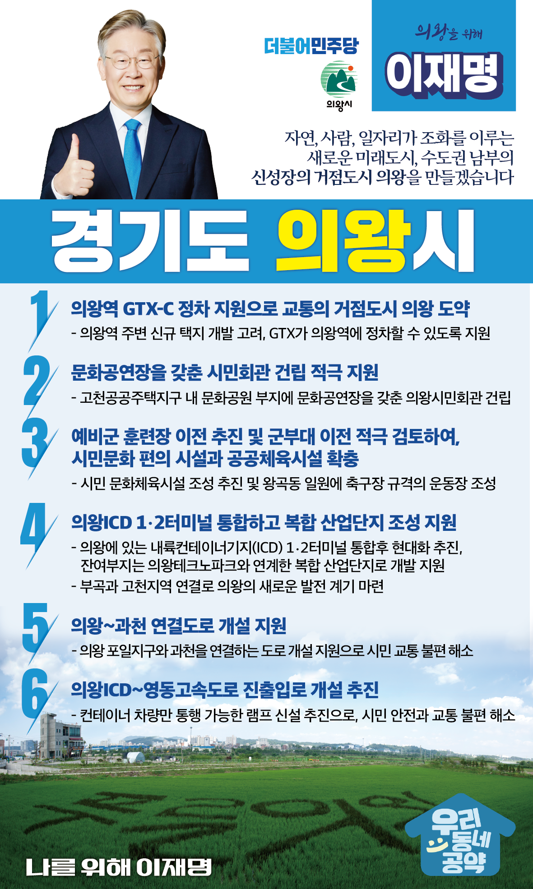

## 경기 지역 공약

# 의왕시

### 새로운 미래도시, 수도권 남부의 신성장의 거점도시 의왕!
> 2022-01-23

존경하는 의왕시민 여러분,

더불어민주당 대통령후보 이재명의 의왕발전 비전을 말씀드리겠습니다.

 

의왕은 서울과 경기남부 주요 지역을 연결하는 요충지에 위치하여 우리나라 물류의 중심지로 우리 경제의 성장을 뒷받침 해 왔습니다. 

그렇지만 의왕은 그동안 개발에서 소외되어 왔습니다. 

 

최근 재개발과 함께 초평지구가 신규 택지개발 지역으로 지정되고 광역철도인 GTX 의왕역 정차가 가시화되고 있습니다.  

수도권 남부의 요충지인 만큼 GTX 의왕역 정차를 확정짓고, 의왕의 발전에 새로운 전기를 맞이해야 합니다. 

 

저 이재명이 왕송호수와 백운호수, 5개의 산을 품고 있는 녹색환경도시 의왕을 사람과 자연이 공존하는 미래도시, 수도권 남부의 신성장 거점도시로 성장할 수 있도록  

6가지 공약을 약속드립니다.  

 

첫째, GTX-C가 의왕역에 정차할 수 있도록 지원하겠습니다.  

의왕역 주변의 신규 택지 개발을 고려해 GTX가 의왕역에 정차할 수 있도록 지원하고, 시민들의 교통편의는 물론 교통의 중심지로 거듭나도록 하겠습니다. 

 

둘째, 문화공연장을 갖춘 시민회관이 조속히 건립되도록 돕겠습니다. 

의왕시는 경기도 내 시민회관이 없는 유일한 지자체입니다. 

의왕시민회관 건립을 적극 지원하여 시민들의 문화적 욕구를 충족하고 시민들이 다양한 문화 혜택을 누릴 수 있도록 하겠습니다.

 

셋째, 예비군 훈련장 이전을 추진하고 군부대 이전도 적극 검토하겠습니다.  

의왕을 단절시키고 발전을 저해하고 있는 내손동 예비군 훈련장 이전을 추진하여 시민들을 위한 공간 조성을 지원하겠습니다. 

더불어 군부대 이전을 통해 주민편의시설 확충까지 적극 검토하겠습니다. 

 

넷째, 의왕ICD 1·2터미널을 통합하고 복합 산업단지의 조성을 지원하겠습니다.   

의왕에 있는 내륙컨테이너기지(ICD, Inland Container Depot) 1·2터미널을 통합하여 현대화하고 잔여부지를 의왕테크노파크와 연계한 복합 산업단지 개발을 지원하겠습니다. 

이를 통해 교통체증과 환경문제를 획기적으로 줄이고 부곡과 고천지역을 연결하여 의왕의 새로운 발전 계기를 마련하겠습니다. 

 

다섯째, 의왕~과천 연결도로 개설을 지원하여 시민의 교통불편을 해소하겠습니다. 

인덕원역과 주변 개발, 과천지식정보타운의 입주 등으로 향후 교통량이 많이 증가할 것입니다.  

이를 개선하기 위해 의왕 포일지구와 과천을 연결하는 도로 개설 지원하여 시민의 교통불편을 해소하겠습니다.  

 

여섯째, 의왕ICD에서 영동고속도로로 바로 통할 수 있는 진출입로 개설을 추진하여 시민의 안전과 교통 불편을 해소하겠습니다. 

의왕에 위치한 내륙컨테이너기지는 대한민국 물류의 중심지입니다. 

하지만 컨테이너 차량으로 인해 교통체증과 환경문제로 시민들이 많은 불편을 겪고 있습니다.  

이를 해결하기 위해 컨테이너 차량만 통행할 수 있는 램프를 신설을 추진하여 시민의 안전과 교통 불편을 해소하겠습니다. 

 

이재명은 유권자와의 약속은 반드시 지킵니다.

 

수도권 남부 신성장거점 의왕!

의왕 앞으로, 발전 제대로!

나를 위해, 의왕을 위해. 이재명은 합니다.

						