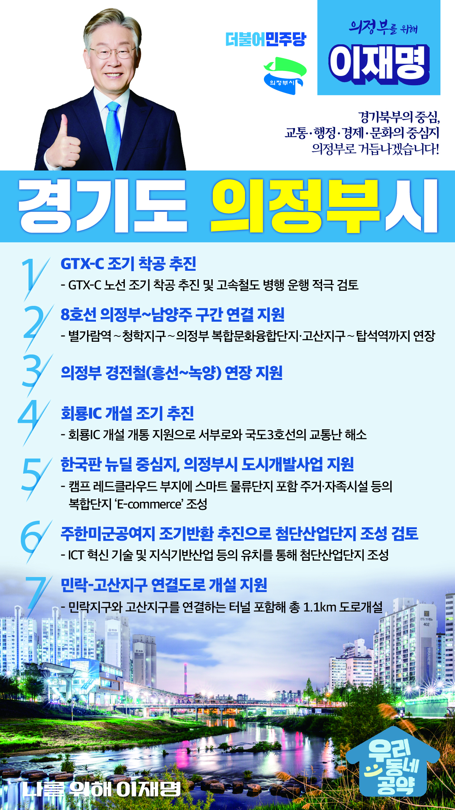

## 경기 지역 공약

# 의정부시

### 경기북부의 중심, 교통·행정·경제·문화의 중심지 의정부로 거듭나겠습니다. 이재명은 합니다!
> 2022-01-25

존경하는 경기 의정부시민 여러분, 의정부는 경기북부의 관문입니다. 의정부는 과거 오랫동안 드리워져 있던 각종 규제로 발전이 더뎠습니다. 하지만 이제 군부대 이전과 미군기지 반환 계획으로 새로운 미래와 도약을 준비하는 도시가 되었습니다.

 

교통, 행정, 경제, 문화의 중심지로 거듭나게 될 의정부시를 위한 7가지 지역공약을 말씀드리겠습니다.

 

첫째, GTX-C 조기 착공으로 의정부를 경기 북부 교통거점으로 만들겠습니다. 수도권 광역급행철도(GTX)-C 노선의 조기 착공을 추진하여 의정부 주민들의 출퇴근 부담을 하루라도 먼저 덜어드리겠습니다. 또한 고속철도 병행 운행도 적극 검토하여 전국 사통팔달 의정부를 만들겠습니다.

 

둘째, 8호선 의정부~남양주 구간 연결을 지원하여 수도권 순환철도망의 기반을 닦겠습니다. 의정부~남양주 구간은 수도권 순환철도망의 유일한 단절구간입니다. 수도권 균형발전과 경기북부의 열악한 철도 인프라 확충을 위해 8호선이 의정부 탑석역까지 연장될 수 있도록 적극 지원하겠습니다.

 

셋째, 의정부가 추진하는 경전철 연장을 지원하겠습니다. 지리적으로 떨어져 있는 의정부 서북부 지역은 철도 교통의 사각지대입니다. 의정부가 경기북부 중심도시의 면모를 갖출 수 있도록 의정부 경전철 연장을 지원하겠습니다.

 

넷째, 회룡IC 개설을 통해 의정부 교통을 발전시키겠습니다. 서울외곽순환도로를 이용하는 차량이 구시가지 우회로를 이용하는 경우가 증가하여 교통체증이 심화되었습니다. 주한미군 공여구역 주변지역 발전종합계획에 따라, 회룡IC 개설이 조속히 개통되도록 지원하여 서부로와 국도3호선의 교통난을 해소하겠습니다.

 

다섯째, 의정부 도시개발사업을 지원하여 지역경제에 활력을 불어넣겠습니다. 캠프 레드클라우드 부지에 수도권 스마트물류 중심지이자 주거 자족시설 등의 복합단지를 조성하여 의정부의 미래 먹거리와 일자리 창출하겠습니다. 이커머스 지원을 위한 물류단지 조성사업이 차질 없이 추진되도록 지원하겠습니다.

 

여섯째, 주한미군공여지 조기반환을 추진하여 첨단산업단지 조성을 검토하겠습니다. 캠프 스탠리 등 주한미군공여지 조기 반환을 추진해 군사도시 이미지를 탈피하고 의정부시를 최첨단 도시가 될 수 있도록 지원하겠습니다. 경기북부 지역 내 지식기반산업 등이 유치될 수 있도록 첨단산업단지 조성이 필요합니다. 의정부시를 젊고 능력 있는 인재들이 거주하는 도시가 되도록 돕겠습니다.

 

일곱째, 민락-고산지구 연결도로가 개설될 수 있도록 지원하겠습니다. 민락지구와 고산지구를 연결하는 터널을 포함해 총 1.1km의 도로개설을 돕겠습니다. 단절된 교통정체 불편을 해소하고 의정부 내의 발전을 추진하겠습니다.