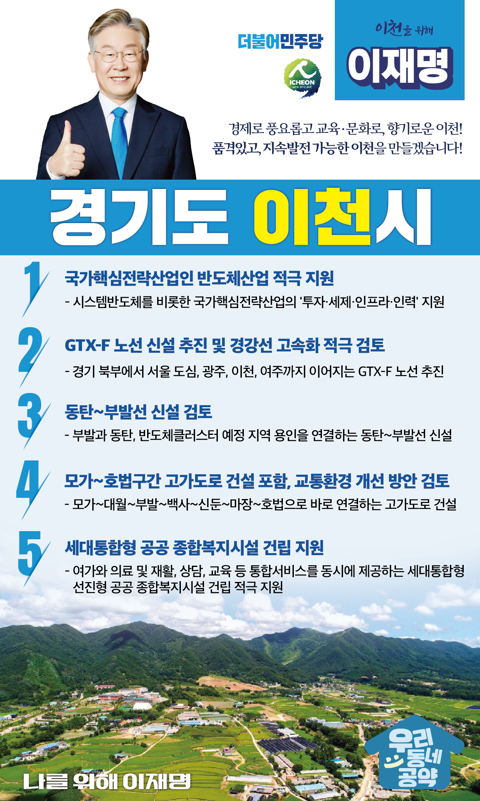

## 경기 지역 공약

# 이천시

### 품격있고, 지속발전 가능한 이천!
> 2022-01-24

존경하는 이천시민 여러분, 

 

이천은 고려시대 거란 80만 대군을 담판으로 물리치고, 압록강 연안까지 영토를 확장시킨 서희 선생의 고장입니다.

도자기, 쌀, 반도체 등으로 유명한 관광도시이기도 합니다.

 

한때 사통팔달의 교통과 성장의 핵심이던 도시 이천이지만 새로운 성장동력을 찾아야 하는 과제도 안고 있습니다.

이제 문화의 도시에서 첨단산업의 도시로 이천시의 가능성을 열어야 합니다. 

 

이천의 지속가능한 발전과 품격있는 도시 완성을 위해 이천시 발전을 위해 5대 지역공약을 약속드립니다.

 

첫째, 국가핵심전략산업인 반도체산업의 적극적 지원을 약속드립니다.

반도체산업은 이천을 넘어 대한민국의 먹거리입니다.

반도체산업에서 초격차를 유지하고 시스템반도체 등 새로운 영역으로 나아가기 위한 노력을 아끼지 않겠습니다. 

이천시를 반도체 산업의 심장부가 되도록 적극 지원하겠습니다.

 

둘째, GTX-F 이천 노선 신설로 30분대 서울 진입을 실현하겠습니다.

경기 북부에서 서울 도심을 거쳐 광주, 이천까지 이어지는 GTX-F 노선을 추진하여 이천을 “서울 30분대 생활권”으로 만들겠습니다.

또한 경강선 고속화도 적극 검토하겠습니다. 

이천시 철도교통의 혁명적 변화를 일으키겠습니다.  

 

셋째, 동탄-부발선 신설을 검토하겠습니다.

수도권 서남부 지역에 집중되어 있는 철도 교통망이 동서로 뻗어나갈 수 있도록 연결해야 합니다. 

이천시 부발과 화성 동탄, 반도체클러스터 예정지역인 용인시를 연결하는 동탄-부발선 신설을 검토하겠습니다.  

 

넷째, 이천시 교통환경 개선 방안을 검토하겠습니다. 

이천시 균형발전을 위해서는 교통체증을 해소할 수 있는 도로망이 필요합니다. 

모가~호법구간 고가도로 건설을 포함한 시도, 지방도 등과 연계하는 교통환경 개선 방안을 검토하겠습니다. 

 

다섯째, 이천시에 세대통합형 공공 종합복지시설 건립을 지원하겠습니다.

이천시 경제가 성장하고 주민들의 요구가 다양화되면서 문화․복지 분야의 관심이 높아졌습니다.

이천시민들이 높은 수준의 문화를 누릴 수 있고, 복지시설 역할까지 수행하는 세대통합형 공공 종합복지시설 건립을 적극 지원하겠습니다. 

 

존경하는 이천시민 여러분!

 

이제 이천에는 변화가 필요합니다. 

장점은 더욱 강하게 만들고 단점은 제대로 보완해 나가겠습니다. 

이재명이 열어가는 이천시의 미래를 기대해주십시오.

 

새로운 이천시를 위해, 이천 시민을 위해 이재명! 

						