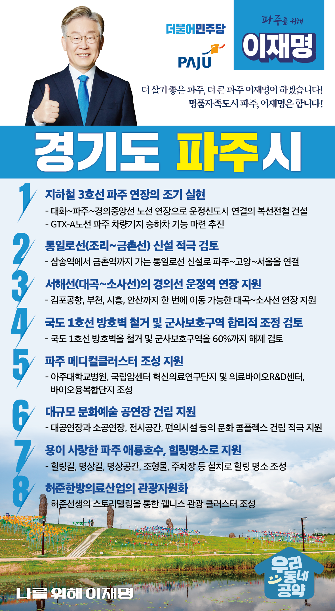

## 경기 지역 공약

# 파주시

### 더 살기 좋은 파주, 더 큰 파주 이재명이 하겠습니다!
> 2022-01-26

존경하는 파주시민 여러분

 

파주는 한반도 평화경제의 중심이 될 도시입니다.

또한 서울과의 접근성이 높아지며 경제적으로도 크게 성장하고 있고, 천혜의 자연환경을 가진 생태문화의 도시이기도 합니다.

 

파주의 지속가능한 발전과 품격있는 도시 완성을 위해 이재명과 민주당이 파주의 도약을 이끌겠습니다.

파주를 위한 이재명의 여덟 가지 약속을 말씀드리겠습니다.

 

첫쨰, 지하철 3호선의 파주연장, 조기에 실현하겠습니다. 

지하철 3호선 파주 연장은 파주시민의 염원입니다. 

지하철 3호선을 대화~파주~경의중앙선까지 연결하여 서울 접근성을 높이고 촘촘한 광역철도망을 구축하겠습니다. 

그리고 GTX-A노선 파주 차량기지에 승하차 기능 마련도 추진하겠습니다. 

접경지역으로 불이익을 감내했던 파주의 특별한 희생에 특별한 보상을 해드리겠습니다.  

 

둘째, 조리, 금촌까지 가는 통일로선 신설을 적극 검토하여 사통팔달 파주를 만들겠습니다. 

삼송역에서 금촌역까지 가는 통일로선은 경기북부 발전의 핵심 수단이 될 것입니다.

파주시는 인구증가와 지역경제 활성화로 선제적인 교통대책 수립이 필요합니다. 

통일로선은 사통팔달 파주를 위한 중요한 발걸음이 될 것입니다. 

통일로선이 신설될 수 있도록 적극 검토하겠습니다.  

 

셋째, 대곡-소사선 운정역 연장을 지원하겠습니다. 

대곡-소사선은 별도의 선로 건설 없이도 서해선과 연결되어 김포공항, 부천, 시흥, 안산까지 한 번에 이동할 수 있습니다. 

대곡-소사선이 조속히 확정될 수 있도록 적극 검토하고 지원하겠습니다.  

 

넷째, 파주 메디컬클러스터 조성을 지원하겠습니다. 

인구 50만도시 파주에는 종합병원이 없습니다. 

파주시가 MOU를 체결해 추진하고 있는 아주대학교병원 건립과 국립암센터 혁신의료연구단지 건립을 지원하겠습니다.

파주시민들의 높은 수준의 의료서비스를 받을 수 있도록 적극 돕겠습니다.  

 

 

다섯째, 대규모 문화예술 공연장 건립을 지원하겠습니다. 

아직도 파주에는 시민들이 문화생활을 즐길 수 있는 대규모 공연장이 없습니다. 

명품신도시 파주에 걸맞은 문화예술공연장이 반드시 필요합니다. 

크고 작은 공연장과 전시공간이 있는 문화콤플렉스 건립을 적극 지원하겠습니다. 

 

여섯째, 국도 1호선 방호벽을 철거하고, 파주의 군사보호구역을 합리적 조정을 검토하겠습니다. 

교통체증 유발과 도로 확장 불편을 초래했던 국도1호선 방호벽을 철거해 교통불편을 최소화하겠습니다. 

또한 파주시의 현재 88.39%를 차지하고 있는 군사보호구역을 60%까지 해제하는 것을 검토해 ‘인구 50만 파주시대’의 마중물을 만들겠습니다.

 

일곱째, 용이 사랑한 파주 애룡호수를 힐링명소로 지원하겠습니다.

파주시 법원읍에 있는 애룡호수는 용이 사랑에 빠진다는 애칭만큼 아름다운 풍광을 지니고 있습니다. 

시민과 관광객들이 천혜의 자연환경을 마음껏 누리고 쉬어갈 수 있도록, 자연과 문화가 함께 있는 힐링 공간으로 조성되도록 지원하겠습니다.

 

여덟째, 허준한방의료산업 관광자원화를 이루겠습니다.

파주에는 허준 선생의 묘가 있습니다. 

허준 선생의 스토리텔링을 토대로 웰니스 관광 클러스터를 조성해 허준한방의료산업 관광자원화를 이루겠습니다. 

 

존경하는 파주 시민 여러분,

 

한반도 평화수도 파주는 더 살기 좋아져야 하고, 더 커져야 합니다. 

파주의 비전과 꿈을 실현하는 길에 이재명이 함께 하겠습니다. 

 

실행력 강한 지방행정과 자치분권 전문가, 이재명이 평화수도 파주를 만들어갑니다. 

						