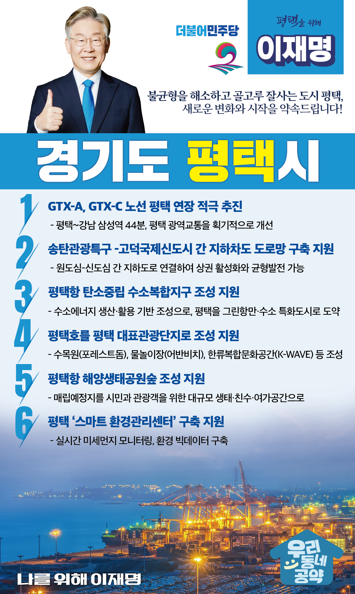

## 경기 지역 공약

# 평택시

### 불균형을 해소하고 골고루 잘사는 도시 평택!
> 2022-01-26

존경하는 평택시민 여러분

 

한반도의 평화를 지키는 국제평화안보도시 평택은 이제 황해시대 경제 중심지, 평화교류와 국제문화 중심지로서 전국에서 주목받는 도시로 발돋움하고 있습니다. 

 

고덕국제신도시, 브레인시티 산업단지 조성 등 대규모 지역사업을 바탕으로 교육·환경·문화 전반의 혁신이 이루어질 예정입니다. 

더불어민주당은 도약하는 평택에 걸맞는 다양한 정책을 펼치겠습니다.

품격있는 글로벌 국제도시를 조성하고, 도심 간 특화형 재생 모델을 발굴해 골고루 잘사는 도시환경을 만들어나가겠습니다.

 

새로운 평택을 위한 6대 지역공약을 말씀드리겠습니다.

 

첫째, GTX-C 노선의 평택 연장을 적극 추진하겠습니다. 

평택은 다수의 대규모 지역 개발사업이 진행 중입니다. 

향후 인구 75만을 바라보는 지금, 중장기 교통대책이 수립되어야 합니다.  

GTX-C 노선을 평택까지 연장해 평택 시민들이 수도권 주요 거점에 신속하게 이동할 수 있도록 돕겠습니다.  

  

둘째, 송탄관광특구와 고덕국제신도시 간 지하차도가 건설되도록 지원하겠습니다. 

지역 내 균형발전과 상권활성화를 위해서는 원도심과 신도심 간 연계가 필요합니다. 

송탄관광특구와 고덕국제신도시 간 자동차와 보행자가 함께 다닐 수 있는 환경친화적인 도로망이 구축되도록 돕겠습니다. 

이를 통해 평택의 균형 발전을 이끌어 나가겠습니다.

  

셋째, 평택항 탄소중립 수소복합지구 조성을 지원하겠습니다.

평택항은 경기도 유일의 국제무역항으로서 새로운 황해시대를 주도하는 글로벌 항만도시 평택의 핵심지입니다. 

이런 평택항에 수소산업 특화단지를 구축해 미래산업육성 기반을 마련하겠습니다. 

‘그린항만’ 평택항과 함께 수소도시, 친환경 도시 평택을 만들어 가겠습니다. 

  

넷째, 평택호 관광단지 개발로 평택의 문화공간을 꽃피우겠습니다.

평택호 관광단지를 푸른 식물과 함께 녹색공간을 체험하고, 물놀이를 즐길 수 있는 자연친화적 문화공간이 되도록 지원하겠습니다.

또한 한류복합문화공간을 통해 K-POP의 과거와 현재를 체험하도록 하겠습니다. 

지역주민들의 숙원사업인 평택호 관광단지의 빠른 조성을 지원하고, 경기남부의 대표 관광지가 될수 있도록 적극 돕겠습니다.

  

다섯째, 평택항 해양생태공원숲 조성을 지원하여 시민 여가공간을 확충하겠습니다.

평택항 항만 배후단지 매립지 공간에 해양생태공원숲과 같은 친수 녹지공간을 만들어 시민 휴식처를 확보하겠습니다. 

해양을 조망하는 여가공간을 조성해, 삶의 질을 높이고, 찾고 싶은 평택을 만들겠습니다.

  

여섯째, 평택시 ‘스마트 환경관리센터’ 구축을 지원하여 깨끗한 대기환경을 조성하겠습니다.

우리 모두 깨끗한 공기를 마시며 건강하게 숨 쉴 권리가 있습니다.

평택시 ‘스마트 환경관리센터’ 구축을 지원하여 실시간 미세먼지 모니터링과 빅데이터 구축을 통해 환경오염에 신속하게 대응하겠습니다. 

촘촘한 환경관리를 통해 시민 여러분께 맑은 공기와 파란 하늘을 돌려드리겠습니다.

 

평택의 찬란한 미래가 꿈이 아닌 현실이 될 수 있도록 저 이재명이 평택시민과 함께 만들어 내겠습니다.

 

이재명이 열어갈 평택시의 미래를 기대해주십시오.

 

새로운 평택시, 이재명은 합니다!