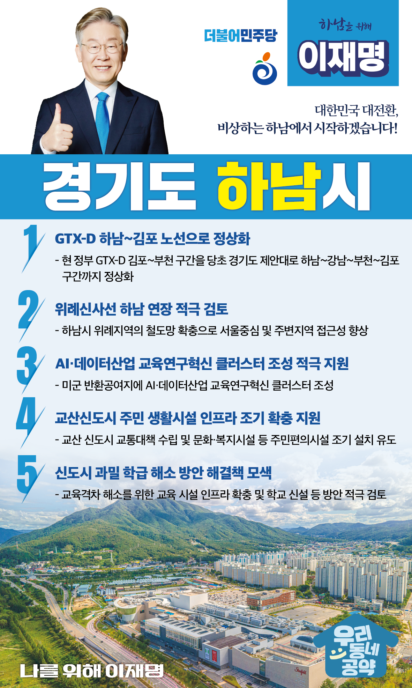

## 경기 지역 공약

# 하남시

### 대한민국 대전환, 비상하는 하남에서 시작하겠습니다!
> 2022-01-25

존경하는 하남시민 여러분.

 

하남은 원도심뿐만 아니라 미사, 위례, 감일, 교산 등 신도시가 생겨나며 빠르게 발전하는 중입니다. 

기회와 도전이 공존하는 도시이자 역동적인 도시가 바로 하남시입니다. 

 

최근에는 AI·데이터산업 교육연구혁신 클러스터 추진으로 자족도시의 기반을 닦고 있습니다. 

 

하남이 수도권 동부의 거점 자족도시로 우뚝 도약하도록 이재명 후보가 시민 여러분께 다섯 가지를 약속드립니다.

 

첫째, GTX-D를 하남-김포 노선으로 정상화하겠습니다.

GTX-D 노선은 단순히 출퇴근 시간을 줄이는 문제가 아니라 교통 기본권이라는 측면에서 반드시 필요합니다. 

 GTX-D는 현 정부의 김포~부천 구간을 당초 경기도의 제안대로 하남~강남~부천~김포 구간까지 정상화하겠습니다.

 

 

둘째, 위례신사선 하남연장을 적극 검토하겠습니다.

위례신사선 하남연장은 사업 규모는 작아도 주변 주요 도로의 교통 혼잡을 개선하고, 하남시민들이 편리하게 대중교통을 이용하실 수 있는 중요한 사업입니다. 

노선버스 하나로 출퇴근 전쟁의 고통을 이겨내고 계신 주민 여러분을 위해 위례신사선 하남연장을 적극 검토하겠다는 약속을 드립니다. 

 

셋째, 하남시가 추진중인 “AI·데이터산업 교육연구혁신 클러스터”조성을 적극 지원하겠습니다. 

미래는 AI·데이터산업이 주도하는 데이터 경제시대가 될 것입니다. 

미군반환공여지에 AI·데이터산업 교육연구혁신 클러스터 조성를 통해 전환적 위기이자 기회의 시기를 준비하는 중심이 되도록 적극 지원하겠습니다. 

4차산업 혁명의 핵심 경쟁력을 강화하고 자족도시 하남의 기틀을 마련하겠습니다. 

 

넷째, 교산신도시의 주민 생활시설 인프라가 조기에 확충되도록 지원하겠습니다.  

신도시 개발은 인프라를 우선 확충한 후 주택을 공급하는 것이 바람직합니다. 

허허벌판에 아파트만 들어서고 몇 년이 지나서야 생활 인프라가 들어서는 비효율을 이제는 바꿔야 합니다. 

입주 초기에 시민들의 불편이 없도록 교통대책을 수립하고 문화·복지시설 등 주민편의시설도 조기에 설치되도록 유도하겠습니다. 

 

다섯째, 신도시의 과밀학급 해소 방안을 검토해 해결책을 찾겠습니다.

하남처럼 인구가 빠르게 증가하는 도시에서는 과밀학급 문제가 심각합니다. 

학생들의 학습권 보장이라는 관점에서 무엇보다 빠르게 해결되어야 합니다.

하남의 학생들에게 양질의 교육을 제공하기 위해 학교 신설 등 다양한 방안을 적극 검토하겠습니다.

또한, 교육격차 해소를 위해 교육시설 인프라 확충도 지원하겠습니다.  

 

지난 5년, 문재인 정부에서 하남은 빠르게 성장했습니다.

 

앞으로 5년, 하남은 5개의 철도 노선을 지닌 경기 동부권의 교통중심 도시, 미래 AI·데이터 산업을 선도하는 첨단 자족도시로 우뚝 서야 합니다.

실행력 강하고 유능한 지방행정과 자치분권 전문가!

저 이재명이 하남을 더욱 역동적인 도시로 만들어 나가겠습니다. 

 

앞으로, 제대로!

‘하남을 위해’ 이재명! 

						