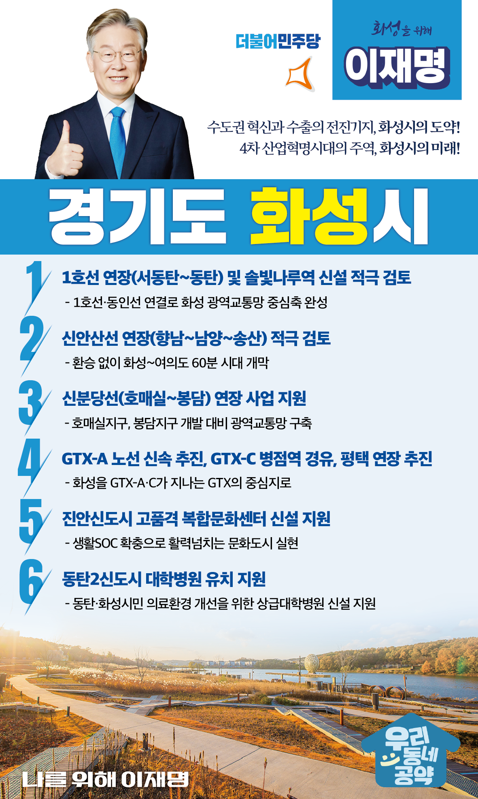

## 경기 지역 공약

# 화성시

### 수도권 혁신과 수출의 전진기지, 화성시의 도약!
> 2022-01-23

존경하는 화성시민 여러분

 

서울시의 1.3배에 달하는 광활한 면적과 100만에 육박하는 인구의 화성시는 경기 서남부를 대표하는 최대의 도시이며, 서해의 자연환경을 품은 아름다운 해안 도시입니다.

 

화성시의 산업환경은 농어업에서 반도체 첨단산업까지 모든 산업이 자리해, 대한민국을 축소해놓은 도시라고 해도 과언이 아닙니다.

또한 자동차산업, 제약산업 등 성장 가능성도 무궁무진합니다.

 

하지만, 급격한 성장과 함께 화성시는 산적한 과제로 성장통을 겪고 있습니다. 

무엇보다 수도권 서남부의 중심도시로서, 수도권 각지로 뻗어 나갈 광역교통망 구축이 절실한 상황입니다.

화성시민의 삶의 질 향상을 위한 생활환경 개선 역시 빼놓을 수 없는 과제입니다.

 

화성시가 직면하고 있는 성장과제와 화성시민의 다양한 목소리에 귀 기울이고 혁신해 나가야 합니다. 

 

국민들과 항상 소통하고, 약속드린 것은 반드시 해내고 마는 이재명이 약속드립니다.

 

 

첫째, 서동탄역~동탄역 간 1호선 연장과 솔빛나루역 신설을 적극 검토하겠습니다.

경부 1호선과 착공예정인 동인선은 경기 서남부권을 남북 수직으로 연결하는 화성시 광역교통망의 중심축입니다. 

1호선 연장과 솔빛나루역 신설을 적극 검토하여 화성시가 수도권 전역으로 뻗어나가는 대중교통의 중심지가 되도록 노력하겠습니다.

 

둘째, 화성 서부권의 숙원사업인 신안산선 연장을 적극 검토하겠습니다.

화성시 서부권에는 대규모 택지개발과 화성 국제테마파크가 추진되고 있습니다.

도시 확장과 인구 증가에 따라 교통인프라 확충이 절실한 상황입니다. 

지역주민들의 교통 불편 해소를 위해  화성서부에서 서울을 잇는 신안산선 연장(향남~남양~송산) 사업을 살피겠습니다. 

 

셋째, 서울 강남과 경기 남부를 잇는 신분당선 봉담 연장 사업을 지원하겠습니다. 

화성시는 인구 100만을 앞두고 있습니다. 

화성시민의 교통 복지와 지역경제 발전을 위해서는 신분당선 봉담 연장을 시작으로 다양한 광역교통망 구축이 필요합니다. 

화성시민들의 삶의 질이 달라지는 광역교통망 구축에 앞장서겠습니다. 

 

넷째, GTX-A 노선을 신속히 추진하고, GTX-C를 병점을 거쳐 오산․평택까지 연장을 추진하겠습니다. 

GTX-A가 동탄역에 운행되고 GTX-C가 병점역에 정차하게 되면 화성시는 GTX 중심지로 거듭날 것입니다. 

 

다섯째, 진안 신도시 내 고품격 생활SOC가 조성되도록 지원하겠습니다.

화성시에는 복지, 문화, 공원 등 생활SOC가 더 많이 조성되어야 합니다.   

아이부터 어르신까지 편히 쉬고 문화·예술을 즐길 수 있는 행복하고 활력 넘치는 문화도시가 되도록 돕겠습니다. 

 

여섯째, 동탄2신도시 내 의료시설용지에 대학병원이 들어서도록 지원하겠습니다.

수도권 최대 신도시로 인구가 급증하고 있지만 화성시민들은 의료서비스가 부족해 불편을 겪고 있습니다. 

상급 의료시설 인프라 구축이 시급한 상황입니다.

동탄주민, 나아가 화성시민의 의료서비스 환경을 개선하기 위해  동탄신도시에 유휴부지로 남아있는 대규모 의료시설용지에 화성시가 대학병원을 유치할 수 있도록 돕겠습니다. 

 

경기도를 잘 알고, 화성시를 잘 아는, 저 이재명이 귀 활짝 열고 화성시민과 함께 뛰겠습니다!

 

수도권 혁신과 수출의 전진기지로서, 인재와 일자리가 넘쳐 나는 살맛 나는 화성시를 만들겠습니다!

 

수도권 혁신의 중심 화성시, 화성시를 위해 이재명!

						