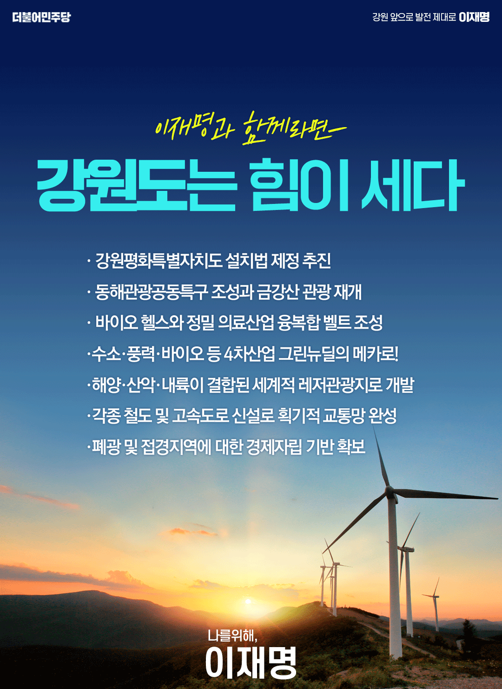

## 지역 공약

# 강원도

- [강릉](./005_010_001/005_010_001.md)
- [고성](./005_010_002/005_010_002.md)
- [동해](./005_010_003/005_010_003.md)
- [삼척](./005_010_004/005_010_004.md)
- [속초](./005_010_005/005_010_005.md)
- [양구](./005_010_006/005_010_006.md)
- [양양](./005_010_007/005_010_007.md)
- [영월](./005_010_008/005_010_008.md)
- [원주](./005_010_009/005_010_009.md)
- [인제](./005_010_010/005_010_010.md)
- [정선](./005_010_011/005_010_011.md)
- [철원](./005_010_012/005_010_012.md)
- [춘천](./005_010_013/005_010_013.md)
- [태백](./005_010_014/005_010_014.md)
- [평창](./005_010_015/005_010_015.md)
- [홍천](./005_010_016/005_010_016.md)
- [화천](./005_010_017/005_010_017.md)
- [횡성](./005_010_018/005_010_018.md)

### 평화시대 선도, 디지털･그린 뉴딜, 평화관광의 메카 강원도 강원의 발전과 도약, 이재명이 제대로 하겠습니다!
> 2022-02-08

존경하는 강원도민 여러분.

지난 강원 방문에서도 말씀드린 바 있지만,
강원도는 저와 특별한 인연이 있는 곳입니다.
아버님은 삼척의 도계광산에서 일하셨고,
큰형님은 일찍이 태백 황지에 삶을 일궈 지금까지도 살고 계신 곳입니다. 

제가 줄곧 “특별한 희생에는 특별한 보상이 필요하다”는 
말씀을 드리곤 하는데 강원도야말로 
분단 70년 남북대치 상황에서 가장 큰 희생을 한 지역입니다.

대한민국 안보를 위한 접경지역 규제, 군사시설 보호 규제,
수도권의 맑고 깨끗한 물과 공기의 공급을 위한 
각종 환경, 산림·개발 제한 규제,
또한 산업 구조조정 과정에서 진행된 석탄산업 셧다운은 

강원도에서
사람이 떠나가고,
산업이 쇠락하고,
경제가 침체되는 아픔을 겪게 했습니다. 

대한민국 공동체를 위한 특별한 희생에는
특별한 보상이 있어야 마땅합니다.

저 이재명은 이곳 강원도를 다시 한번 도약시키겠습니다.

“한반도 평화시대를 선도하는 디지털·그린 뉴딜의 메카”로 
제대로 만들겠습니다. 

‘접경’과 ‘DMZ’가  
더 이상 질곡이 아닌 기회가 되도록 하겠습니다.
‘굴뚝 없는 4차산업 시대’에는 
강원도가 디지털과 그린 에너지 산업의 중심이 될 수 있게 하겠습니다. 
‘수도권 시민의 휴양지를 넘어 글로벌 평화 관광지’로 성장하는데 
지원을 아끼지 않겠습니다.

민주당 정부가 추진해 온 평화경제와 강원발전의 약속을 
반드시 실천하겠습니다.

첫째, 강원도를 평화특별자치도로 만들겠습니다.

강원도가 남북평화시대를 선도하는 지역으로 성장할 수 있도록
강원평화특별자치도 설치법 제정을 적극 추진하겠습니다.
평화경제특별구역을 지정하고 왕래와 교역의 절차를 간소화해
남북경제협력, 공동 자원개발을 지속 추진하겠습니다.

남북 상황에 좌지우지되며 사업추진이 지연되는 일이 없도록
사업단계를 명확히 나눠 흔들림 없이 해나가겠습니다. 

둘째, 동해와 DMZ 국제관광 공동특구를 조성하고 
금강산 관광을 재개하겠습니다.

한반도 평화는 우리 모두의 생존 문제입니다.
2008년 이후 닫혀버린 금강산 관광의 문을
최대한 빠르게 다시 열겠습니다.

금강산 관광 재개를 시작으로, 2018년 남북정상이 합의한 
원산-금강산-고성-강릉에 이르는 동해관광공동특구를 조성하고, 
세계인이 깊은 관심을 가진 DMZ 평화생태관광을 추진하겠습니다.

관광과 스포츠 등 비정치적 분야 교류부터 시작해
남과 북 모두에게 이익이 되는 실용적 대북정책으로
남북 상생을 추구하겠습니다. 

셋째, 데이터 기반의 바이오·헬스 융복합 벨트를 조성하겠습니다.

굴뚝 없는 디지털 4차 산업혁명 시대는 
강원도의 새로운 기회가 될 수 있습니다. 

디지털 공공 데이터를 기반으로 
바이오 헬스케어 및 맞춤형 의료서비스 산업이 
성장·발전 할 수 있도록 충분히 지원하고 

정밀의료 데이터산업과 수열에너지 클러스터를 연계해
바이오･의료 분야 지역산업 생태계를 완성하겠습니다.

중화항체 치료제 개발지원센터 설립 지원으로 
글로벌 백신･치료제 개발에 참여 기반을 만들겠습니다.

넷째, 수소·풍력·바이오 등 인프라 확대로
강원도를 탄소중립과 그린뉴딜의 메카로 만들겠습니다.

세계적인 탈석탄 추세로 인해
강원도의 경제적 어려움이 점점 커지고 있습니다.

제 아버님께서 일하셨던 삼척 도계광업소도 폐광을 앞두고 있습니다. 
태백의 장성광업소도 마찬가지입니다.
강원도의 지속가능한 경제기반을 만드는 전환 성장이 필요합니다. 

동해바다의 풍부한 풍량을 활용해 풍력발전을 추진하고, 
그린수소 연구 및 생산단지를 조성하겠습니다. 
또한 액화수소 저장 및 운송 중심 클러스터도 조성해 
수소경제 생태계를 구축하겠습니다. 

강원도가 산업화 시대 대한민국 에너지 중심이었듯
그린에너지 시대에 새로운 에너지 메카로 
거듭날 수 있도록 하겠습니다.

다섯째, 강원도가 지닌 천혜의 환경을 활용해
해양･산악･내륙 관광을 육성하겠습니다.

관광의 트렌드가 많이 바뀌고 있습니다. 
특정 계절에 집중되던 강원도 관광이 4계절 내내 가능하고, 
다양한 레저와 체험, 힐링과 치유가 이뤄지는 관광으로 
변화·발전시키겠습니다.

동해관광공동특구와 연계해서
강원도를 종합적인 레저와 휴양을 위한
세계적인 관광지로 성장시키겠습니다.

강원도 면적의 82%에 이르는 산지를 친환경적으로 활용한 
산림휴양관광을 활성화하겠습니다.

‘호수’를 활용한 국가 정원 조성하여
관광 레저 활동이 가능하도록 적극 지원하겠습니다. 

여섯째, 한반도 평화경제를 위한 교통망을 확충하겠습니다.

강원도의 단절된 철도 및 고속도로망을 확충해
국토균형발전을 위한 기반을 만들겠습니다.

남북한의 끊어진 철도와 도로를 연결해
강원도가 북방경제 진출의 핵심 거점이 되도록 하겠습니다.

동서고속화철도, 동해북부선철도,
홍천~용문선 철도 등 철도노선과
제천~영월 간 고속도로, 제2경춘국도 건설이
원활히 추진될 수 있게 하겠습니다.

또한 평화시대를 대비하고 균형발전을 실현하기 위해서
제천에서 원주~강릉으로 이어지는 강호축 철도, 
영월∼태백∼삼척 고속도로, 속초∼고성 동해고속도로,
춘천~철원 중앙고속도로 연결 등
교통 인프라 구축을 적극 추진하겠습니다.

일곱째, 폐광 및 접경지역에 대한 경제자립 기반을 마련하겠습니다.

강원지역에서도 더 특별한 희생을 해온 곳이 있습니다. 
바로 폐광지역과 접경지역입니다. 

폐광지역은 정부의 탄소중립 정책으로 
채굴하고 있는 탄광이 폐광될 위기에 처해 있으며, 

접경지역은 군부대 통·폐합이 진행되고 있습니다.
인구감소는 물론 탄광과 군부대에 의존적인 지역경제는 
궤멸 위기 상황입니다.

탄광지역은「산업위기대응특별지역」으로 지정, 
선제적 지원이 이뤄지도록 하고, 
카지노 중심의 강원랜드를 
고품질의 문화공연, MICE 산업 등 
문화관광콘텐츠 산업과 병행하도록 육성하여
지역 일자리 창출 및 자립경제 기반을 탄탄히 하겠습니다.

접경지역은 군부대가 빠져나간 군 유휴부지를 적극 활용, 
혁신 기업도시를 조성해 주민 피해를 최소화하고, 
군부대 통·폐합 과정에서 발생하는 피해 지원 강화를 위해
「접경지역 지원 특별법」을 개정하겠습니다.

존경하는 강원도민 여러분,

이중삼중의 희생을 치러온 강원도에는 더 특별한 보상이 필요합니다.

더 행복하고 공정한 강원도, 한반도 평화 시대를 선도하는 강원도를
저 이재명이 만들겠습니다.

디지털･그린 뉴딜을 이끄는 강원의 발전과 도약, 
저 이재명이 제대로 하겠습니다!

감사합니다.​