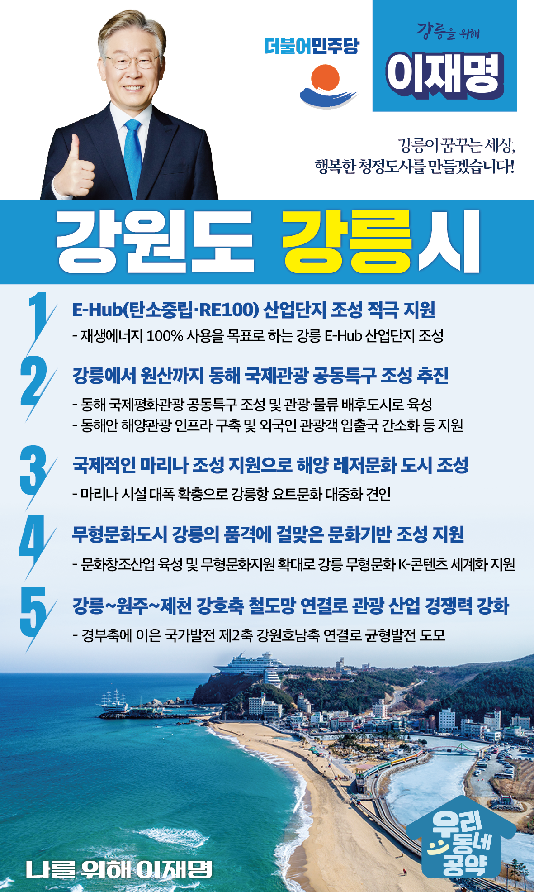

## 강원 지역 공약

# 강릉시

### 강릉이 꿈꾸는 세상, 행복한 청정도시를 만들겠습니다!
> 2022-02-14

존경하는 강릉시민 여러분, 

 

강릉은 모든 국민이 가고 싶어 하고, 모두를 위로해 주는 도시입니다. 바다, 산, 호수가 어우러진 천혜의 자연환경으로 예로부터 관동팔경 중 으뜸인 제일강릉으로 불릴 뿐만 아니라 신사임당, 율곡 이이, 허균, 허난설헌 등 조선시대 우리나라에서 제일 유명한 모자(母子)와 남매를 배출한 도시입니다. 

또 강릉단오제와 강릉농악 등 두 개의 유네스코 무형문화유산을 지닌 품격의 도시이기도 합니다.

 

 

제일강릉의 명성에 맞는 도시를 위한, 이재명의 강릉발전 5대 공약을 약속드립니다. 

 

첫째, E-Hub(탄소중립·RE100) 산업단지 조성을 적극 지원하겠습니다.

청정강릉을 지향하는 강릉의 미래는 탄소중립입니다. 탄소중립이 불러온 글로벌 시장 변화로 재생에너지 확보가 산업단지의 주요 경쟁력이 됩니다. 재생에너지 100% 사용을 목표하는 강릉 E-Hub 산업단지 조성을 적극 지원하고 강릉의 산업경쟁력을 높이겠습니다.

 

둘째, 강릉에서 원산까지 동해 국제관광 공동특구 조성을 추진하겠습니다.

분단으로 인해 가장 큰 희생을 치른 강원도는 그에 걸맞은 공정한 보상이 따라야 합니다. 동해 국제평화관광 공동특구를 조성하고 강릉을 관광·물류 배후도시로 만들겠습니다. 동해안 해양관광 인프라 구축과 외국인 관광객 입출국 간소화 등을 통해 강릉을 동북아시아 평화관광 거점으로 위상을 강화하겠습니다. 

 

셋째, 해양 레저문화도시 강릉을 위해 국제적인 마리나 조성을 지원하겠습니다.

국민소득 3만불 시대, 선진국형 해양레저산업인 요트산업은 우리가 눈여겨봐야 할 강릉형 미래산업입니다. 강릉항에 요트문화 대중화를 견인할 마리나 시설이 대폭 확충되도록 지원하겠습니다.  강릉을 해양생태·환경도시, 해양레저문화의 중심지로 만들겠습니다.

 

 

 

넷째, 무형문화도시인 강릉의 품격에 걸맞은 문화기반 조성을 지원하겠습니다.

강릉은 천년을 이어온 강릉단오제와 농악 등 2개의 유네스코 인류무형문화유산을 보유하고 있습니다. 강릉이 지닌 무형문화가 세계를 향한 K-콘텐츠로 이어질 수 있도록 지원을 확대하겠습니다.

 

다섯째, 강릉~원주~제천 강호축 철도망 연결로 강릉의 관광과 산업 경쟁력을 강화하겠습니다.

충북선 고속화가 완료되면 강릉에서 목포까지 3시간 30분이 걸리게 됩니다. 경부축에 이은 국가발전 제2축으로 강원호남축을 연결하여 균형발전의 중추로 삼겠습니다. 강호축 완성으로 전국과 연결되는 사통팔달 강릉을 만들겠습니다. 

 

 

존경하는 강릉시민 여러분!

이재명은 지킬 수 있는 것만 약속했고 약속했떤 것은 지켜왔습니다. 

살기 좋은 강릉 미래를 위한 약속, 실력과 성과로 입증된 이재명이 반드시 실천하겠습니다.

 

강릉 앞으로, 발전 제대로!

새로운 강릉을 위해, 이재명! 

						