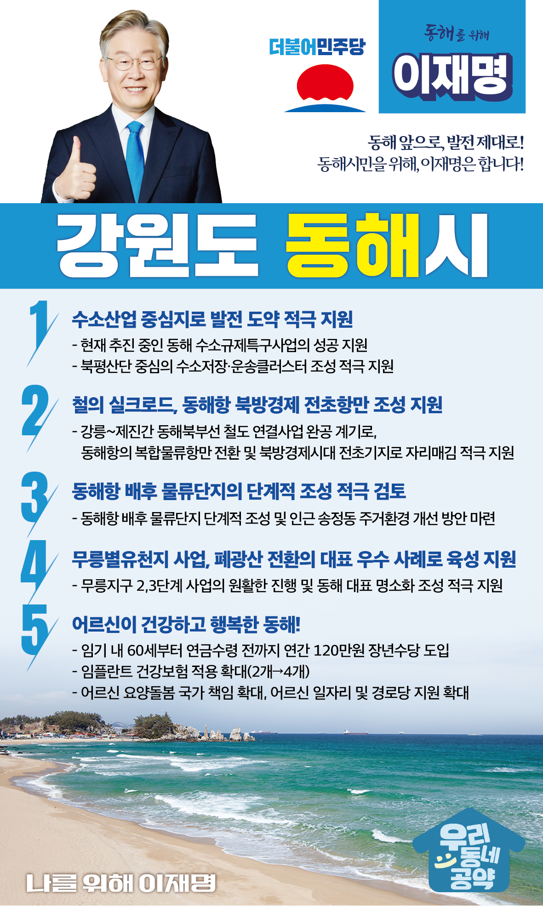

## 강원 지역 공약

# 동해시

### 동해 앞으로! 발전 제대로! 동해시민을 위해, 이재명!
> 2022-02-14

존경하는 동해시민 여러분,

 

42년전 옛 명주군 묵호읍과 삼척군 북평읍이 합쳐져 동해시가 출범하였습니다. 허허벌판에서 시작되었던 42년의 역사는 동해시민 모두의 땀과 정성으로 이룩한 도전과 개척의 역사입니다. 시민 한분 한분이 동해시의 역사이자 기록입니다. 그러나 에너지·산업의 대전환 시대를 맞아 동해시에도 변화가 필요합니다.

 

다시 살아나는 동해를 위한 5대 지역공약을 약속드립니다.

 

첫째, 동해가 수소산업 중심지로 도약할 수 있도록 적극 지원하겠습니다.

수소는 탄소 발생 없는 청정에너지원으로 주목받고 있습니다. 현재 추진 중인 동해 수소규제특구사업이 성공할 수 있도록 지원하겠습니다. 또한 북평산단을 중심으로 수소저장·운송클러스터 조성도 적극적으로 돕겠습니다.

 

둘째, 동해북부선 철도 연결로 동해항을 북방경제 전초항만으로 삼겠습니다.

강릉~제진간 동해북부선 철도 연결사업이 완공되면 북한을 거쳐 시베리아, 서유럽까지 갈 수 있는 ‘철(鐵)의 실크로드’가 됩니다. 이를 계기로 동해항이 복합물류항만으로 전환하고 북방경제시대 전초기지로 거듭나도록 적극 지원하겠습니다. 

 

셋째, 동해항 배후 물류단지의 단계적 조성을 적극 검토하겠습니다.

동해신항이 환동해권 복합물류거점이자 북방경제 전진기지가 되기 위해 동해항 배후 물류단지 조성이 필요합니다. 동해항 배후 물류단지를 단계적으로 조성하는 방안을 마련하고, 인근 송정동 주민들의 주거환경 개선도 함께 모색하겠습니다. 

 

넷째, ‘무릉별유천지’가 폐광산 활용의 우수 사례가 되도록 적극 돕겠습니다.

국내 최초로 폐광산을 재생한 ‘무릉별유천지’사업은 산업전환에 따른 창조적 복구와 지역상생의 우수 사례입니다. 무릉지구 2,3단계 사업이 원활하게 진행되어 동해의 자랑스러운 명소가 될 수 있도록 적극 지원하겠습니다.

 

다섯째, 어르신이 건강하고 행복한 동해를 만들겠습니다.

소득 공백에 놓인 60대 초반을 대상으로 연간 120만원의 장년수당을 지급하겠습니다. 또한 65세 이상 어르신에 대한 임플란트 건강보험 적용 개수도 현행 2개에서 4개까지 확대하겠습니다. 동해시 어르신들의 건강하고 행복한 노후를 뒷받침하겠습니다. 

 

 

존경하는 동해시민 여러분!

이재명은 지킬 수 있는 것만 약속했고 약속했던 것은 지켜왔습니다.

살기 좋은 동해 미래를 위한 약속, 실력과 성과로 입증된 이재명이 반드시 실천하겠습니다.

 

동해 앞으로! 발전 제대로! 

동해시민을 위해, 이재명!

 

						