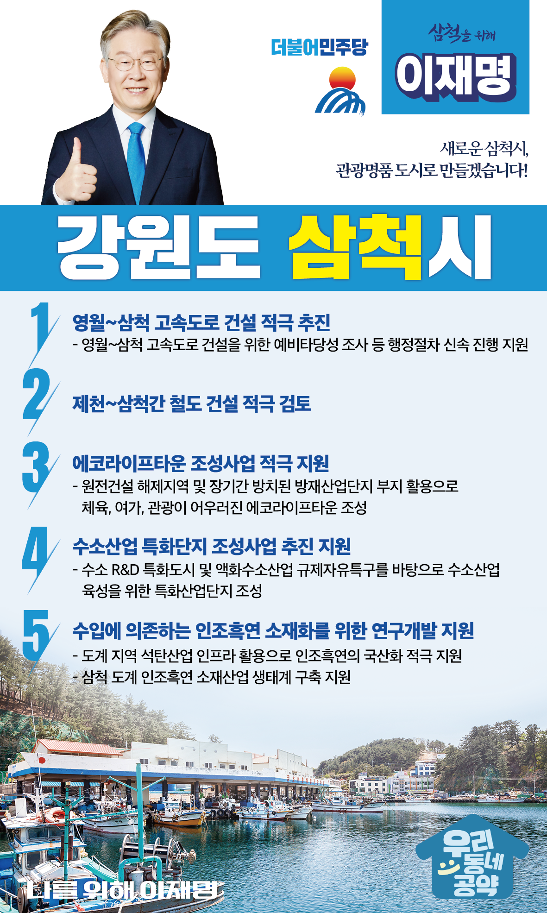

## 강원 지역 공약

# 삼척시

### 새로운 삼척시, 관광명품 도시로 만들겠습니다!
> 2022-02-14

존경하는 삼척시민 여러분,

 

삼척은 단군신화부터 고려로 통일되는 과정이 기술된 이승휴의 ‘제왕운기’ 탄생의 고장으로 ‘역사적으로 중요하고 가장 복된 땅’이자 강원의 자랑입니다.

 

아울러 세계에서 가장 아름다운 환선굴, 대금굴을 보유하고 있으며, 동해안 수산물이 풍부하고, 장호·후진 해수욕장 등으로 유명한 관광도시이기도 합니다. 그러나 전환의 시대를 맞아 삼척시가 위축되고 있습니다. 

 

대전환의 시기, 다시 살아나는 삼척을 위한 5대 공약을 약속드립니다.

 

첫째, 영월~삼척 고속도로 건설을 적극 추진하겠습니다.

인구소멸 위험지역으로 진입한 삼척은 교통인프라가 구축이 절실합니다. 현재 공사중인 제천~영월 고속도로를 삼척까지 조속히 연결해야 합니다. 예비타당성 조사 등 행정절차를 신속히 진행해 영월~삼척 고속도로가 빠르게 건설할 수 있도록 지원하겠습니다. 

 

둘째, 제천~삼척간 철도 건설을 적극 검토하겠습니다.

강원 남부권 폐광지역의 인구감소와 지역낙후를 해결하기 위해 열악한 교통 환경 개선이 절실합니다. 제천~삼척 ITX노선이 추진될 수 있는 방안을 적극 검토하겠습니다.

 

셋째, 삼척시가 추진하는 에코라이프타운 조성사업을 적극 지원하겠습니다.

원전건설 해제지역과 장기간 방치된 방재산업단지 부지를 활용해 체육, 여가, 관광이 어우러진 에코라이프타운 조성을 적극 지원하겠습니다. RE100 에너지 자립을 실현하는 관광거점이 되도록 하겠습니다.  

 

넷째, 수소산업 특화단지 조성사업의 추진을 지원하겠습니다.

삼척은 수소 R&D 특화도시와 액화수소산업 규제자유특구로 지정되었습니다. 이를 바탕으로 수소산업 육성을 위한 특화산업단지 조성을 지원하겠습니다. 일자리를 위해 찾아오는 삼척이 되도록 뒷받침하겠습니다.

 

다섯째, 수입에 의존하는 인조흑연 소재화를 위한 연구개발을 지원하겠습니다. 

도계 지역의 석탄산업 인프라를 활용하여 전량 수입에 의존하는 인조흑연의 국산화를 적극 지원하겠습니다. 삼척 도계에 인조흑연 소재산업 생태계가 구축될 수 있도록 뒷받침하겠습니다.

 

이재명은 지킬 수 있는 것만 약속했고 약속했던 것은 지켜왔습니다.

살기좋은 삼척시 미래를 위한 약속 실력과 성과로 입증된 이재명이 반드시 실천하겠습니다.

 

삼척 앞으로, 발전 제대로!

삼척시민을 위해, 이재명은 합니다! 

						