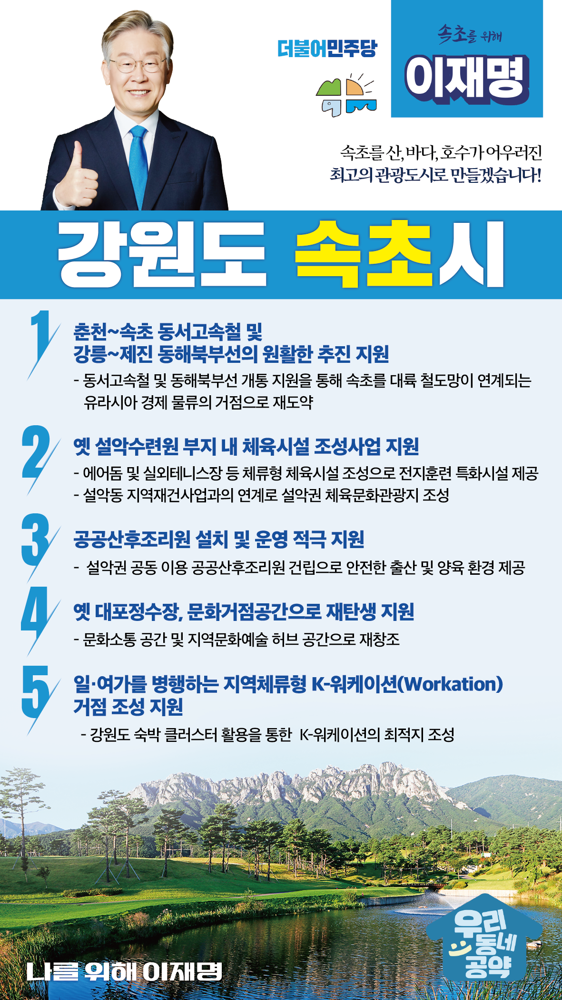

## 강원 지역 공약

# 속초시

### 속초를 산, 바다, 호수가 어우러진 최고의 관광도시로 만들겠습니다!
> 2022-02-14

존경하는 속초시민 여러분,

 

속초는 설악산과 동해바다, 영랑호와 청초호를 품고 있고 1년에 1700만명의 관광객이 찾아오는 최고의 관광도시입니다. 남북교류 및 북방교역의 중심지이기도 합니다. 

 

속초시민 여러분!

 

속초가 지속가능 발전을 하기 위해서는 더 편리한 교통과 문화시설을 갖춰야 합니다. 더욱 쾌적하고 살기 좋은 속초를 만들기 위한 5대 공약을 약속드립니다.

 

첫째, 춘천~속초 동서고속철과 강릉~제진 동해북부선이 원활히 추진될 수 있도록 하겠습니다. 

강원도의 양대 철도사업인 동서고속철과 동해북부선은 속초를 교통의 요충지와 남북평화협력의 중심지로 만들 것입니다. 동서고속철과 동해북부선이 개통되면, 속초가 대륙 철도망이 연계되는 유라시아 경제 물류의 거점이 될 것입니다. 

 

둘째, 옛 설악수련원 부지에 체육시설 조성사업을 뒷받침하겠습니다.

용도폐지 된 옛 설악수련원 활용은 속초 관광산업이 해결해야 할 과제입니다. 옛 설악수련원 부지에 에어돔과 실외테니스장 등 체류형 체육시설을 조성하면 다양한 종목의 선수들이 전지훈련을 할 수 있습니다. 설악동 지역재건사업과 연계해 설악권이 명실상부한 체육문화관광지가 되도록 돕겠습니다. 

 

셋째, 공공산후조리원 설치 및 운영을 적극 지원하겠습니다.

속초시에는 질 좋은 산후조리원이 부족합니다. 속초시에 설악권 주민들이 함께 이용할 수 있는 공공산후조리원 건립을 적극 지원하겠습니다. 강원도를 출산과 양육하기 좋은 지역으로 만들겠습니다.

 

 

넷째, 옛 대포정수장이 문화거점공간으로 재탄생할 수 있도록 지원하겠습니다.

속초시에는 주민들의 문화예술 활동 공간이 부족합니다. 속초시민들이 수준 높은 문화생활을 할 수 있도록 옛 대포정수장이 지역문화예술 허브공간이 되도록 적극 지원하겠습니다. 시민과 문화예술인이 문화로 소통하는 속초를 만들겠습니다.

 

다섯째, 일·여가를 병행하는 지역체류형 K-워케이션(Workation) 거점 조성을 뒷받침하겠습니다.

비대면 경제가 확대되면서 원격근무를 하시는 분들이 늘어나고 있습니다. 최근에는 집이나 사무실이 아닌 휴양지에 머물면서 일을 병행하는 '지역 체류형' 근무제도인 워케이션이 늘어나고 있습니다. 강원도 숙박 클러스터를 활용해 속초를 K-워케이션 거점이 조성되도록 적극 지원하겠습니다. 

 

 

존경하는 속초시민 여러분!

이재명은 지킬 수 있는 것만 약속했고 약속했던 것은 지켜왔습니다.

살기 좋은 속초시 미래를 위한 약속 실력과 성과로 입증된 이재명이 반드시 실천하겠습니다.

 

속초 앞으로, 발전 제대로!

속초시민을 위해, 이재명은 합니다! 

						