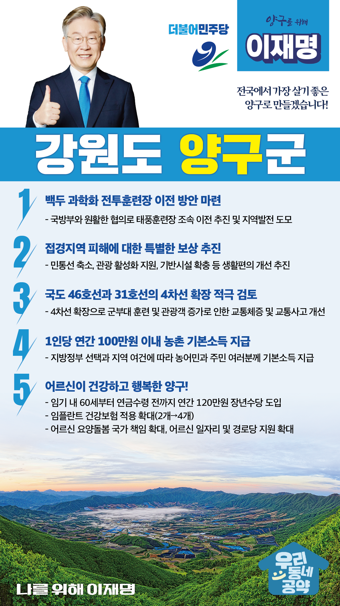

## 강원 지역 공약

# 양구군

### 전국에서 가장 살기 좋은 양구로 만들겠습니다!
> 2022-02-14

존경하는 양구군민 여러분,

 

양구군은 국토의 정중앙이자 금강산으로 가는 길목에 위치해 있으나, 소양강댐, 화천댐, 평화의댐으로 막혀 육지의 고도로 불리던 곳입니다. 또한 한국전쟁 당시 가장 치열한 전투가 치러지고 무적해병의 신화가 탄생한 곳이기도 합니다. 한편 각종 규제로 개발이 제한되었던 낙후지역이었습니다.

 

이러한 환경 속에서도 접경지역 양구는 변화와 도전으로 이제 전국에서 가장 살기 좋은 곳으로 변모하고 있습니다. 

더욱 쾌적하고 안전하며 살기 좋은 양구를 만들기 위한 5대 공약을 말씀드리겠습니다.

 

 

첫째, 백두 과학화 전투훈련장 이전 방안을 마련하겠습니다. 

태풍훈련장으로 불리는 백두 과학화 전투훈련장은 소음과 진동으로 주민들의 피해가 큽니다. 국방부와 원활한 협의로 태풍훈련장을 조속히 이전하여 주민불편을 해소하고 지역발전이 되도록 적극 돕겠습니다.

 

둘째, 접경지역 피해에 대한 특별한 보상을 추진하겠습니다. 

지난 70년간 안보를 이유로 소외되고 낙후된 양구군민의 정주여건 개선과 삶의 질 향상이 필요합니다. 민통선 축소, 관광 활성화 지원, 기반시설 확충을 힘있게 추진하겠습니다. 양구 군민의 생활편의를 개선하고 지역경제를 발전시키겠습니다.

 

 

셋째, 국도 46호선과 31호선의 4차선 확장을 적극 검토하겠습니다.
양구의 중심 도로인 국도 46호선과 31호선은 군부대 훈련으로 교통이 지체되고 무리한 추월 사고가 빈번합니다. 이를 개선하기 위해 국도 46호선과 31호선의 4차선 확장을 적극 검토하겠습니다.

 

 

넷째, 농촌에 거주하는 농민과 주민 여러분께 기본소득을 지급하겠습니다. 

지방정부의 선택과 지역의 여건에 따라 1인당 연간 100만원 이내의 농촌 기본소득을 지급하겠습니다. 농촌 기본소득 지급으로 농촌과 도시 간 소득격차를 줄이고, 안정적 생활을 지원하겠습니다. 

 

다섯째, 어르신이 건강하고 행복한 양구를 만들겠습니다. 

소득 공백에 놓인 60대 초반을 대상으로 연간 120만원의 장년수당을 지급하겠습니다. 또한 임플란트 건강보험 적용 개수를 현재 2개에서 4개로 확대하고 어르신 요양에 대한 국가 책임을 확대하고 어르신 일자리 지원과 경로당 지원 확대로 어르신들이 행복한 양구를 만들겠습니다.

 

 

존경하는 양구군민 여러분!

이재명은 지킬 수 있는 것만 약속했고 약속했던 것은 지켜왔습니다.

살기 좋은 양구군 미래를 위한 약속, 실력과 성과로 입증된 이재명이 반드시 실천하겠습니다.

 

양구군 앞으로! 발전 제대로! 

양구군민을 위해, 이재명! 

						