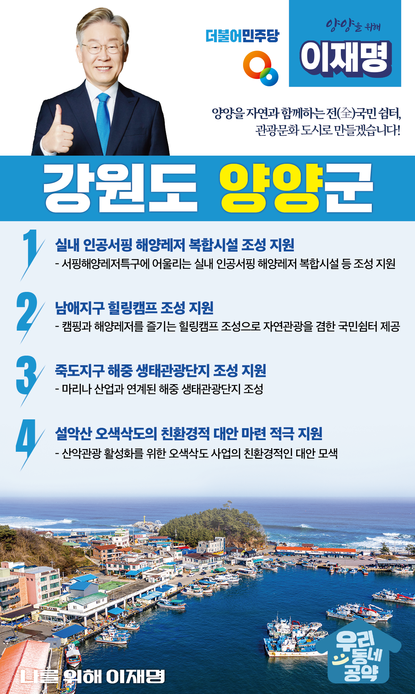

## 강원 지역 공약

# 양양군

### 양양을 자연과 함께하는 전(全)국민 쉼터, 관광문화 도시로 만들겠습니다!
> 2022-02-14

존경하는 양양군민 여러분,

 

양양은 웅장한 설악산과 드넓은 동해바다가 만든 천혜의 관광지입니다. 양양은 작은 지역이지만 그 어느 도시보다 발전 가능성이 있는 곳입니다. 그러나 아름다운 해안선은 철조망으로 막혀 있고, 군부대의 해안소초들은 지역발전을 가로막는 걸림돌이 되고 있습니다.

 

특별한 희생에는 특별한 보상이 되어야 합니다. 규제로 묶인 사업들은 대체방안을 마련해야 합니다. 국가가 해야 할 일입니다.

 

이재명이 하겠습니다. 3만 양양군민과 함께 만들어 가겠습니다. 완전히 새로운 양양을 위해 이재명이 4가지 약속을 드립니다.

 

 

첫째, <실내 인공서핑 해양레저 복합시설> 조성을 지원하겠습니다.

양양은 동해안 최고의 서핑 고장입니다. 서핑해양레저특구에 어울리는 복합시설 조성을 지원하여 실내외 어디서나 서핑을 즐길 수 있는 관광명소로 만들겠습니다. 

 

둘째, <남애지구 힐링캠프> 조성을 지원하겠습니다.

이제 관광트렌드가 소규모ㆍ가족ㆍ자연 관광으로 변하고 있습니다. 자연경관이 뛰어난 남애 어촌지역에 캠핑과 해양레저를 즐길 수 있는 힐링캠프를 조성하여 자연관광을 겸한 국민쉼터가 될 수 있도록 돕겠습니다.

 

셋째, <죽도지구 해중 생태관광단지> 조성을 지원하겠습니다.

죽도지구는 요트마리나 시설과 서핑 비치로드가 조성되어 서핑 해양레저의 기반이 잘 갖춰져 있습니다. 이에 더해 마리나 산업과 연계된 해중 생태관광단지를 조성하여 더 많은 국민들이 즐기는 해양레저 관광지가 되도록 적극 지원하겠습니다.

 

넷째, <설악산 오색삭도>의 친환경적 대안 마련을 돕겠습니다. 

설악산은 자연환경 보전을 통해 후대에 물려주어야 할 자연 자산이자 관광 자산입니다. 오색삭도 사업의 친환경적인 대안을 찾도록 돕겠습니다. 지역경제도 살고, 산악관광도 활성화하며 자연 훼손도 최소화하겠습니다.  

 

 

존경하는 양양군민 여러분!

 

양양은 변하고 있습니다. 

발상의 전환과 과감한 시도를 통해 새롭고 활기 넘치는 도시로 탈바꿈하겠습니다.

 

이재명은 지킬 수 있는 것만 약속했고 약속했던 것은 지켜왔습니다.

살기좋은 양양군 미래를 위한 약속 실력과 성과로 입증된 이재명이 반드시 실천하겠습니다.

 

양양 앞으로, 발전 제대로!

양양군민을 위해, 이재명은 합니다! 

						